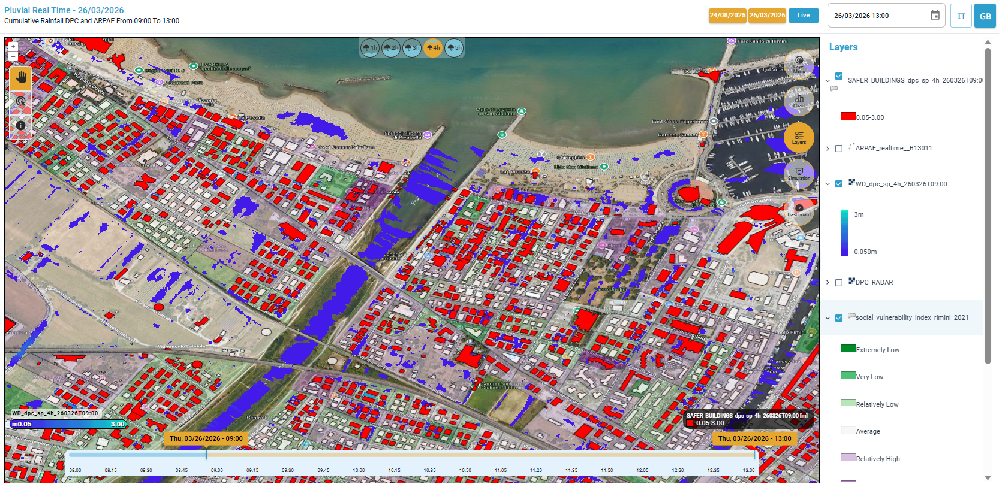
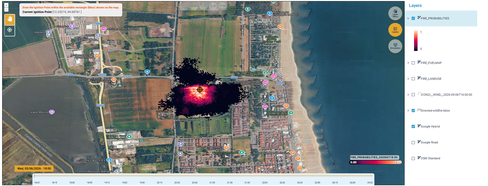

# 👋 MANUALE Data Fabric RWL2 - SaferCast

<kbd>**Introduzione**</kbd>


Il Data fabric RWL2 - SaferCast è un servizio di Early Warning integrato sia per gli **allagamenti**, in grado di anticipare eventi di pioggia intensa e inondazioni in ambito urbano, che per lo studio della **propagazione degli incendi**. 

Il servizio è stato sviluppato con il supporto del progetto [**DIRECTED**](https://directedproject.eu/) e sfruttando la tecnologia di [SaferPlaces](https://saferplaces.co). 

Per **"**_**Data Fabric**_**"** si intende una piattaforma web basata sul cloud che integrerà fonti di dati e modelli per la gestione del rischio e consentirà agli utenti di visualizzare i rispettivi risultati di modellazione. Gli utenti possono esplorare le fonti dei dati e modelli, e combinarli in modo modulare.&#x20;


<kbd>**Come funziona**</kbd>

Il servizio è in grado di operare in tempo reale, alimentandosi di dati meteorologici provenienti da più fonti sia commerciali che open source, e combinando:

* **Nowcasting:** utilizzo di dati radar meteorologici e stazioni pluviometriche per una fotografia immediata della situazione meteo, con aggiornamenti in tempo reale.
* **Forecasting**: integrazione di previsioni meteo open-source (ICON2) e/o fornite da partner commerciali come MeteoBlue e Hypermeteo, per anticipare l’evoluzione delle condizioni meteorologiche nelle ore successive.

I dati di precipitazione vengono poi elaborati dagli innovativi modelli di allagamento di [SaferPlaces](https://saferplaces.co) sviluppati sfruttando algoritmi di intelligenza artificiale, in modo da generare mappe dinamiche di allagamento ad alta risoluzione. Infatti, il servizio è in grado di produrre mappe di allagamento seguendo l'evoluzione dei fenomeni in tempo reale. In questo modo, è possibile intersecare in tempo reale le aree potenzialmente allagate con i punti critici e le zone urbane più vulnerabili.


Le mappe di allagamento sono generate ad altissima risoluzione (1-2 m) e sono in grado di identificare le aree allagate al dettaglio dei singoli edifici.


<figure><figcaption>
Mappa di allagamento risultato di una simulazione 
</figcaption></figure>

I dati relativi al campo di vento (direzione e intensità) vengono invece utilizzati per simulare scenari di propagazione di un incendio a partire da uno specifico punto di innesco selezionato dall'utente. Il sistema è alimentato da un modello probabilistico per la simulazione della propagazione degli incendi, basato sull’integrazione di diversi dati relativi alla morfologia del terreno (_Digital Elevation Model_), alla tipologia di vegetazione e combustibile presente, all’umidità del suolo e della vegetazione, a dati satellitari e cartografici ad alta risoluzione, oltre che alle condizioni del vento (direzione e intensità) e al punto d'innesco dell’incendio, al fine di stimare l’evoluzione spaziale e temporale del fronte di fiamma.

<figure><figcaption>
Mappa di propagazione di un incendio risultato di una simulazione
</figcaption></figure>

In base al tipo di analisi di interesse è quindi possibile scegliere tra quattro diversi scenari:

* _**Pluvial Real Time/Nowcasting**_**:** utilizzo di dati radar meteorologici e stazioni pluviometriche per una fotografia immediata della situazione meteo, con aggiornamenti in tempo reale per simulare eventi di allagamento pluviale nell'immediato.
* _**Pluvial Forecasting**_: integrazione di previsioni meteo open-source e/o fornite da partner commerciali come MeteoBlue, per anticipare l’evoluzione delle precipitazioni nelle ore successive, al fine di simulare eventi di allagamento pluviale futuri.
* _**Coastal Real time + Forecasting**_**:** utilizzo di dati meteomarini misurati e di dati da modelli previsionali su altezza dell'onda e maree, per simulare sia scenari in tempo reale che previsionali, di allagamento costiero.
* _**Fire Real time + Forecasting**_**:** utilizzo di dati di direzione e intensità del vento per simulare scenari di propagazione di un incendio a partire dal punto di innesco selezionato.

<kbd>**Perché è utile**</kbd>

L’obiettivo è fornire ai comuni, multiutility e agenzie di protezione civile uno strumento operativo che permetta di:

* Identificare tempestivamente le aree a rischio
* Supportare decisioni cruciali per evacuazioni preventive o interventi rapidi
* Integrare i risultati nei sistemi gestionali esistenti

Il tutto è accessibile attraverso una dashboard interattiva, che visualizza scenari previsionali in maniera chiara e immediata, con possibilità di esportazione dei dati.

<kbd>**Vantaggi principali**</kbd>

* Alta Risoluzione 1-2 m
* Scalabile: utilizzabile su qualsiasi contesto urbano o regionale
* Altamente automatizzato: riduce tempi di analisi e reazione
* Affidabile: integra fonti multiple e modelli di intelligenza artificiale avanzati
* Operativo ora: già attivo in più città italiane e in espansione in tutta Europa

<kbd>**Interfaccia Grafica Utente (GUI)**</kbd>

<figure><figcaption>
Data Fabric RWL2 - SaferCast  - Interfaccia grafica <strong>scenario pluviale</strong>
</figcaption></figure>

<figure><figcaption>
Data Fabric RWL2 - SaferCast  - Interfaccia grafica <strong>scenario costiero</strong>
</figcaption></figure>

<figure><figcaption>
Data Fabric RWL2 - SaferCast  - Interfaccia grafica <strong>scenario incendio</strong>
</figcaption></figure>


**Data fabric RWL2 - SaferCast è un servizio disponibile come applicazione web**.&#x20;

Dispone di un'interfaccia grafica utente (GUI - Graphic User Interface) dedicata, che permette di generare, eseguire e visualizzare scenari di **rischio da alluvione e da incendio** per aree specifiche di interesse.

Alimentato da dati meteorologici in tempo reale (dati radar o da modelli previsionali), il servizio è in grado di generare mappe dinamiche di allagamento sfruttando gli algoritmi di intelligenza artificiale di [SaferPlaces](https://saferplaces.co/), progettato a sua volta per fornire "Flood Risk Intelligence" ad alta risoluzione e con elevata granularità, in tempo reale, per vari scenari di inondazione pluviale e costiera.

La simulazione della propagazione degli incendi si basa invece su un modello probabilistico, fondato sull’integrazione di differenti sorgenti informative territoriali e ambientali. Il sistema utilizza dati relativi alla morfologia del terreno (_Digital Elevation Model_), alla tipologia di vegetazione e combustibile presente, all’umidità del suolo e della vegetazione, alle condizioni del vento (direzione e intensità), ai punti di innesco dell’incendio e a dati satellitari e cartografici ad alta risoluzione, al fine di stimare l’evoluzione spaziale e temporale del fronte di fiamma.



Il presente **Manuale d'uso** illustra le caratteristiche principali del servizio, evidenziando la semplicità con cui gli utenti possono effettuare **simulazioni alluvionali e di propagazione degli incendi** per valutarne la pericolosità e identificare tempestivamente le aree a rischio.

Di seguito, sono presentate le informazioni di dettaglio su tutte le funzioni e gli strumenti disponibili.

