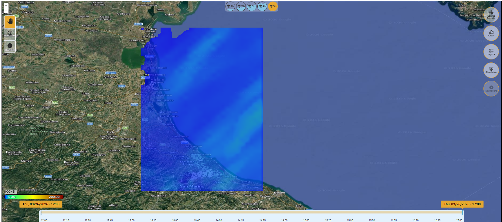
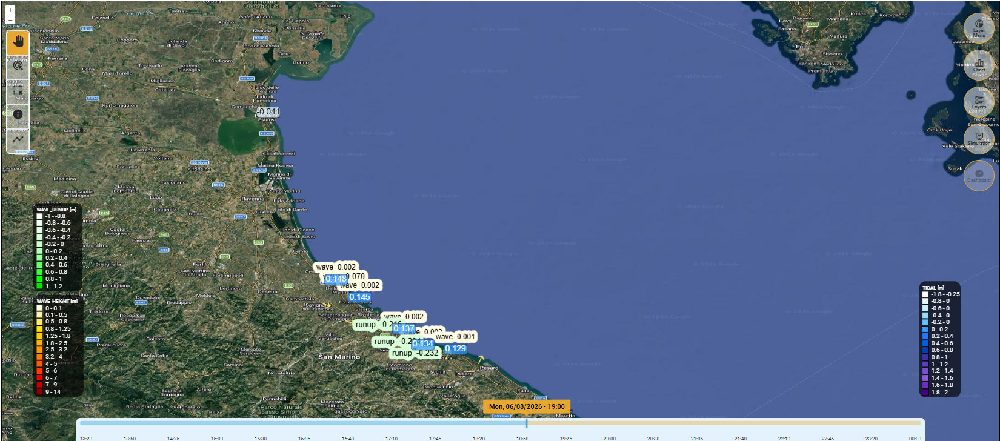
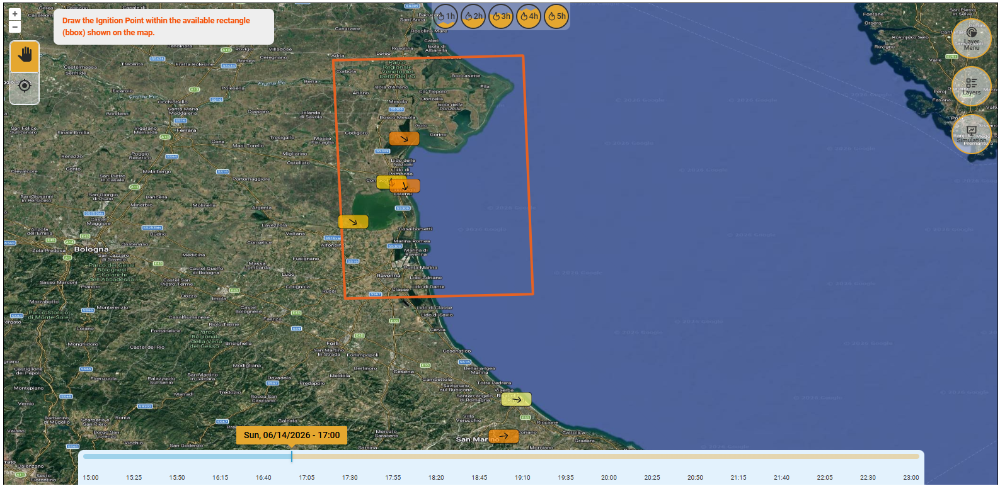
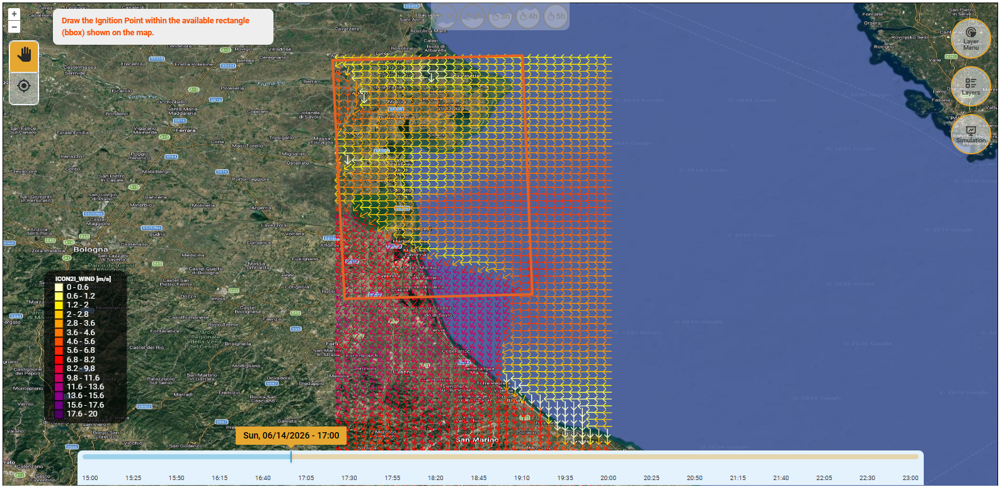

# Area di mappatura

L'area di mappatura occupa la parte centrale della schermata e mostra la mappa interattiva della città selezionata.

Viene utilizzato come default un basemap satellitare, sul quale possono essere sovrapposti i layer tematici (es. intensità di pioggia, allagamenti simulati, punti critici).


Il sistema di riferimento spaziale adottato per le operazioni di visualizzazione e di esportazione dei dati è il sistema geodetico **EPSG:4326**



Sulla sinistra sono presenti degli strumenti per navigare all'interno della mappa:

_**Zoom**_**&#x20;(+/-)** aumenta o diminuisce lo zoom.

_**Pan**_ (Mano) attiva lo spostamento della mappa. Si può cliccare e trascinare per muoversi senza cambiare scala.

_**Single Feature Select**_ (icona con freccia circolare) permette di selezionare un elemento (“_feature_”) sulla mappa, che viene poi evidenziato, principalmente per le stazioni di rilevamento dei dati.

_**Multiple Feature Select**_ (icona con quadrato disegnato con linea tratteggiata)  permette di selezionare tutti gli elementi sulla mappa (“_features_”) che ricadono all'interno dell'area disegnata (strumento presente solo per lo Scenario costiero), che vengono poi evidenziati e i cui dati vengono visualizzati nel grafico ( [#chart-coastal](barra-laterale-destra.md#chart-coastal "mention").

_**Identify**_ (icona “i”) serve per interrogare un layer ed ottenere informazioni puntuali.

_**BarrierDraw**_ (linea segmentata) permette di disegnare le barriere (strumento presente solo per lo Scenario costiero)

_**Fire Ignition**_ (bersaglio) permette di disegnare sulla mappa il punto di innesco dell'incendio.


<figure><figcaption>
Area centrale di mappatura (scenario pluviale - real time)
</figcaption></figure>

<figure><figcaption>
Area centrale di mappatura (scenario pluviale - forecast)
</figcaption></figure>

<figure><figcaption>
Area centrale di mappatura (scenario costiero - real time &#x26; forecast)
</figcaption></figure>

<figure><figcaption>
Area centrale di mappatura (scenario incendio - real time)
</figcaption></figure>

<figure><figcaption>
Area centrale di mappatura (scenario incendio - forecast)
</figcaption></figure>


All'interno dell'area di mappatura **sulla destra** si trovano una serie di **strumenti di analisi** disposti in verticale che, quando selezionati, attivano la [barra-laterale-destra.md](barra-laterale-destra.md "mention"). Quando uno strumento viene selezionato, si apre il relativo pannello, la cui larghezza può essere aumentata o ridotta in base alle esigenze dell'utente, fino a occupare circa metà dell'area di mappatura.

Nella **parte bassa** si trova la [barra-inferiore.md](barra-inferiore.md "mention") che consente il **controllo temporale** dei dati visualizzati e della simulazione. \
Si precisa che sono evidenziati in azzurro gli orari antecedenti e in arancione gli orari conseguenti all'ora di simulazione.

Infine, nella **parte superiore,** degli scenari pluviali e di incendio, si trovano 5 icone che consentono di selezionare un **intervallo di tempo in ore**, per il quale verrà calcolata la pioggia cumulata (per le simulazioni di pioggia negli scenari pluviali) o la durata della propagazione del fuoco (per lo scenario incendio).


