# Barra Laterale Destra

La barra laterale destra è un pannello contestuale che si apre in base allo strumento selezionato dal **toolbar verticale** che si trova sulla destra dell'ambiente di mappatura.&#x20;

La selezione di uno di questi strumenti attiva il relativo pannello di funzionalità.&#x20;

La larghezza del pannello è regolabile dall'utente e può essere ampliata fino a occupare circa metà dell'area di mappatura oppure ridotta, in modo da ottimizzare la visualizzazione della mappa e dei risultati delle analisi.

Il contenuto del pannello laterale destro varia leggermente a seconda dello scenario selezionato (pluviale real time, pluviale forecast, costiero e incendio).


Il contenuto della barra laterale destra cambia dinamicamente a seconda dell’icona selezionata tra quelle presenti sulla **toolbar verticale.**&#x20;

Una volta aperto i pannello della barra laterale destra, la larghezza del pannello è **regolabil**e dall'utente.

La barra laterale destra si **chiude automaticamente** cliccando di nuovo sull’icona dello strumento selezionato.&#x20;

Nascondendo la barra laterale è possibile mantenere la mappa a schermo intero per una visualizzazione più ampia.


<figure>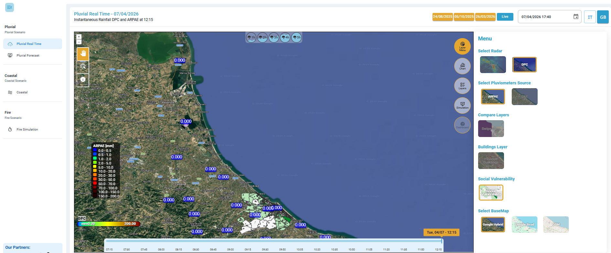<figcaption>
Sulla destra della schermata si apre un pannello contestuale in base allo strumento selezionato dal toolbar verticale
</figcaption></figure>

Layer Menu  (Pluvial Real Time)

**(per lo scenario&#x20;**_**Pluvial Real Time**_**)**

Le diverse sezioni del **Layer Menu** consentono di:

* scegliere la fonte dei dati radar meteorologici _(Select Radar),_
* scegliere la fonte di dati pluviometrici _(Select Pluviometers Sources)_
* visualizzare la carta delle vulnerabilità (_Social Vulnerability_)&#x20;
* visualizzare il tipo di mappa di base su cui visualizzare le informazioni _(Select Basemap)_.&#x20;

Una volta ottenuti i risultati delle simulazioni, in questa sezione sarà possibile effettuare un confronto interattivo tra diversi layer _(Compare Layers)_ o visualizzare gli edifici vulnerabili _(Buildings Layer)_.


La scelta del dato radar determina la fonte, la risoluzione e l’accuratezza delle precipitazioni utilizzate sia per la visualizzazione in mappa sia per le simulazioni di allagamento.&#x20;

Poiché il radar selezionato alimenta direttamente i modelli di allagamento, la scelta può incidere sull’estensione e sulla precisione delle aree a rischio simulate, rendendo utile il confronto tra fonti per validare e interpretare correttamente i risultati.


Le sezioni del **Layer Menu** sono sei:

<figure>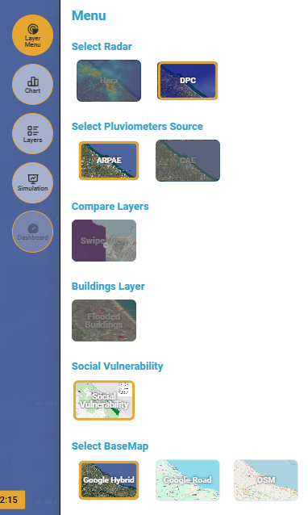<figcaption>
Layer Menù - Pluvial Real Time
</figcaption></figure>

L’utente può scegliere tra diverse fonti di dati:

**1) Select Radar**

* **Hera**: dato radar meteorologico fornito da Hera
* **DPC**: dato radar meteorologico del Dipartimento di Protezione Civile.

**2) Select Pluviometers Source**

* **ARPAE:** dati di precipitazione (in mm di pioggia) acquisiti in telemisura dalla rete idrometeorologica regionale, (in grado di rilevare diverse variabili come temperature, precipitazioni, livelli idrometrici, portate, umidità, pressione, vento, radiazione solare.
* **CAE:** dati di precipitazione (in mm di pioggia) della rete di monitoraggio CAE.

**3) Compare Layers**

La funzione _Swipe View_ consente di confrontare visivamente due layer (ad esempio mappa radar delle precipitazioni e risultato della simulazione di allagamento).&#x20;

Questa sezione si attiva solo dopo aver effettuato una simulazione. Spostando il cursore orizzontalmente sulla mappa vengono visualizzati i due layer affiancati.

**4) Building Layer**

Questa funzione consente di visualizzare gli edifici vulnerabili e si attiva solo dopo aver effettuato una simulazione.&#x20;

**5) Social Vulnerability**

Consente di visualizzare una mappa di "_**Social Vulnerability**_" che rappresenta la distribuzione spaziale dell’indice di vulnerabilità sociale (_Social Vulnerability Index_) per l’area di Rimini.&#x20;

Il territorio è suddiviso in **poligoni (unità territoriali),** ciascuno colorato secondo una **scala qualitativa**, che indica il grado di vulnerabilità della popolazione residente:

* Le aree in **verde** indicano zone con popolazione meno vulnerabile (maggiore resilienza socio-economica)
* Le aree in **viola** evidenziano zone con **maggiore fragilità sociale**, dove gli impatti di eventi critici (es. incendi) possono essere più gravi
* Le aree in **grigio** rappresentano condizioni medie

Questa mappa permette di:

* Integrare le informazioni ambientali (es. pioggia, allagamenti) con dati **socio-demografici**
* Identificare le **aree più esposte dal punto di vista sociale**
* Supportare decisioni operative e pianificazione di emergenza, dando priorità alle zone più vulnerabili.&#x20;

**6) Select BaseMap**

Consente di scegliere il layer di base tra:

* _Google Hybrid_: mappa satellitare
* _Google Road_: mappa stradale senza immagini satellitari
* _OSM_: mappa standard di OpenStreetMap

Source Provider (Pluvial Forecast)

**(per lo scenario&#x20;**_**Pluvial Forecast**_**)**

Questa sezione consente di selezionare il _provider_ di dato previsionale, la mappa di base da visualizzare, di effettuare un confronto interattivo tra diversi layer e di visualizzare gli edifici vulnerabili.


La scelta della fonte del dato (_**Source Provider**_) influenza direttamente i dati utilizzati nella catena di calcolo dei modelli di allagamento previsionali; per questo motivo è importante selezionare la fonte più adatta al contesto territoriale e all’orizzonte temporale desiderato.


Gli elementi principali sono cinque:

<figure><figcaption>
Source Provider (Pluvial Forecast)
</figcaption></figure>

**1) Select Forecast Model (per lo scenario&#x20;**_**Pluvial Forecast)**_

L’utente può scegliere tra diverse fonti di dati previsionali:

* **ICON\_21** – modello open-source del servizio meteorologico tedesco (DWD), con aggiornamenti regolari e copertura globale.
* **MeteoBlue** – previsioni ad alta risoluzione fornite da partner commerciale.

**2) Compare Layers**

Funzione _Swipe View_: confronto interattivo tra due layer tramite cursore scorrevole. Questa sezione si attiva solo dopo aver effettuato una simulazione.&#x20;

**3) Building Layer**

Funzione che consente di visualizzare gli edifici vulnerabili e si attiva solo dopo aver effettuato una simulazione.

**4) Social Vulnerability**

Consente di visualizzare una mappa di "**Social Vulnerability**" che rappresenta la distribuzione spaziale dell’indice di vulnerabilità sociale (Social Vulnerability Index) per l’area di Rimini.&#x20;

Il territorio è suddiviso in **poligoni (unità territoriali),** ciascuno colorato secondo una **scala qualitativa**, che indica il grado di vulnerabilità della popolazione residente:

* Le aree in **verde** indicano zone con popolazione meno vulnerabile (maggiore resilienza socio-economica)
* Le aree in **viola** evidenziano zone con **maggiore fragilità sociale**, dove gli impatti di eventi critici (es. incendi) possono essere più gravi
* Le aree in **grigio** rappresentano condizioni medie

Questa mappa permette di:

* Integrare le informazioni ambientali (es. pioggia, allagamenti) con dati **socio-demografici**
* Identificare le **aree più esposte dal punto di vista sociale**
* Supportare decisioni operative e pianificazione di emergenza, dando priorità alle zone più vulnerabili.&#x20;

**5) Select BaseMap**

Consente di scegliere il layer di base tra:

* _Google Hybrid_: mappa satellitare con etichette stradali.
* _Google Road_: mappa stradale senza immagini satellitari.
* _OSM_: mappa standard di OpenStreetMap.

Layer Menu (Coastal)

**(per lo scenario&#x20;**_**Coastal Real Time + Forecast**_**)**

Questa sezione consente di selezionare i provider di dati previsionali e la mappa di base da visualizzare. Inoltre consente di caricare un file contenente le geometrie delle barriere da utilizzare per una simulazione con misure di mitigazione.


Poiché il dato selezionato alimenta direttamente i modelli di allagamento, la scelta può incidere sull’estensione e sulla precisione delle aree a rischio simulate, rendendo utile il confronto tra fonti per validare e interpretare correttamente i risultati.


Le sezioni del **Layer Menu** sono:

<figure>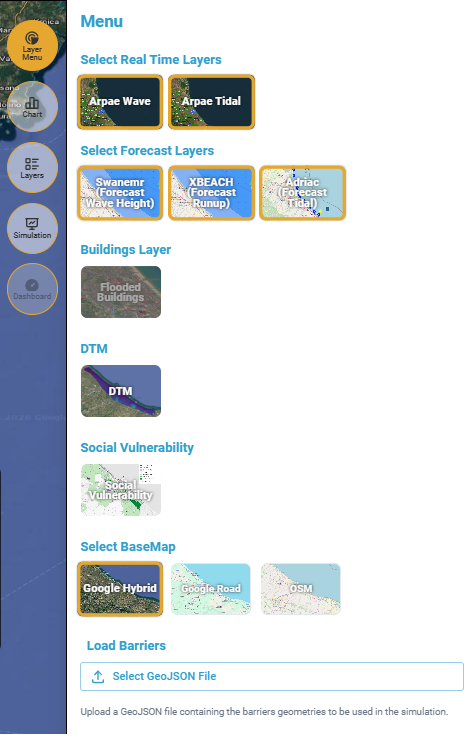<figcaption>
Layer Menu (Coastal)
</figcaption></figure>

**1) Select Real Time Layer**

L’utente può scegliere tra diverse fonti di dati, per lo scenario in tempo reale (Real Time):

* **Arpae Wave**: dato fornito da Arpae sul moto ondoso, nello specifico l'altezza dell'onda rilevata dalla boa onda-metrica Nausicaa2 di _Arpae_ Emilia-Romagna, installata al largo di Cesenatico.
* **Arpae Tidal**: dato fornito da Arpae relativo alle maree, nello specifico il livello del mare rilevato dal mareografo situato a Porto Garibaldi in provincia di Ferrara.

**2) Select Forecast Layers**

L’utente può scegliere tra diverse fonti di dati, per lo scenario previsionale (Forecast):

* **Swanemr (Forecast Wave Height):** dato previsionale relativo all'altezza dell'onda (nello stesso punto dei dati Adriatic) e alla direzione dell'onda
* **XBEACH (Run-UP Forecast)**: dato previsionale del parametro "Run-UP", che è un parametro usato nell’idraulica marittima  che descrive l’altezza massima raggiunta dall’acqua lungo una superficie inclinata (spiaggia, scogliera, diga, ecc.) rispetto al livello medio del mare, in relazione alle caratteristiche dell’onda incidente (wave).
* **Adriac (Forecast Tidal):** dato previsionale relativo al livello del mare.

**3) Building Layer**

Funzione che consente di visualizzare gli edifici vulnerabili e si attiva solo dopo aver effettuato una simulazione

**4) DTM**

Consente di visualizzare il DTM ad alta risoluzione (2m) della zona costiera per tutta la provincia di Rimini. Di default tale layer risulta spento, ma può essere acceso dal tool in "Layer menù".

**5) Social Vulnerability**

Consente di visualizzare una mappa di "**Social Vulnerability**" che rappresenta la distribuzione spaziale dell’indice di vulnerabilità sociale (Social Vulnerability Index) per l’area di Rimini.&#x20;

Il territorio è suddiviso in **poligoni (unità territoriali),** ciascuno colorato secondo una **scala qualitativa**, che indica il grado di vulnerabilità della popolazione residente:

* Le aree in **verde** indicano zone con popolazione meno vulnerabile (maggiore resilienza socio-economica)
* Le aree in **viola** evidenziano zone con **maggiore fragilità sociale**, dove gli impatti di eventi critici (es. incendi) possono essere più gravi
* Le aree in **grigio** rappresentano condizioni medie

Questa mappa permette di:

* Integrare le informazioni ambientali (es. inondazioni, allagamenti) con dati **socio-demografici**
* Identificare le **aree più esposte dal punto di vista sociale**
* Supportare decisioni operative e pianificazione di emergenza, dando priorità alle zone più vulnerabili.&#x20;

**6) Select BaseMap**

Consente di scegliere il layer di base tra:

* _Google Hybrid_: mappa satellitare
* _Google Road_: mappa stradale senza immagini satellitari
* _OSM_: mappa standard di OpenStreetMap

**7) Load Barrier**

Consente di caricare un file **GeoJSON** contenente le geometrie delle barriere da utilizzare nella simulazione.

Layer Menu (Fire)

**(per lo scenario&#x20;**_**Fire**_**)**

Questa sezione consente di selezionare la fonte di dati informativi per le analisi (es. direzione e intensità del vento, la mappa della **classificazione dell’uso del suolo** e della **distribuzione spaziale dei combustibili** presenti sul territorio) e il tipo di mappa di base per migliorare la leggibilità e l’analisi del dato.

Le sezioni del **Layer Menu** sono cinque:

<figure><figcaption>
Layer Menu (Fire)
</figcaption></figure>

**1) Select Layer Real Time**

Al momento sono disponibili solo i dati puntuali misurati da ARPAE: corrisponde alla visualizzazione del campo di vento (direzione e intensità), mostrato sulla mappa tramite vettori (frecce) e codifica a colori.

**2) Select Forecast Layer**

Al momento è disponibile solo il layer previsionale **icon2i\_wind** del modello tedesco ICON: corrisponde alla visualizzazione del campo di vento (direzione e intensità), mostrato sulla mappa tramite vettori (frecce) e codifica a colori.

**3) Land Use/Fuel Map provider**

Consente di visualizzare la mappa della **classificazione dell’uso del suolo** nel territorio, che suddivide l’area in diverse categorie di copertura e utilizzo del suolo (agricolo, naturale, forestale, ecc.).scegliendo tra i vari fornitori di dati disponibili:

* Emilia Romagna Antincendio Boschivo (AIB)
* Emilia Romagna Region (RER)
* European Space Agency (ESA)
* Fuel Difference Built-up Vegetation Index (FBVI)

**4) Select Fuel Map provider**

Consente di visualizzare la mappa della **distribuzione spaziale dei combustibili** presenti sul territorio, ovvero i tipi di vegetazione e copertura del suolo che possono alimentare l’incendio, da aree non combustibili (es. acqua, aree urbanizzate) a vegetazione combustibile più densa e complessa, ed è direttamente correlata alla mappa dell'uso del suolo:

* Emilia Romagna Antincendio Boschivo (AIB)
* Emilia Romagna Region (RER)
* European Space Agency (ESA)
* Fuel Difference Built-up Vegetation Index (FBVI)

**5) Select BaseMap**

Consente di scegliere il layer di base tra:

* _Google Hybrid_: mappa satellitare
* _Google Road_: mappa stradale senza immagini satellitari
* _OSM_: mappa standard di OpenStreetMap

Chart (Pluvial Real Time e Forecast)

**(per gli Scenari Pluvial&#x20;**_**Real Time e Forecast**_**)**

Permette di visualizzare un grafico che riporta:

* &#x20;sia i valori istantanei di precipitazione rilevati dal radar meteorologico che i valori di precipitazione cumulata in funzione del tempo (scegliendo in alto il periodo di accumulo in ore) per un punto selezionato sulla mappa (tramite strumento "_Identify_" presente nel lato sinistro dell' [area-di-mappatura.md](area-di-mappatura.md "mention"));&#x20;
* sia i valori di precipitazione misurati da un pluviometro che i valori di precipitazione cumulata (scegliendo in alto il periodo di accumulo in ore) in funzione del tempo, per un pluviometro selezionato sulla mappa (tramite strumento "_Feature Select_" presente nel lato sinistro dell' [area-di-mappatura.md](area-di-mappatura.md "mention")).


è possibile selezionare solo un punto sulla mappa e solo un pluviometro alla volta.\
Non è possibile selezionare più punti o più pluviometri contemporaneamente.


<figure>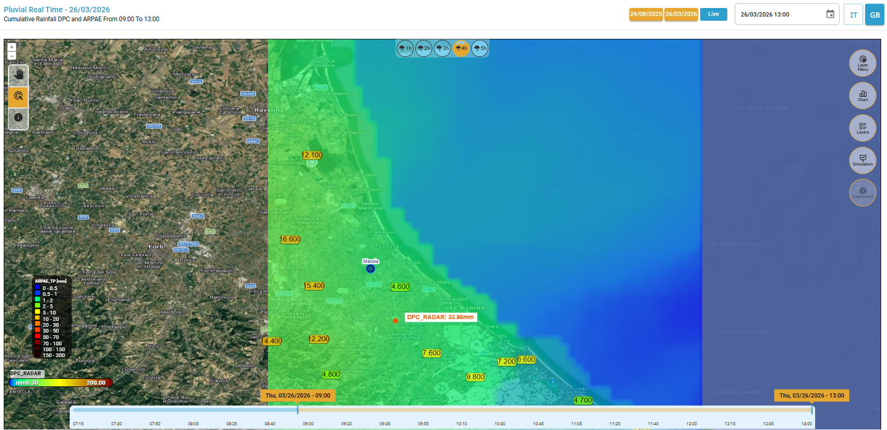<figcaption>
Selezione di un punto (in arancione perché riferito a una pioggia cumulata di 4h) sulla mappa e di un pluviometro (compare il nome in blu: Mesola)
</figcaption></figure>

<figure>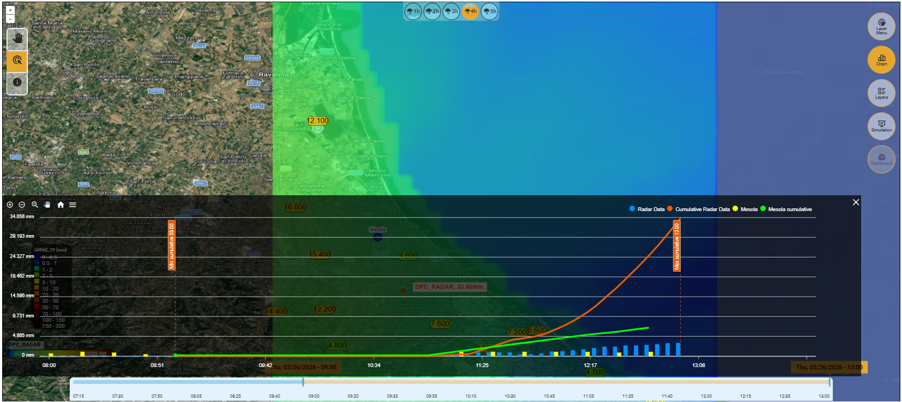<figcaption>
Grafico dei valori di precipitazione per un punto della mappa (azzurro: valore ogni 5 minuti, arancione: valore cumulato) e per un pluviometro (giallo: valore ogni 15 minuti), verde: valore cumulato)
</figcaption></figure>

**Elementi del grafico**:

* Asse verticale: millimetri di pioggia (mm);
* Asse orizzontale: intervallo temporale (minuti);
* <mark style="color:$primary;">Istogrammi azzurri:</mark> valori (in mm) rilevati dal **radar** in quel punto con passo temporale di 5 minuti;
* <mark style="color:$warning;">Linea arancione</mark>: valore massimo cumulato nella data e ora selezionata per il **radar** nel punto selezionato;
* <mark style="color:yellow;">Istogrammi gialli</mark>: valori (in mm) rilevati dal **pluviometro** selezionato con passo temporale di 15 minuti;
* <mark style="color:$success;">Linea verde</mark>: valore massimo cumulato nella data e ora selezionata per il **pluviometro** selezionato;
* Strumenti di navigazione del grafico: zoom in, zoom out, zoom selettivo (_Selection zoom_), spostare la vista (_panning_), resettare lo zoom a quello iniziare (_reset zo&#x6F;_&#x6D;) e menù (per scaricare il grafico in formato svg, png e csv).

<figure><figcaption>
Strumenti di navigazione del grafico
</figcaption></figure>

* Pulsante di chiusura in alto a destra per tornare all'ambiente di mappatura.


posizionando il cursore sul grafico è possibile leggere i dati raffigurati


<figure>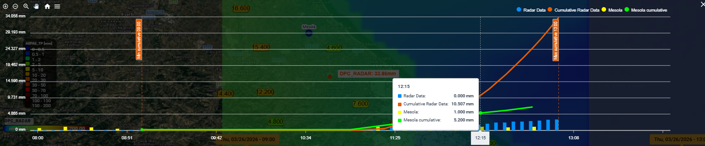<figcaption></figcaption></figure>


Cliccando sulla legenda in alto a destra è possibile spegnere/accendere gli elementi visualizzati


<figure>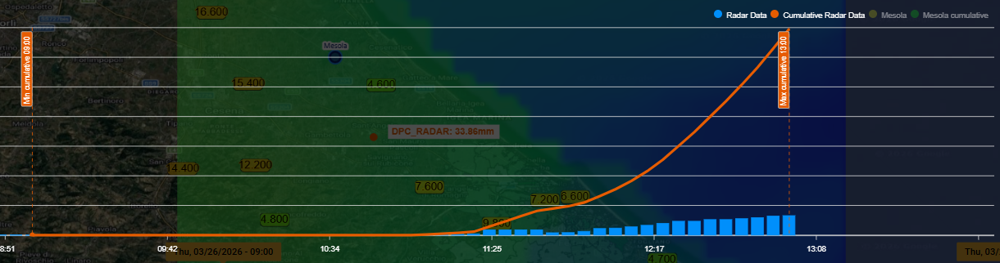<figcaption></figcaption></figure> <figure>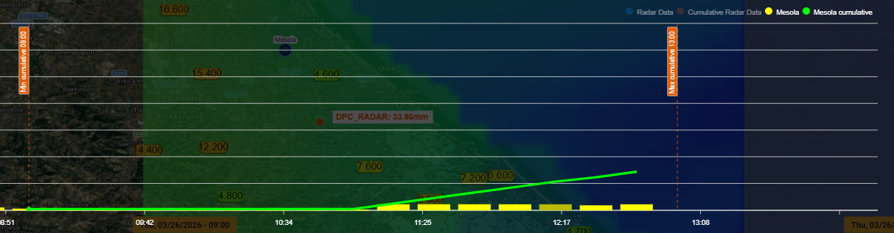<figcaption></figcaption></figure>

Chart (Coastal)

**(per lo scenario&#x20;**_**Coastal Real Time + Forecast**_**)**

Permette di visualizzare un grafico che riporta sia i valori del livello del mare (_tidal_) che i dati relativi all'altezza dell'onda (_wave_).


Aprendo il grafico, di defaul vengono visualizzati di default i dati ARPAE Wave e Tidal Real Time.


<figure><figcaption>
Grafico dei dati di default: valori di altezza dell'onda e delle maree (Real Time)
</figcaption></figure>

Selezionando (tramite lo strumento _"Single Feature Select"_ o _"Multiple Feature Select"_) altre tipologie di dati,) è possibile visualizzare, oltre ai dati osservati, anche i dati previsionali: sia relativi alle previsioni future sia alle previsioni storiche elaborate in passato.

Lo strumento **"Single Feature Select"** consente di selezionare manualmente un punto per ciascuna tipologia di dato disponibile (un punto **Wave**, un punto **Tidal** e un punto **Runup**), anche se i punti non sono adiacenti tra loro. I dati dei punti selezionati vengono quindi visualizzati nel grafico per consentirne il confronto.


Per visualizzare i dati selezionati con lo strumento "_Single Feature Select_" è necessario prima selezionare i dati e poi aprire il grafico selezionando il Tool "_Chart_" della barra laterale destra


<figure><figcaption>
Grafico dei valori di <em>wave, tidal</em> e <em>runup</em> (<em>real time e forecast) - Single Feature Select</em> 
</figcaption></figure>

Lo strumento **"Multiple Feature Select"** consente di disegnare un'area di selezione sulla mappa. Al termine della selezione, il sistema individua automaticamente un punto per ciascuna tipologia di dato disponibile (un punto **Wave**, un punto **Tidal** e un punto **Runup**), i cui dati vengono visualizzati nel grafico.

Qualora all'interno dell'area selezionata siano presenti più punti appartenenti alla stessa tipologia di dato, il sistema visualizza nel grafico esclusivamente i dati relativi al punto ubicato più a sud-est.

<figure><figcaption>
Grafico dei valori di <em>wave, tidal</em> e <em>runup</em> (<em>real time e forecast) - Multiple Feature Select</em>
</figcaption></figure>


Dopo aver definito l'area di selezione mediante lo strumento **"Multiple Feature Select"**, il sistema apre automaticamente il grafico che visualizza i dati delle stazioni ricadenti all'interno dell'area selezionata



Il **tag**, ossia la finestra di riepilogo dei parametri e dei relativi valori, si aggiorna in corrispondenza di ciascun istante temporale (identificato da una linea verticale tratteggiata, più sottile rispetto a quella che indica l'orario della simulazione, più spesse e che rimane fissa). Il Tag riepilogativo mantiene una posizione fissa nell'angolo superiore sinistro del grafico, indipendentemente dallo spostamento nel tempo.


<figure><figcaption>
Tag fisso in alto a sinistra
</figcaption></figure>

**Elementi del grafico (con dati a partire dal 12 giugno 2026)**

* Asse verticale: altezza (m);
* Asse orizzontale: intervallo temporale (minuti);
* Linea bianca orizzontale corrispondente a 0 m&#x20;
* linee tratteggiate orizzontali ogni 0.2 m
* Linea bianca tratteggiata verticale corrispondente all'ora della simulazione
* <mark style="color:$primary;">Tidal RT</mark>: in azzurro i dati rilevati in tempo reale dalla stazione Porto Garibaldi per il livello del mare;
* <mark style="color:yellow;">Wave RT</mark>: in giallo i dati di altezza dell'onda rilevati in tempo reale dalla boa onda-metrica Nausicaa2;
* <mark style="color:cyan;">Tidal Forecast</mark> (PAST/FUTURE): in celeste chiaro i dati previsionali storici e futuri (rispetto all'orario della simulazione) di una delle stazioni Adriac selezionate;
* <mark style="color:$warning;">Wave Forecast</mark> (PAST/FUTURE): in arancione dati previsionali storici e futuri (rispetto all'orario della simulazione) di una delle stazioni WW3 selezionate;
* <mark style="color:$success;">Runup XBEACH</mark> (PAST/FUTURE): in verde chiaro i valori di run-up previsionali storici e futuri (rispetto all'orario della simulazione)&#x20;
* Strumenti di navigazione del grafico: zoom in, zoom out, zoom selettivo (_Selection zoom_), spostare la vista (_panning_), resettare lo zoom a quello iniziare (_reset zoom_) e menù (per scaricare il grafico in formato svg, png e csv);

<figure><figcaption>
Strumenti di navigazione del grafico
</figcaption></figure>

* Pulsante di chiusura in alto a destra per tornare all'ambiente di mappatura.

Si precisa che per i **dati antecedenti al 12 giugno 2026** saranno presenti due layer distinti tra i dati di previsione storici (del periodo antecedente alla simulazione) e quelli previsionali futuri. Gli elementi del grafico saranno gli stessi ad eccezione di Tidal Forecast, Wave Forecast e Runup XBEACH così suddivisi:

* Tidal Forecast (FUTURE): in verde petrolio i dati forecast previsionali (futuri) di una delle stazioni Adriac selezionate;
* Wave Forecast (PAST): in arancione i dati forecast previsionali storici (del periodo antecedente alla simulazione) di una delle stazioni WW3 selezionate;
* Wave forecast (FUTURE): in rosso i dati forecast previsionali (futuri) di una delle stazioni WW3 selezionate;
* Runup XBEACH (PAST): in verde chiaro i valori di run-up previsionali storici, derivanti da simulazioni passate (nel periodo antecedente la simulazione)
* Runup XBEACH (FUTURE): in verde scuro i valori previsionali futuri di run-up.


#### Modalità di visualizzazione dei dati

La visualizzazione di ciascun elemento nel grafico dipende dalla selezione effettuata tramite lo strumento "_Single Feature Select_" o "_Multiple Feature Select_".

Ogni dato selezionato viene visualizzato in modo indipendente dagli altri.\
**Gli elementi rimangono sempre attivi nel grafico fino alla selezione di un nuovo elemento** appartenente alla **stessa tipologia di dato** (_wave_ oppure _run-up_)

Ad esempio:

* selezionando un nuovo elemento di **Wave Forecast**, e posizionando lo _slider_ temporale sia nel passato che nel futuro, la precedente linea _Wave Forecast_ viene sostituita;
* la selezione di un dato di **Run-up XBEACH** non modifica invece le linee visualizzate relative ai dati _wave_ passati e futuri.

Questo comportamento consente di confrontare contemporaneamente dati _real time_, _forecast_ passati e _forecast_ futuri mantenendo separate le diverse categorie informative.


Simulation

Permette di avviare una simulazione di allagamento in base ai dati selezionati.

**Scenario Pluviale**&#x20;

<figure><figcaption>
Scenario Pluviale Real Time - Strumento per avviare una simulazione di allagamento
</figcaption></figure>

<figure>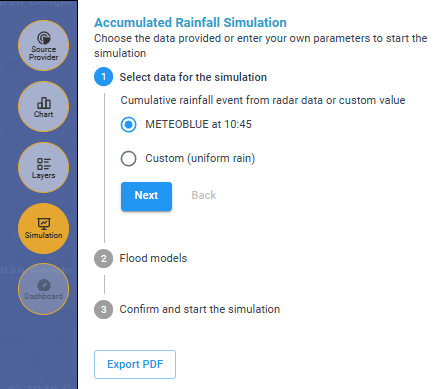<figcaption>
Scenario Pluviale Forecast - Strumento per avviare una simulazione di allagamento
</figcaption></figure>

**Flusso di lavoro:**

1. _**Select data for the simulation (Seleziona i dati per la simulazione)**_ – consente di selezionare i dati per la simulazione:
   * \[Provider selezionato] at \[ora]: utilizza il dato selezionato all'ora selezionata
   * Custom (uniform rain): permette di impostare manualmente un valore uniforme di pioggia (mm) per una certa durata (h)
2. _**Flood models**_ _**(Modelli di allagamento)**_ – permette di scegliere il modello di calcolo per le simulazioni tra SaferPlaces e UNTRIM
3. _**Confirm and start the simulation (Conferma e avvia la simulazione)**_ – avvia il calcolo del modello di allagamento.


**Output**: possibilità di esportare il risultato in PDF tramite il pulsante "Export PDF".



Per informazioni di dettaglio sulle simulazioni:\
[scenario-pluvial-real-time.md](../simulazioni-allagamento-pericolo-e-danno/definizione-scenario/scenario-pluvial-real-time.md "mention")\
[scenario-pluvial-forecast.md](../simulazioni-allagamento-pericolo-e-danno/definizione-scenario/scenario-pluvial-forecast.md "mention")


**Scenario Costiero**

<figure>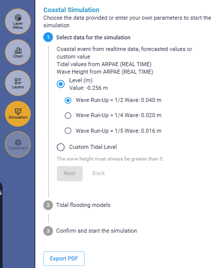<figcaption>
Scenario Costiero - Strumento per avviare una simulazione di allagamento
</figcaption></figure>

**Flusso di lavoro:**

1. _**Select data for the simulation**_ _**(Seleziona i dati per la simulazione)**_ – consente di selezionare i dati per la simulazione:
   * Level (m) Valute: utilizza il dato di livello del mare (_Tidal_) finora selezionato all'ora selezionata (come visualizzato nel _Wave Chart_) a cui viene aggiunta l'altezza d'onda (Wave) secondo tre modalità (1/2, 1/4 e 1/5)
   * Custom (Tidal Level): permette di impostare manualmente un valore uniforme di altezza massima dell'onda in metri.
2. _**Tidal Flooding models**_ _**(Modelli di allagamento da marea)**_ – permette di scegliere il modello di allagamento per le simulazioni tra SaferPlaces e UNTRIM. \
   Nel modello SaferPlaces è possibile considerare o meno l'effetto della pendenza della costa, scegliendo di spuntare o meno il parametro morfologico Cotg(B).
3. _**Confirm and start the simulation**_ _**(Conferma e avvia la simulazione)**_ – avvia il calcolo del modello di allagamento.


**Output**: possibilità di esportare il risultato in PDF tramite il pulsante "Export PDF".



Per informazioni di dettaglio sulle simulazioni:\
[scenario-coastal-real-time-+-forecast.md](../simulazioni-allagamento-pericolo-e-danno/definizione-scenario/scenario-coastal-real-time-+-forecast.md "mention")


**Scenario di Propagazione di un incendio**

<figure>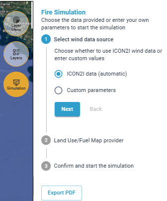<figcaption>
Strumento per avviare una simulazione incendio con dati di input da ICON2I
</figcaption></figure> <figure>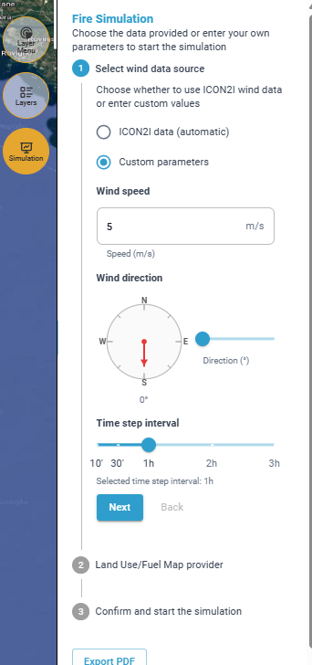<figcaption>
Strumento per avviare una simulazione incendio con dati di direzione e velocità del vento personalizzati
</figcaption></figure>

**Flusso di lavoro:**

1. _**Select wind data source (Seleziona sorgente dati vento)**_ – consente di selezionare i dati di input di vento tra:
   * dati del provider (ICON2I data - _automatic_)
   * dati personalizzati (_Custom parameters_) con la possibilità di inserire manualmente:\
     &#x20;\- la velocità (_Wind speed_), \
     &#x20;\- la direzione del vento (_Wind direction_) e \
     &#x20;\- l'intervallo in cui verranno visualizzati i risultati (_Time step Interval_).
2. _**Land Use/Fuel Map provider (Uso del suolo e Mappa combustibile)**_ – consente di selezionare il fornitore di dati sull'uso del suolo e relativa mappa combustibile tra:&#x20;
   * Attività Incendi Boschivi (Civil Protection RER - AIB)
   * Emilia Romagna Region (RER)
   * European Space Agency (ESA)
   * Fuel Difference Built-up Vegetation Index (FBVI)
3. _**Confirm and start the simulation**_ – avvia il calcolo del modello di allagamento. Si aprirà anche un pannello che riassume tutte le ipotesi di input (data e ora della simulazione, durata della simulazione, orario di partenza e orario di fine simulazione, coordinate del punto d'innesco, fornitore del dato di uso del suolo, direzione e velocità del vento, intervallo di tempo solo per i dati Custom).


**Output**: possibilità di esportare il risultato in PDF tramite il pulsante Export PDF.



Per informazioni di dettaglio sulle simulazioni:

[scenario-fire.md](../simulazioni-allagamento-pericolo-e-danno/definizione-scenario/scenario-fire.md "mention")


Layers

Consente la gestione avanzata dei layer visualizzati nell'area centrale di mappatura e la visualizzazione delle relative legende di ciascun layer.

<figure>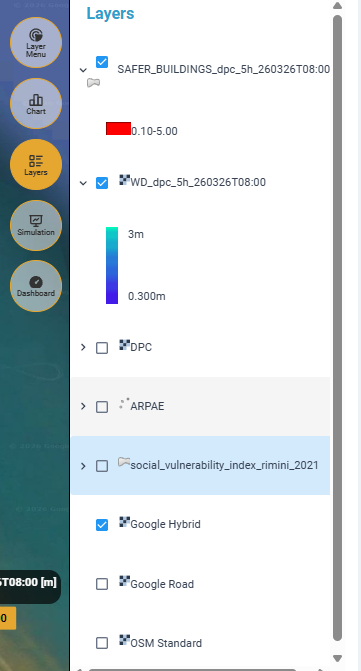<figcaption>
accensione/spegnimento dei Layer presenti nella mappa e visualizzazione della legenda
</figcaption></figure>

**Esempio degli elementi presenti nella sezione Layers:**

* Elenco dei layer attivi con checkbox per attivazione/disattivazione. Ad esempio, per lo scenario pluviale real time:
  * **SAFER\_BUILDINGS**: edifici caratterizzati da un allagamento superiore a 0.05 m (colorati in rosso);
  * _**WD (WATER\_DEPTH)**:_ layer risultato delle simulazioni di allagamento, con legenda a gradiente (0.3 a 3 m);
  * _**DPC**_: layer di pioggia radar con legenda a gradiente (da 0.1 mm a 200 mm);
  * _**ARPAE:**_ layer dei pluviometri ARPAE con legenda con valori discreti compresi tra 0 e 200 mm;
  * _**Social\_Vulnerability\_index\_Rimini\_2021**_: layer con la carta della vulnerabilità di Rimini con legenda con una **scala qualitativa**, da verde a viola, che indica il grado di vulnerabilità della popolazione residente;
  * _**Google Hybrid**_**,&#x20;**_**Google Road**_**,&#x20;**_**OSM Standard**_: layer di base.
* Per lo scenario costiero sono presenti anche i layer delle misure di mitigazione (barriere) e del DTM della costa.
* Tutti i layer hanno una legenda cromatica (per interpretare i valori dei risultati delle simulazioni di allagamento e i valori del radar).
* Cliccando con il tasto destro del mouse su un determinato layer si apre una finestra con tutte le azioni possibili, come zoomare su quel layer, cambiarne la trasparenza ed esportalo. Tutti i file saranno esportati nel sistema di riferimento EPSG 4326.

<figure><figcaption></figcaption></figure>

<figure><figcaption>
Mappa centrale e Layer attivi con relativa legenda
</figcaption></figure>

Dashboard

Lo strumento Dashboard si attiva solo dopo aver effettuato una simulazione di allagamento (pluviale o costiero).

Selezionando lo strumento **Dashboard**, si apre un pannello laterale destro che riepiloga, con una vista sintetica e interattiva, **impatti previsti o rilevati** in seguito a un evento alluvionale. &#x20;

È pensato per supportare rapidamente la valutazione dei danni potenziali e la definizione delle priorità di intervento.

Il Dashboard evidenzia il numero e il tipo di **strutture/elementi sensibili esposti** e consente di controllare quali strutture vengano considerate “allagate” tramite una **soglia di altezza d’acqua (Wd thresh)** che può essere regolata dall'utente.

Nella parte alta del pannello sono presenti due controlli:

* **Flood Levels**\
  Gestisce la visualizzazione delle informazioni sul livello di allagamento (profondità/altezza d’acqua) per ciascun tipo di struttura allagata in funzione della soglia di altezza dell'acqua _(Wd thresh)_ impostata.
* **Flooded facilities**\
  Gestisce la visualizzazione delle strutture classificate come allagate, sempre in funzione della soglia di altezza dell'acqua _(Wd thresh)_ impostata.


è inoltre presente la funzione "**Download Building Stats(.csv**)" che permette di **esportare l'elenco degli edifici**, in formato .csv, completo di tutte le seguenti caratteristiche:

* category (macro categoria di classificazione degli edifici che saranno poi riportate nella dashboard)
* id (numero identificativo univoco dell'edificio)
* subtype (definizione di dettaglio della categoria)
* class
* height\_m (Altezza edificio)
* is\_flooded (se è allagato o meno nella simulazione),
* is\_underground (se è presente o meno il piano interrato),
* flood\_wd\_min\_m (Water depth minima)
* flood\_wd\_mean\_m (Water depth media)
* flood\_wd\_max\_m (Water depth massima)
* lon, lat (coordinate dell'edificio)


<figure><figcaption>
Dashboard che mostra il livello di allagamento
</figcaption></figure> <figure><figcaption>
Dashboard che visualizza le strutture classificate come allagate
</figcaption></figure>

**Contenuti principali della Dashboard**

*   **Categorie di elementi sensibili**\
    Ogni riga rappresenta una categoria di elementi sensibili esposti, ad esempio:

    Agricultural → Agricolo

    Civic → Civico

    Commercial → Commerciale

    Education → Istruzione

    Entertainment → Intrattenimento

    Industrial → Industriale

    Medical → Sanitario

    Military → Militare

    Other → Altro

    Outbuilding → Annesso (edificio accessorio)

    Religious → Religioso

    Residential → Residenziale

    Service → Servizi

    Transportation → Trasporti

    _(L’elenco può variare in base ai dati disponibili per l’area analizzata)._
* **Informazioni sugli impatti**\
  Accanto al nome della categoria è indicato il numero di strutture coinvolte nell’evento o il valore medio del livello dell'acqua (es. _Flooded facilities: 54_ oppure _Mean water height: 0.8 m)_.
* **Barra colorata con scala di valori**\
  Ogni categoria è associata a una barra orizzontale che mostra:
  * Valore minimo e massimo della scala (es. numero di strutture presenti dell'area).
  * Indicatore puntuale (pallino) che segnala il livello rilevato/previsto per quella categoria.
  * Codifica cromatica **verde-giallo-rosso** per indicare la gravità (da bassa a elevata).

**Funzioni operative:**

* **Valutazione rapida degli impatti**: le barre colorate consentono di identificare immediatamente le categorie più colpite.
* **Supporto decisionale**: queste informazioni possono essere utilizzate per:
  * Pianificare evacuazioni mirate.
  * Assegnare priorità agli interventi di soccorso.
  * Stimare rapidamente i danni per categoria di struttura.
* **Possibilità di esportare l'elenco degli edifici**, completo di tutte le caratteristiche

