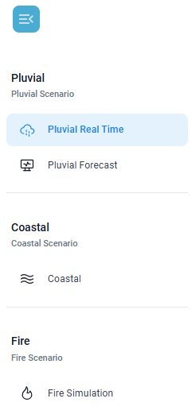

# Barra Laterale Sinistra

Questa sezione permette di selezionare lo scenario desiderato tra:

**Scenario Pluviale&#x20;**_**(Pluvial Scenario)**_

* analisi in tempo reale _(Pluvial Real Time)_&#x20;
* analisi in modalità predittiva _(Pluvial Forecast)_

**Scenario Costiero&#x20;**_**(Coastal Scenario)**_

* analisi in tempo reale e in modalità predittiva (_Coastal_)

**Scenario Incendio&#x20;**_**(Fire Scenario)**_

* analisi n tempo reale e previsionale di propagazione di un incendio (_Fire Simulation_)

<figure><figcaption></figcaption></figure> <figure><figcaption></figcaption></figure>

<table><thead><tr><th width="241">Icona</th><th>Descrizione</th></tr></thead><tbody><tr><td>
<figure><figcaption></figcaption></figure>
</td><td>Icona menù (in alto a sinistra) che permette di aprire/chiudere la barra laterale sinistra.</td></tr><tr><td>
<figure><figcaption></figcaption></figure>
</td><td>Visualizza i dati radar e delle stazioni pluviometriche per analisi immediate della situazione.</td></tr><tr><td>
<figure><figcaption></figcaption></figure>
</td><td>Mostra i dati di pioggia basati su modelli previsionali, per anticipare l’evoluzione delle precipitazioni.</td></tr><tr><td></td><td>Consente di visualizzare sia dati in tempo reale su onde e maree per analisi immediate, che dati previsionali per anticipare l'evoluzione di eventi futuri.</td></tr><tr><td></td><td>Visualizza i valori in tempo reale o una mappa previsionale di direzione e intensità del vento che influenzeranno la propagazione dell'incendio nell'area di interesse.</td></tr></tbody></table>
