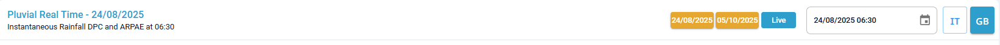
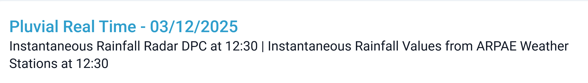
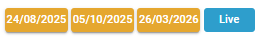
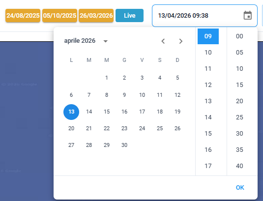
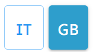

# Barra Superiore

Nella barra superiore sono presenti diversi elementi:

1. A sinistra il **titolo dello scenario** e la **data**, insieme alla **fonte e all'ora di riferimento** dei dati visualizzati.
2. Sulla destra pulsanti rapidi per accedere alla **modalità storica** (dove sono salvate date di eventi passati rilevanti) o alla **modalità "Live"**.
3. Più a destra il **calendario**, con un selettore di data/ora che consente di navigare nel tempo.
4. All'estrema destra la **scelta della lingua** tra IT (italiano) e GB (inglese)

<figure><figcaption></figcaption></figure>

Elementi della barra superiore:

Titolo dello scenario e la data/ora di riferimento

<figure><figcaption></figcaption></figure>

Pulsanti rapidi

<figure><figcaption></figcaption></figure>

Calendario

<figure><figcaption></figcaption></figure>

Lingua

<figure><figcaption></figcaption></figure>

