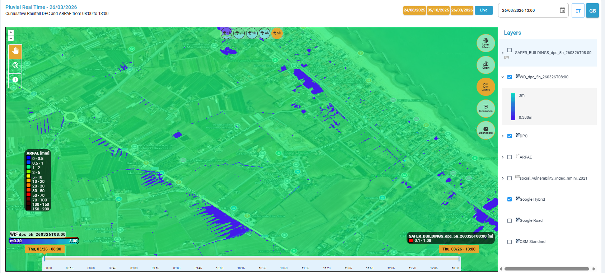
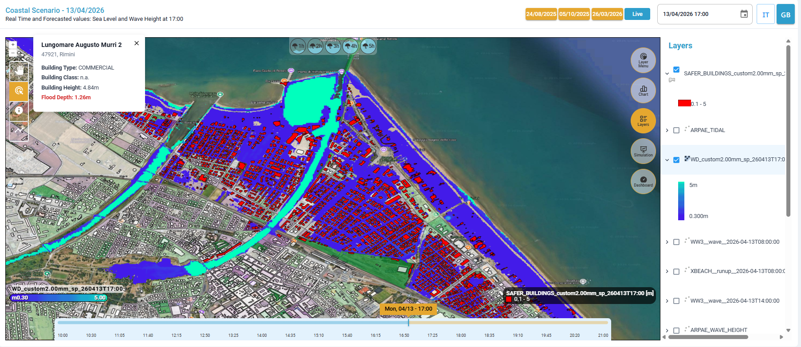
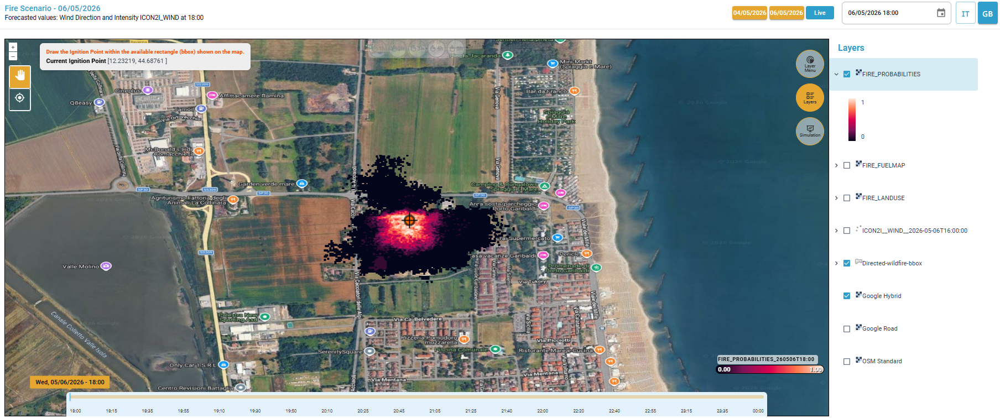
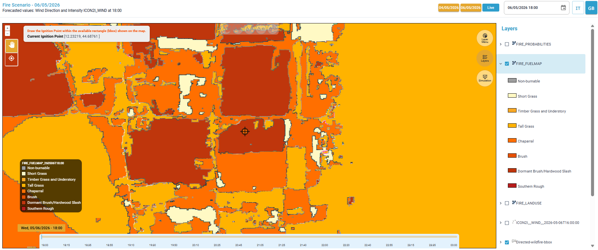
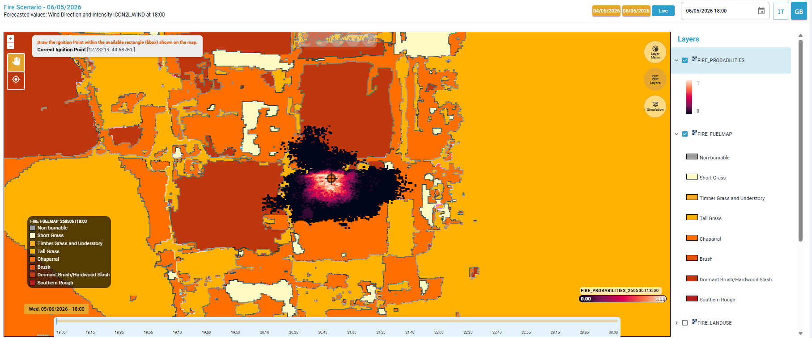
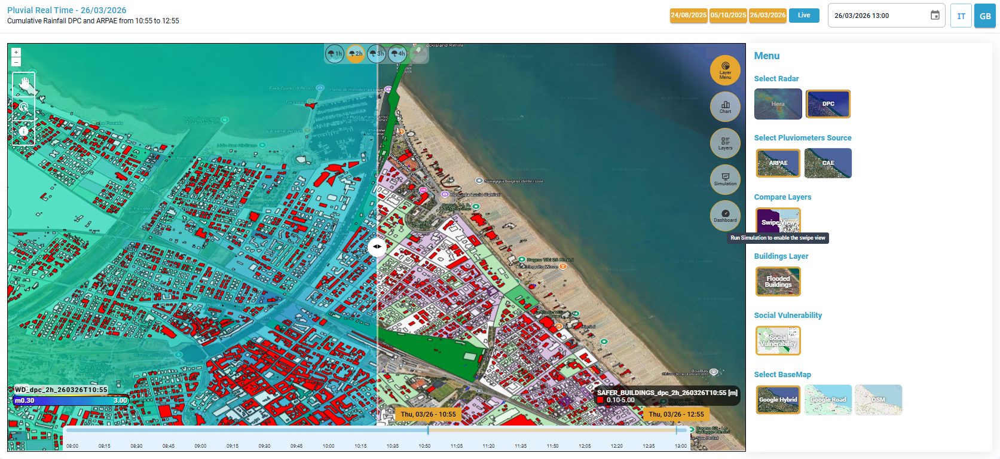
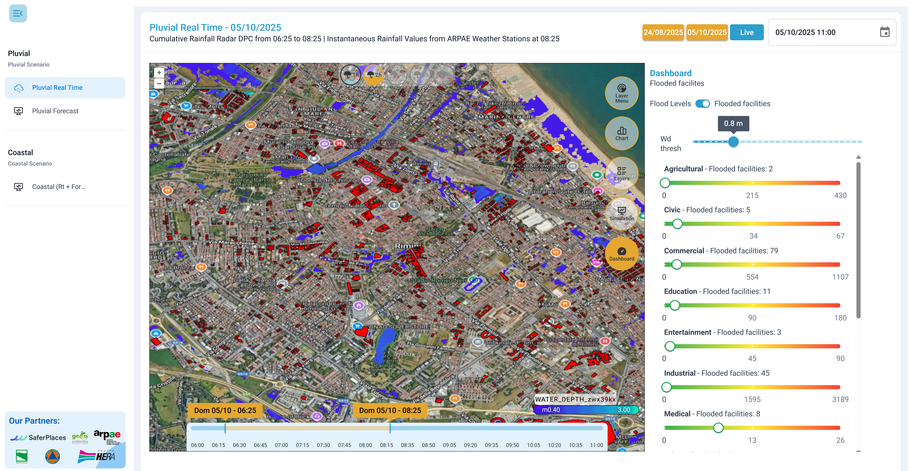

# 🛠️ Visualizzazione dei risultati

In pochi minuti, dopo aver avviato la simulazione, l'utente potrà visualizzare i risultati direttamente nell'ambiente centrale di mappatura e nella sezione [#layers](../interfaccia-gui-web/barra-laterale-destra.md#layers "mention").


é possibile scaricare gli output generati come file PDF cliccando sul tasto "_Export PDF_" (Esporta PDF) nella sezione [#simulation](../interfaccia-gui-web/barra-laterale-destra.md#simulation "mention")

.png>)

Oppure è possibile scaricare  (in formato .tif o shape file) tramite la funzione "_Export_", cliccando con il tasto destro su ogni singolo layer presente nella sezione [#layers](../interfaccia-gui-web/barra-laterale-destra.md#layers "mention").



Layers: WD (WATER_DEPTH)

Nel pannello [#layers](../interfaccia-gui-web/barra-laterale-destra.md#layers "mention"), apparirà il layer WD (_**WATER\_DEPTH)**,_ risultato delle simulazioni di allagamento,  con legenda a gradiente:

* 0.30 a 3 m per gli scenari di pioggia [scenario-pluvial-real-time.md](../simulazioni-allagamento-pericolo-e-danno/definizione-scenario/scenario-pluvial-real-time.md "mention"), [scenario-pluvial-forecast.md](../simulazioni-allagamento-pericolo-e-danno/definizione-scenario/scenario-pluvial-forecast.md "mention"))
* 0.30 a 5 m per lo scenario costiero [scenario-coastal-real-time-+-forecast.md](../simulazioni-allagamento-pericolo-e-danno/definizione-scenario/scenario-coastal-real-time-+-forecast.md "mention")

Si tratta di un Raster GeoTiff (che è possibile scaricare nel sistema di riferimento EPSG 4326) che rappresenta sia l'estensione che la profondità dell'acqua delle aree allagate; è caratterizzato una legenda cromatica blu per interpretare i valori dei risultati delle simulazioni di allagamento da pioggia o inondazione.

<figure><figcaption>
Layer WATER_DEPTH generato come risultato delle simulazioni di allagamento
</figcaption></figure>

Cliccando sul tool "identify" e successivamente cliccando su un punto di interesse sulla mappa, è possibile visualizzare il valore della Water depth in quel punto.

<figure><figcaption>
Interrogazione puntuale dei valori della Water Depth tramite tool "identify"
</figcaption></figure>

Per gli scenari di pioggia, inoltre, è presente una legenda cromatica dal blu al rosso per interpretare i valori dei dati meteorologici ottenuti dai vari provider e poterli confrontare con i risultati delle simulazioni modellistiche di allagamento.

Layers: SAFER_BUILDING

Nel pannello [#layers](../interfaccia-gui-web/barra-laterale-destra.md#layers "mention"), apparirà il layer **SAFER\_BUILDING**_,_ risultato delle simulazioni di allagamento,  in cui sono evidenziati in rosso gli edifici interessati da un'altezza della water depth superiore a un valore soglia (definito nella dashboard, dove è possibile anche scaricare l'elenco degli edifici in formato .csv)

Si tratta di uno shape file, che è possibile scaricare nel sistema di riferimento EPSG 4326.

Selezionando il tool "feature select" e cliccando su un edificio si aprirà una finestra che descrive le caratteristiche dell'edificio stesso:

* indirizzo,
* tipologia,
* classe,
* altezza edificio,
* altezza dell'allagamento

<figure><figcaption>
Layer (WD) - SAFER BUILDING generato come risultato delle simulazioni di allagamento
</figcaption></figure>

Layers: FIRE_PROBABILITIES e FIRE_FUELMAP

Nel pannello [#layers](../interfaccia-gui-web/barra-laterale-destra.md#layers "mention") appariranno i due layer ottenuti come risultato dell'ultima simulazione effettuata, che vengono visualizzati con la relativa legenda:

**1)  FIRE\_PROBABILITIES**

Rappresenta il vero e proprio **risultato della simulazione**, ovvero la probabilità che il fuoco interessi ciascuna area del territorio.&#x20;

Si tratta di una **mappa continua di probabilità** (valori da **0 a 1**), dove ogni cella/pixel indica la probabilità che venga raggiunta dal fuoco entro l’intervallo temporale considerato.

Scala dei valori

* **Valori bassi (vicini a 0)** con colorazione (gradiente) **scuro / viola-nero** → bassa probabilità&#x20;
* **Valori alti (vicini a 1)** con colorazione (gradiente) **rosso / rosa / chiaro**→ alta probabilità&#x20;

**Interpretazione**

* Le aree più chiare e intense indicano le **zone più esposte alla propagazione**
* Tipicamente, le probabilità più alte si concentrano:
  * attorno all’**ignition point**
  * lungo le direzioni favorite dal **vento**
  * in presenza di combustibili più favorevoli

**Ruolo operativo**

Questo layer consente di:

* Identificare le **aree a rischio** nel breve periodo
* Supportare decisioni di:
  * evacuazione
  * allocazione delle risorse
  * pianificazione degli interventi

<figure><figcaption>
FIRE_PROBABILITIES: Mappa della probabilità che il fuoco interessi ciascuna area del territorio
</figcaption></figure>

**2) FIRE\_FUELMAP**

Rappresenta la **distribuzione spaziale dei combustibili** presenti sul territorio, ovvero i tipi di vegetazione e copertura del suolo che possono alimentare l’incendio.

Il territorio è suddiviso in **classi di combustibile**, ciascuna associata a un diverso comportamento al fuoco, ed ogni classe è rappresentata da un **colore specifico** (come indicato nella legenda)

Le classi incluse sono:

* **Non-burnable** → **Aree non combustibili**\
  Superfici che non possono bruciare, come corpi idrici, aree urbane, strade o suolo privo di vegetazione.
* **Short Grass** → **Erba bassa**\
  Vegetazione erbacea corta e rada, che brucia rapidamente ma con intensità generalmente limitata.
* **Timber Grass and Understory** → **Bosco con erba e sottobosco**\
  Aree forestali con presenza di erba e vegetazione bassa sotto gli alberi; possono sostenere incendi sia superficiali che più intensi.
* **Tall Grass** → **Erba alta**\
  Vegetazione erbacea più alta e densa, che favorisce una propagazione più veloce del fuoco rispetto all’erba bassa.
* **Chaparral** → **Macchia mediterranea fitta**\
  Vegetazione arbustiva densa e resinosa, tipica di ambienti secchi, altamente infiammabile e soggetta a incendi intensi.
* **Brush** → **Arbusti / cespugli**\
  Vegetazione arbustiva meno densa del chaparral, ma comunque facilmente combustibile e in grado di sostenere la propagazione del fuoco.
* **Dormant Brush / Hardwood Slash** → **Arbusti secchi / residui legnosi**\
  Materiale vegetale secco o residui di taglio (rami, tronchi), con elevata infiammabilità e capacità di generare incendi intensi.
* **Southern Rough** → **Vegetazione mista densa (tipo macchia/foresta degradata)**\
  Miscela complessa di arbusti, erba e materiale legnoso tipica di alcune aree naturali, caratterizzata da combustione irregolare e potenzialmente molto intensa.

**Interpretazione**

* Il layer descrive la **“materia prima” del fuoco**, cioè quanto e come il territorio può bruciare
* Combustibili diversi implicano:
  * **Velocità di propagazione differenti**
  * **Intensità del fuoco variabile**
  * **Comportamenti diversi (superficiale vs più intenso)**

**Ruolo nella simulazione**

È un **input fondamentale del modello**, utilizzato per calcolare:

* direzione e velocità di propagazione
* intensità dell’incendio
* interazione con vento e topografia

<figure><figcaption>
FIRE_FUELMAP: Mappa della distribuzione spaziale dei combustibili presenti sul territorio
</figcaption></figure>

<figure><figcaption>
Mappe risultato della simulazione di propagazione del fuoco (FIRE_PROBABILITIES e FIRE_FUELMAP)
</figcaption></figure>

Layers: <em>Social Vulnerability</em> (Vulnerabilità Sociale)

Nel pannello [#layers](../interfaccia-gui-web/barra-laterale-destra.md#layers "mention")è disponibile una mappa di "**Social Vulnerability**" che rappresenta la distribuzione spaziale dell’indice di vulnerabilità sociale (Social Vulnerability Index) per l’area di Rimini.

Il territorio è suddiviso in **poligoni (unità territoriali),** ciascuno colorato secondo una **scala qualitativa**, che indica il grado di vulnerabilità della popolazione residente:

* Le aree in **verde** indicano zone con popolazione meno vulnerabile (maggiore resilienza socio-economica)
* Le aree in **viola** evidenziano zone con **maggiore fragilità sociale**, dove gli impatti di eventi critici (es. incendi) possono essere più gravi
* Le aree in **grigio** rappresentano condizioni medie

Confrontare questa mappa con i risultati delle simulazioni permette di:

* Integrare le informazioni ambientali (es. precipitazioni, altezza dell'acqua delle inondazioni, vento, propagazione del fuoco) con dati **socio-demografici**
* Identificare le **aree più esposte dal punto di vista sociale**
* Supportare decisioni operative e pianificazione di emergenza, dando priorità alle zone più vulnerabili, sia per le alluvioni che per gli incendi.

<figure><figcaption>
Mappa di vulnerabilità sociale
</figcaption></figure>

<em>Compare Layers - Swipe View</em>

Nella sezione "**Compare Layers**" del [#layer-menu](../interfaccia-gui-web/barra-laterale-destra.md#layer-menu "mention") o [#source-provider](../interfaccia-gui-web/barra-laterale-destra.md#source-provider "mention"), la funzione _**Swipe View**_ consente di confrontare visivamente due layer, spostando un cursore in orizzontale sulla mappa per visualizzarli affiancati. Il pulsante _Compare Layers_ si attiva solamente se è stato generato il layer _water depth,_ risultato della simulazione.

<figure><figcaption>
Funzione Swipe View
</figcaption></figure>

<em>Dashboard</em>

Dallo strumento [#dashboard](../interfaccia-gui-web/barra-laterale-destra.md#dashboard "mention") è possibile ottenere una vista sintetica e interattiva sugli impatti previsti o rilevati in seguito a un evento pluviometrico, evidenziando il numero e il tipo di strutture/elementi sensibili allagati. Il sistema è progettato per facilitare una rapida valutazione dei danni potenziali e per aiutare a stabilire le priorità di intervento.

<figure><figcaption>
Funzione  Dashboard
</figcaption></figure>

Il Dashboard evidenzia il numero e il tipo di **strutture/elementi sensibili esposti** e consente di controllare quali strutture vengano considerate “allagate” tramite una **soglia di altezza d’acqua&#x20;**_**(Wd thresh)**_ che può essere regolata dall'utente.

Nella parte alta del pannello sono presenti due controlli:

* **Flood Levels**\
  Gestisce la visualizzazione delle informazioni sul livello di allagamento (profondità/altezza d’acqua) per ciascun tipo di struttura allagata in funzione della soglia di altezza dell'acqua _(Wd thresh)_ impostata.
* **Flooded facilities**\
  Gestisce la visualizzazione delle strutture classificate come allagate, sempre in funzione della soglia di altezza dell'acqua _(Wd thresh)_ impostata.

<figure><figcaption>
Dashboard mostra the le strutture allagate e relativa classificazione
</figcaption></figure> <figure><figcaption>
Dashboard mostra  il livello di allagamento
</figcaption></figure>

**Contenuti principali della Dashboard**

*   **Categorie di elementi sensibili**\
    Ogni riga rappresenta una categoria di elementi sensibili esposti, ad esempio:

    Agricultural → Agricolo

    Civic → Civico

    Commercial → Commerciale

    Education → Istruzione

    Entertainment → Intrattenimento

    Industrial → Industriale

    Medical → Sanitario

    Military → Militare

    Other → Altro

    Outbuilding → Annesso (edificio accessorio)

    Religious → Religioso

    Residential → Residenziale

    Service → Servizi

    Transportation → Trasporti

    _(L’elenco può variare in base ai dati disponibili per l’area analizzata)._
* **Informazioni sugli impatti**\
  Accanto al nome della categoria è indicato il numero di strutture coinvolte nell’evento o il valore medio del livello dell'acqua (es. _Flooded facilities: 54 / Mean water height: 0.8 m)_.
* **Barra colorata con scala di valori**\
  Ogni categoria è associata a una barra orizzontale che mostra:
  * Valore minimo e massimo della scala (es. numero di strutture presenti dell'area).
  * Indicatore puntuale (pallino) che segnala il livello rilevato/previsto per quella categoria.
  * Codifica cromatica **verde-giallo-rosso** per indicare la gravità (da bassa a elevata).

**Funzioni operative**

* **Valutazione rapida degli impatti**: le barre colorate consentono di identificare immediatamente le categorie più colpite.
* **Supporto decisionale**: queste informazioni possono essere utilizzate per:
  * Pianificare evacuazioni mirate.
  * Assegnare priorità agli interventi di soccorso.
  * Stimare rapidamente i danni per categoria di struttura.

{% embed url="https://files.gitbook.com/v0/b/gitbook-x-prod.appspot.com/o/spaces%2F6a3QgDGzrxeFxNcSzPJg%2Fuploads%2FLMDZTZ1BkgJjWLg71x9r%2Fswipe%20view.mp4?alt=media&token=84453936-a386-400b-9e6f-5f35b81a7d6d" %}
Confronto tra due layer (mappa di pioggia da rader e mappa di allagamento) con lo strumento Swipe View


