# 🌊 Scenario Coastal - Real Time + Forecast

#### **Procedura per la Simulazione di Allagamenti Costieri negli scenari Real Time e Forecast**

Di seguito verranno descritti i passi per eseguire una simulazione di allagamento sia per eventi in tempo reale o _Nowcasting_, che per eventi futuri o in modalità _Forecasting_.



### Selezionare Scenario _Coastal_

L'utente deve selezionare lo Scenario _Coastal_ dal menù della [barra-laterale-sinistra.md](../../interfaccia-gui-web/barra-laterale-sinistra.md "mention")

<figure>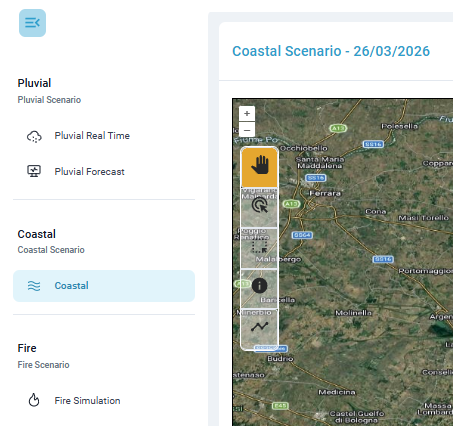<figcaption>
Scenario Costiero
</figcaption></figure>



### Definire Data e Istante Temporale di Riferimento

Il servizio dà la possibilità d'indagare sia eventi storici che eventi in tempo reale _(Live)_.

La data di interesse può essere selezionata dalla [barra-superiore.md](../../interfaccia-gui-web/barra-superiore.md "mention") con due modalità:&#x20;

1. Selezionando la data e l'ora di interesse dal **calendario** (dati meteo a disposizione con continuità a partire dal 17 luglio 2025)
2. Selezionando uno dei **pulsanti rapidi** già presenti nella barra superiore, relativi a date con eventi pluviali di riferimento (possibilità di customizzazione su richiesta dell'utente). Nel caso invece si voglia procedere con una simulazione in tempo reale basta selezionare il **pulsante&#x20;**_**Live**_.

<figure><figcaption>
Calendario, pulsanti rapidi e pulsante <em>Live</em>
</figcaption></figure>

Una volta scelta la data e l'ora, si può procedere ad una definizione più esatta dell'orizzonte temporale che sarà poi oggetto della simulazione di allagamento, utilizzando lo _slider_ della [barra-inferiore.md](../../interfaccia-gui-web/barra-inferiore.md "mention").

<figure>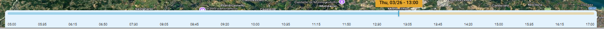<figcaption>
Slider temporale con cursore
</figcaption></figure>



### Selezione sorgente dei dati e mappe di base

Dal toolbar verticale della [barra-laterale-destra.md](../../interfaccia-gui-web/barra-laterale-destra.md "mention"), tramite [#layer-menu](../../interfaccia-gui-web/barra-laterale-destra.md#layer-menu "mention"), l'utente deve selezionare il provider di dati tra quelli disponibili. Il provider del dato può essere diverso a seconda dell'area oggetto dell'attivazione del servizio SaferCast.&#x20;

Per Rimini, l'utente può scegliere tra le seguenti fonti di dati.&#x20;

Per lo scenario in tempo reale (Select Real Time Layers):

* **Arpae Wave**: dato fornito da Arpae sul moto ondoso, nello specifico l'altezza dell'onda rilevata dalla boa onda-metrica Nausicaa2 di Arpae Emilia-Romagna, installata al largo di Cesenatico.
* **Arpae Tidal**: dato fornito da Arpae relativo alle maree, nello specifico il livello del mare rilevato dal mareografo situato a Porto Garibaldi in provincia di Ferrara.

Per lo scenario previsionale (Select Forecast Layers):

* **WW3 (Wave Forecast)**: dato previsionale relativo all'altezza dell'onda (nello stesso punto dei dati Adriatic) e alla direzione dell'onda
* **XBEACH (Run-up Forecast)**: dato previsionale del "_run-up_", un parametro usato nell’idraulica marittima che descrive l’altezza massima raggiunta dall’acqua lungo una superficie inclinata (spiaggia, scogliera, diga, ecc.) rispetto al livello medio del mare, in relazione alle caratteristiche dell’onda incidente (_wave_).
* **Adriac (Forecast Tidal):** dato previsionale relativo al livello del mare.

<figure>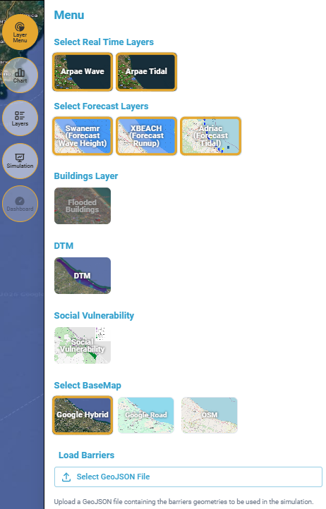<figcaption>
Layer Menu per la selezione dei dati di input per le simulazioni
</figcaption></figure>

L'utente può nello stesso menù cambiare la mappa base di riferimento (_BaseMap Google Hybrid, Google Road_ oppure _Open Street Maps_).&#x20;

Inoltre, è disponibile una mappa di "_**Social Vulnerability**_" che rappresenta la distribuzione spaziale dell’indice di vulnerabilità sociale (_Social Vulnerability Index_) per l’area di Rimini. Il territorio è suddiviso in **poligoni (unità territoriali),** ciascuno colorato secondo una **scala qualitativa**, che indica il grado di vulnerabilità della popolazione residente.

è possibile anche visualizzare il Layer del **DTM** ad alta risoluzione della costa della provincia di Rimini, tramite la funzione _DTM_.

La funzione _Buildings Layer_ rimarrà disattivata fino a che non verrà effettuata la prima simulazione di allagamento.


Un video di esempio sulla tipologia di dati disponibili è visibile [qui](https://drive.google.com/file/d/1uNOMLW2zBYSfv7YL4AkvoeWQEhilqvUa/view).




### Visualizzazione valori di altezza dell'onda e livello del mare

L'utente ha la possibilità di visualizzare i valori di altezza dell'onda e livello del mare rilevati da Arpae e quelli previsionali forniti dai provider. L’asse verticale esprime l'altezza dell'onda o del mare in metri, e l’asse orizzontale l’intervallo temporale in ore.

Attivando il pulsante [#wave-chart-coastal](../../interfaccia-gui-web/barra-laterale-destra.md#wave-chart-coastal "mention") nella [barra-laterale-destra.md](../../interfaccia-gui-web/barra-laterale-destra.md "mention"), viene visualizzato un grafico che riporta:

* i valori del **livello del mare** (_tidal_);
* i dati relativi all’**altezza dell’onda** (_wave_);
* i valori di _**run-up**_, ovvero la massima risalita verticale/orizzontale dell’onda lungo la spiaggia o una struttura costiera rispetto al livello medio del mare.


Di default, se non sono selezionati (tramite tool _"Single Feature Select"_ o _"Multiple Feature Select"_) altre tipologie di dati, il grafico mostra i dati ARPAE in tempo reale relativi:

* all’altezza dell’onda rilevata dalla boa Nausicaa (_**wave**_),
* al livello del mare (_**tidal**_).


<figure>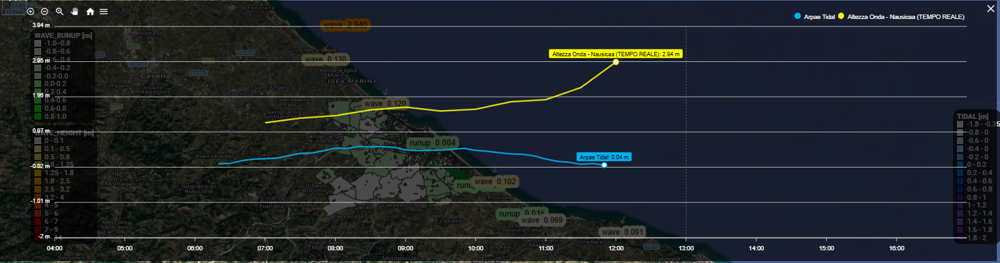<figcaption>
Grafico dei valori di altezza dell'onda e delle maree (Real Time)
</figcaption></figure>


Selezionando anche i dati **Forecast** (tramite lo strumento **"Single Feature Select"**) è possibile visualizzare, oltre ai dati osservati, anche i dati previsionali, sia relativi alle previsioni future sia alle previsioni storiche elaborate in passato.



Muovendo lo _slider_ posizionato nella parte inferiore della schermata è possibile osservare l’evoluzione dei valori nel tempo.


Lo strumento **"Single Feature Select"** consente di selezionare manualmente un punto per ciascuna tipologia di dato disponibile (un punto **Wave**, un punto **Tidal** e un punto **Runup**), anche se i punti non sono adiacenti tra loro. I dati dei punti selezionati vengono quindi visualizzati nel grafico per consentirne il confronto.


Per visualizzare i dati selezionati con lo strumento "_Single Feature Select_" è necessario prima selezionare i dati e poi aprire il grafico selezionando il Tool "_Chart_" della barra laterale destra.


<figure>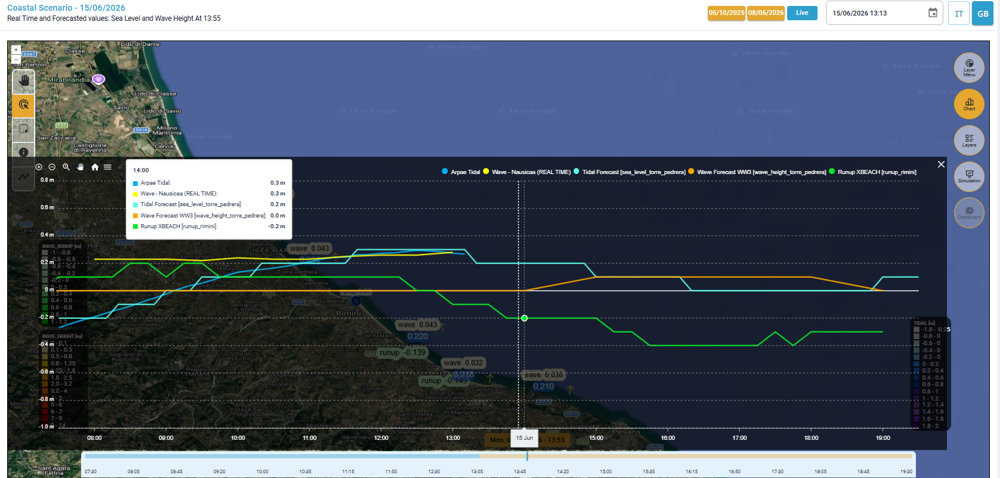<figcaption>
Grafico dei valori di <em>wave, tidal</em> e <em>runup</em> (<em>real time e forecast) - Single Feature Select</em> 
</figcaption></figure>

Lo strumento **"Multiple Feature Select"** consente di disegnare un'area di selezione sulla mappa. Al termine della selezione, il sistema individua automaticamente un punto per ciascuna tipologia di dato disponibile (un punto **Wave**, un punto **Tidal** e un punto **Runup**), i cui dati vengono visualizzati nel grafico.

Qualora all'interno dell'area selezionata siano presenti più punti appartenenti alla stessa tipologia di dato, il sistema visualizza nel grafico esclusivamente i dati relativi al punto ubicato più a sud-est.

<figure>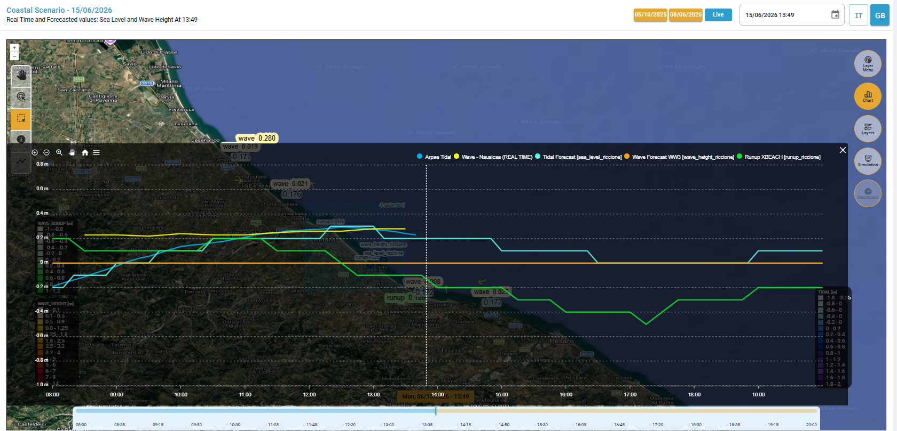<figcaption>
Grafico dei valori di <em>wave, tidal</em> e <em>runup</em> (<em>real time e forecast) - Multiple Feature Select</em>
</figcaption></figure>


Dopo aver definito l'area di selezione mediante lo strumento **"Multiple Feature Select"**, il sistema apre automaticamente il grafico che visualizza i dati delle stazioni ricadenti all'interno dell'area selezionata



Il **tag**, ossia la finestra di riepilogo dei parametri e dei relativi valori, si aggiorna in corrispondenza di ciascun intervallo temporale (identificato da una linea verticale tratteggiata, più sottile rispetto a quella che indica l'orario della simulazione), mantenendo tuttavia una posizione fissa nell'angolo superiore sinistro del grafico, indipendentemente dallo spostamento lungo la serie temporale.


<figure>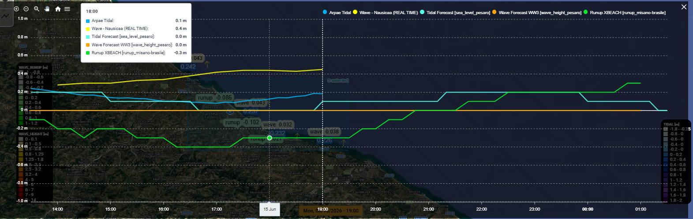<figcaption>
Tag fisso in alto a destra
</figcaption></figure>

Inoltre, in alto a sinistra sono presenti degli strumenti di navigazione del grafico che consentono di fare zoom in, zoom out, zoom selettivo (_Selection zoom_), spostare la vista (_panning_), resettare lo zoom a quello iniziare (_reset zoom_) e un menù per scaricare il grafico in formato svg, png e csv.

<figure><figcaption>
Strumenti di navigazione del grafico
</figcaption></figure>

in alto a destra è presente il pulsante di chiusura per tornare all'ambiente di mappatura.

**Elementi del grafico (con dati a partire dal 12 giugno 2026)**

* Asse verticale: altezza (m);
* Asse orizzontale: intervallo temporale (minuti);
* Linea bianca orizzontale corrispondente a 0 m&#x20;
* linee tratteggiate orizzontali ogni 0.2 m
* Linea bianca tratteggiata verticale corrispondente all'ora della simulazione
* Tidal RT: in azzurro i dati rilevati in tempo reale dalla stazione Porto Garibaldi per il livello del mare;
* Wave RT: in giallo i dati di altezza dell'onda rilevati in tempo reale dalla boa onda-metrica Nausicaa2;
* Tidal Forecast (PAST/FUTURE): in verde acqua i dati previsionali storici e futuri (rispetto all'orario della simulazione) di una delle stazioni Adriac selezionate;
* Wave Forecast (PAST/FUTURE): in arancione dati previsionali storici e futuri (rispetto all'orario della simulazione) di una delle stazioni WW3 selezionate;
* Runup XBEACH (PAST/FUTURE): in verde chiaro i valori di run-up previsionali storici e futuri (rispetto all'orario della simulazione)&#x20;

Perciò nel grafico possono essere visualizzate fino a **5 elementi differenti**, ciascuno associato a una specifica tipologia di dato, riassunti nella seguente tabella:

<table><thead><tr><th width="142.4666748046875">Colore</th><th>Descrizione</th></tr></thead><tbody><tr><td><mark style="color:blue;"><strong>Azzurro</strong></mark></td><td><strong>Arpae Tidal (REAL TIME)</strong> – livello del mare rilevato in tempo reale da Arpae</td></tr><tr><td><mark style="color:yellow;"><strong>Giallo</strong></mark></td><td><strong>Wave - Nausicaa (REAL TIME)</strong> – altezza dell’onda rilevata in tempo reale dalla boa Nausicaa di Arpae</td></tr><tr><td><mark style="color:cyan;"><strong>Verde acqua</strong></mark></td><td><strong>Tidal Forecast (PAST/ FUTURE)</strong> – previsioni sia passate che future del livello del mare</td></tr><tr><td><mark style="color:$warning;"><strong>Arancione</strong></mark></td><td><strong>Wave Forecast (PAST/ FUTURE)</strong> – previsioni sia passate che future dell’altezza dell’onda</td></tr><tr><td><mark style="color:$success;"><strong>Verde chiaro</strong></mark></td><td><strong>Runup XBEACH (PAST/ FUTURE)</strong> – valori di run-up derivanti da simulazioni passate e future</td></tr></tbody></table>

Si precisa che per i **dati antecedenti al 12 giugno 2026** saranno presenti due layer distinti tra i dati previsionali storici (del periodo antecedente alla simulazione) e quelli forecast previsionali (futuri).&#x20;

li elementi del grafico saranno gli stessi ad eccezione di Tidal Forecast, Wave Forecast e Runup XBEACH così suddivisi:

* Tidal Forecast (FUTURE): in verde petrolio i dati forecast previsionali (futuri) di una delle stazioni Adriac selezionate;
* Wave Forecast (PAST): in arancione i dati forecast previsionali storici (del periodo antecedente alla simulazione) di una delle stazioni WW3 selezionate;
* Wave forecast (FUTURE): in rosso i dati forecast previsionali (futuri) di una delle stazioni WW3 selezionate;
* Runup XBEACH (PAST): in verde chiaro i valori di run-up previsionali storici, derivanti da simulazioni passate (nel periodo antecedente la simulazione)
* Runup XBEACH (FUTURE): in verde scuro i valori previsionali futuri di run-up.

Perciò nel grafico possono essere visualizzati fino a **8 elementi differenti**, ciascuno associato a una specifica tipologia di dato.

<table><thead><tr><th width="142.4666748046875">Colore</th><th>Descrizione</th></tr></thead><tbody><tr><td></td><td><strong>Real time</strong></td></tr><tr><td><mark style="color:blue;"><strong>Blu</strong></mark></td><td><strong>Arpae Tidal (REAL TIME)</strong> – livello del mare rilevato in tempo reale da Arpae</td></tr><tr><td><mark style="color:yellow;"><strong>Giallo</strong></mark></td><td><strong>Wave - Nausicaa (REAL TIME)</strong> – altezza dell’onda rilevata in tempo reale dalla boa Nausicaa di Arpae</td></tr><tr><td></td><td><strong>Forecast</strong></td></tr><tr><td><mark style="color:$primary;"><strong>Azzurro chiaro</strong></mark></td><td><strong>Tidal Forecast (PAST)</strong> – previsioni passate del livello del mare</td></tr><tr><td><mark style="color:cyan;"><strong>Verde acqua</strong></mark></td><td><strong>Tidal Forecast (FUTURE)</strong> – previsioni future del livello del mare</td></tr><tr><td><mark style="color:$warning;"><strong>Arancione</strong></mark></td><td><strong>Wave Forecast (PAST)</strong> – previsioni passate dell’altezza dell’onda</td></tr><tr><td><mark style="color:red;"><strong>Rosso</strong></mark></td><td><strong>Wave Forecast (FUTURE)</strong> – previsioni future dell’altezza dell’onda</td></tr><tr><td><mark style="color:$success;"><strong>Verde chiaro</strong></mark></td><td><strong>Runup XBEACH (PAST)</strong> – valori di run-up derivanti da simulazioni passate</td></tr><tr><td><mark style="color:green;"><strong>Verde scuro</strong></mark></td><td><strong>Runup XBEACH (FUTURE)</strong> – valori previsionali futuri di run-up</td></tr></tbody></table>

<figure>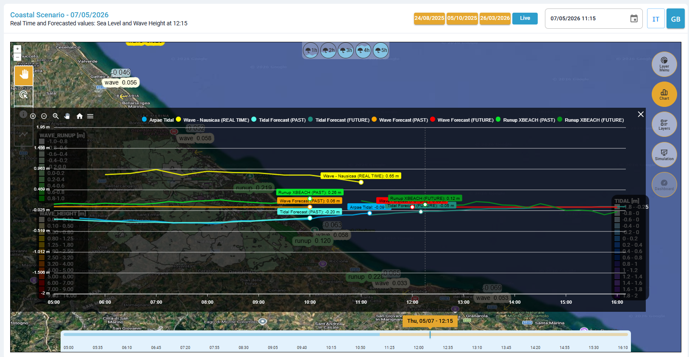<figcaption>
Grafico dei valori di <em>wave, tidal</em> e <em>runup</em> (<em>real time</em> e <em>forecast</em>) - dati antecedenti al 12 giugno 2026
</figcaption></figure>

#### Modalità di visualizzazione dei dati

La visualizzazione di ciascun elemento nel grafico dipende dalla selezione effettuata tramite lo strumento "_Feature Select_".

Ogni dato selezionato viene visualizzato in modo indipendente dagli altri.\
**Gli elementi rimangono sempre attivi nel grafico fino alla selezione di un nuovo elemento** appartenente:

* alla **stessa tipologia di dato** (_wave, tidal_ o _run-up_);
* E nello **stesso intervallo temporale** (passato oppure futuro).

Ad esempio:

* selezionando un nuovo elemento di **Wave Forecast**, e posizionando lo _slider_ temporale nel futuro, la precedente linea _Wave Forecast (FUTURE)_ viene sostituita;
* la selezione di un dato di **Run-up XBEACH** non modifica invece le linee visualizzate relative ai dati _wave_ o _tidal_ passati e futuri (se presenti).

Questo comportamento consente di confrontare contemporaneamente dati _real time_, _forecast_ passati e _forecast_ futuri mantenendo separate le diverse categorie informative.


Video esempio sulla visualizzazione dei dati nel grafico _Chart_ disponibile [qui](https://drive.google.com/file/d/1rsz7DfgPtPuVVGKyBJqDfuDUIfK-rVEB/view)




### Esecuzione della simulazione di allagamento

I passi precedenti consentono quindi all'utente di ottenere informazioni sulle condizioni meteo-marine, che possono essere usate come input per le simulazioni di allagamento costiero.

Per eseguire una simulazione di allagamento occorre ora selezionare lo strumento **Simulation** della [barra-laterale-destra.md](../../interfaccia-gui-web/barra-laterale-destra.md "mention"), e seguire il seguente flusso di lavoro:

1.  _**Select data for the simulation**_ – consente di selezionare i dati per la simulazione:

    * _**Level (m) Valute**_**:** utilizza il dato di livello del mare in metri (_Tidal_) selezionato, all'ora selezionata (come visualizzato nel _Wave Chart_), al quale si aggiunge il contributo dell'onda (_wave run-up_) con tre opzioni: ½ , ¼ e ⅕ dell'altezza dell'onda.\
      \
      Ad esempio per lo scenario real-time, viene utilizzato come valore del livello del mare il valore del mareografo situato a Porto Garibaldi, mentre come valore dell'altezza dell'onda quella registrata dalla boa onda-metrica Nausicaa2.\
      \
      Tramite il tool "_Feature Select_" (posto in alto a destra  nell' [area-di-mappatura.md](../../interfaccia-gui-web/area-di-mappatura.md "mention")) è possibile scegliere altri valori del livello del mare (_tidal_), di altezza d'onda (_wave_) e di _run-up_ [#layer-menu-coastal](../../interfaccia-gui-web/barra-laterale-destra.md#layer-menu-coastal "mention")
    * _**Custom (Max height m)**_: permette di impostare manualmente un valore uniforme di altezza massima dell'onda in metri.

2. _**Tidal Flooding models**_ – permette di scegliere il modello di allagamento per le simulazioni tra SaferPlaces (Static Model, basato sul modello [safer\_coast.md](../modelli-alla-base-delle-simulazioni/safer_coast.md "mention")) e UNTRIM (Hydrodynamic Model, [untrim.md](../modelli-alla-base-delle-simulazioni/untrim.md "mention"), se disponibile). \
   \
   Il modello **SaferPlaces** permette, inoltre di scegliere l'opzione CotgB, in cui l'utente definisce la pendenza della spiaggia espressa come Tangente dell'angolo (B) in gradi. \
   Questa opzione consenti di attenuare l'avanzamento del livello del mare da propagare ipotizzando di generare un DTM virtuale pari al massimo tra il valore reale del DTM e il valore di un piano inclinato con pendenza alfa a partire dalla linea di costa. (ref.[https://nhess.copernicus.org/articles/16/181/2016/](https://nhess.copernicus.org/articles/16/181/2016/)) 
3. _**Confirm and start the simulation**_ – avvia il calcolo del modello di allagamento. 

Sinteticamente, una volta selezionata l'opzione desiderata (dato da _provider_ o personalizzato &#x63;_&#x75;stom_) con il pulsante _**Next**_ si passa allo step successivo di scelta del modello di allagamento e al seguente step di conferma e lancio della simulazione.&#x20;

Con il pulsante _**Back**_ è possibile tornare indietro in ogni momento e modificare sia i dati di input che il modello alluvionale per lanciare un'altra simulazione con parametri differenti. &#x20;

Una volta avviata la simulazione tramite il pulsante _**Confirm**,_ il calcolo è in corso, ma può essere interrotto in qualsiasi momento tramite il pulsante _**Cancel**._&#x20;

Si riporta di seguito la sequenza delle schermate che verranno visualizzate, passo dopo passo, per procedere alla simulazione di allagamento.

<figure>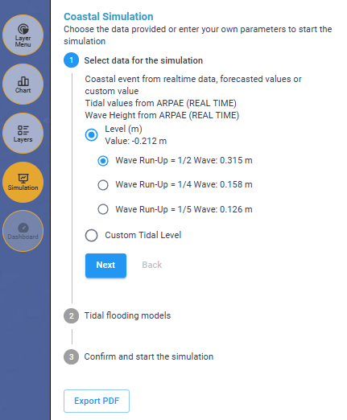<figcaption>
Scelta dati per la simulazione: dati calcolati dal software, misurati o previsionali
</figcaption></figure> <figure>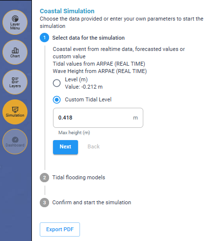<figcaption>
Scelta dati per la simulazione: dati impostati manualmente
</figcaption></figure>

<figure>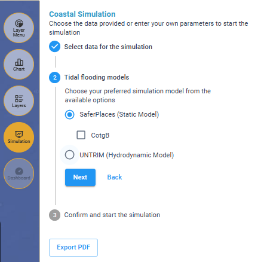<figcaption>
Scelta modello: SaferPlaces 
</figcaption></figure> <figure>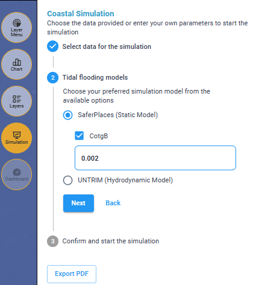<figcaption>
Scelta modello: SaferPlaces (con opzione della pendenza spiaggia)
</figcaption></figure> <figure>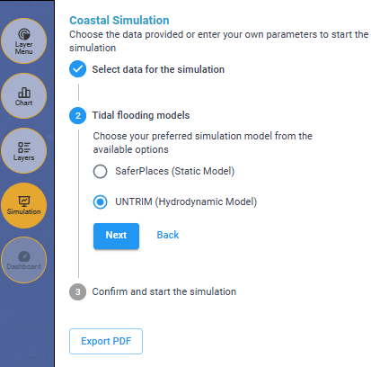<figcaption>
Scelta modello: UNTRIM (se disponibile)
</figcaption></figure>


Il valore massimo della CotgB è pari a **0.002**. \
Qualsiasi numero >0.002 viene approssimato a tale massimo.


<figure>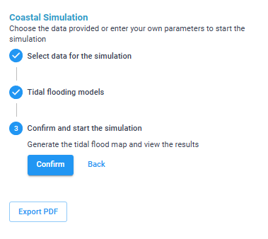<figcaption>
Avvio del calcolo del modello di allagamento
</figcaption></figure> <figure>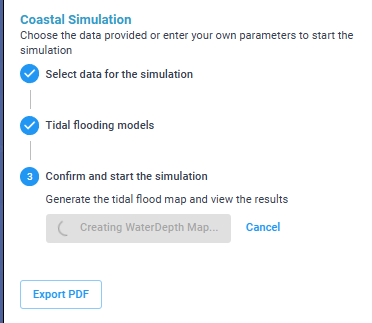<figcaption>
Calcolo del modello di allagamento (pulsante <em>Cancel</em> per interrompere la simulazione)
</figcaption></figure>


**Pulsante Export PDF**: offre la possibilità di esportare la mappa con il risultato delle simulazioni in formato PDF


<figure>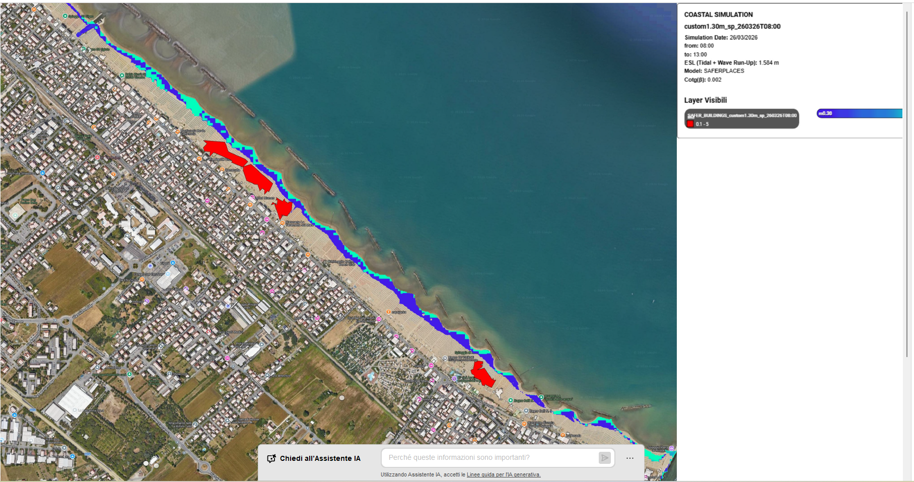<figcaption>
Esempio di PDF
</figcaption></figure>

A destra in alto è riportata una legenda che riassume i principali input della simulazione e i layer visualizzati

<figure>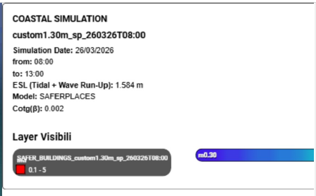<figcaption>
esempio: Legenda PDF
</figcaption></figure>



### Inserimento di misure di mitigazione

Lo scenario _coastal_ può essere utilizzato per testare l'efficacia di progetti e misure di mitigazione del rischio di allagamento sia in termini di riduzione del pericolo come estensione e magnitudo (profondità dell'acqua) sia in termini di protezioni passive e riduzione della vulnerabilità dei beni esposti.

Le misure di mitigazione che si possono simulare sono [#barriere-fisiche](scenario-coastal-real-time-+-forecast.md#barriere-fisiche), come dune, argini o muri che possono contenere e limitare la portata delle inondazioni, in particolare quelle di origine fluviale e costiera.


Barriere fisiche come dune, argini o muri che possono contenere e limitare l'estensione spaziale e ridurre i battenti acqua associate agli scenari di allagamento.

Le barriere fisiche inserite nel modello sono simulate modificando la quota del terreno (DTM) e quindi determinano un effetto di contenimento dei fenomeni di allagamento.

L'effetto è particolarmente evidente nella simulazione delle inondazioni costiere, dove barriere continue come le dune artificiali, se applicate lungo la linea di costa, possono proteggere una porzione significativa dell'entroterra.


Le barriere fisiche possono essere aggiunte al dominio di calcolo attraverso due metodi:

1\) con lo **strumento "**_**Draw barrier**_**" dell'** [area-di-mappatura.md](../../interfaccia-gui-web/area-di-mappatura.md "mention") che permette di disegnare elementi lineari (polilinea). Selezionando la barriera appena disegnata e cliccando con il tasto destro del mouse si apre un menù contestuale con diverse funzioni:

* _**New**_: permette di disegnare una nuova barriera
* _**Edit**_: consente di modificare la barriera selezionata
* _**Delete**_: permette di cancellare solo la barriera selezionata
* _**Clear**_: determina la cancellazione di tutte le barriere presenti nel progetto
* _**Slider**_: può essere usato per modificare l'altezza della barriera selezionata
* **Valore numerico:** rappresenta l'altezza, espressa in metri, della barriera selezionata

<figure>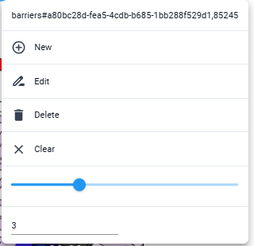<figcaption>
Menù contestuale per modificare una barriera già esistente
</figcaption></figure>


Si precisa che "_**Delete**_" permette di cancellare solo la barriera selezionata, mentre "_**Clear**_" determina la cancellazione di tutte le barriere presenti nel progetto.&#x20;



&#x20;Il numero in basso esprime l'altezza della barriera in metri


2\) caricate come file **GeoJSON** dal _**Layer menù**_&#x20;

<figure>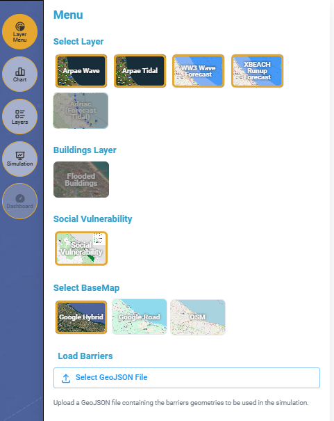<figcaption>
Pulsante per caricare le barriere come file GeoJSON
</figcaption></figure>

<figure>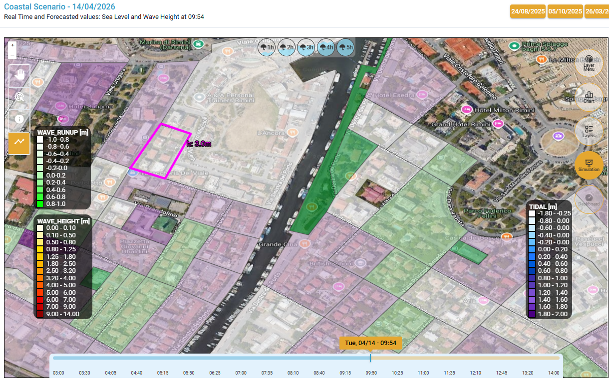<figcaption>
barriera di altezza 3 metri
</figcaption></figure>

<figure>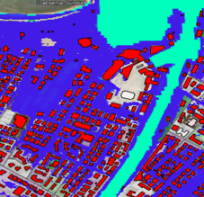<figcaption>
Zoom simulazione di allagamento senza barriera
</figcaption></figure> <figure>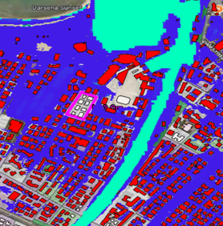<figcaption>
Zoom simulazione di allagamento con barriera
</figcaption></figure>


Un video dimostrativo di una simulazione di allagamento costiero, sia senza che con misure di mitigazione, è disponibile [qui](https://drive.google.com/open?id=1eZJ45_stkT_lMRPLj7VrE4aHUfayUUPn\&usp=drive_fs)




### Visualizzazione dei risultati

Dopo qualche minuto dal lancio della simulazione, l'utente vedrà comparire direttamente nell'ambiente centrale la mappa di allagamento per lo scenario di pioggia definito.

Nella sezione[#layers](../../interfaccia-gui-web/barra-laterale-destra.md#layers "mention") del toolbar verticale vengono generati due layers: **WD (WATER DEPTH)** risultato dell'ultima simulazione di allagamento effettuata e  **SAFER\_BUILDING**, che permette di visualizzare in rosso, sulla mappa, gli edifici danneggiati dall'allagamento.


Di default si considerano allagati (e quindi rappresentati in rosso) gli edifici caratterizzati da un livello d’acqua superiore a 0.1 m; tale valore può essere modificato tramite la Dashboard.


<figure>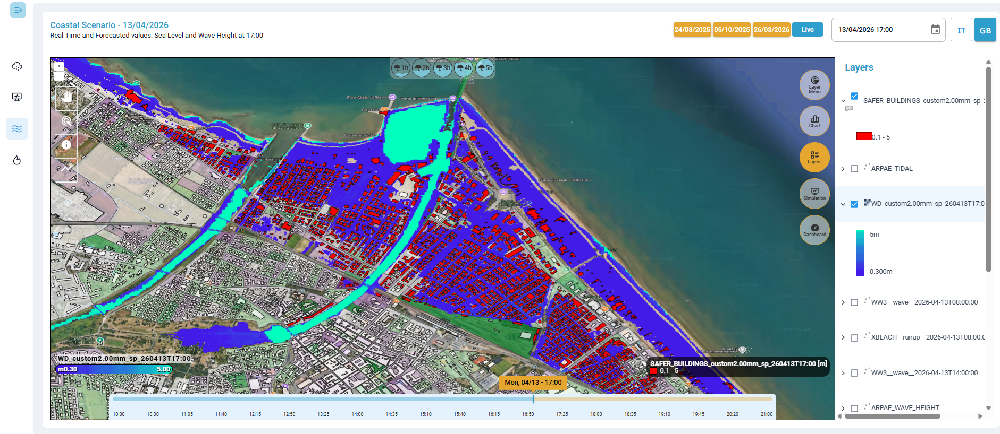<figcaption>
Visualizzazione della <em>Water depth</em> e degli edifici allagati sulla carta di vulnerabilità del territorio
</figcaption></figure>

**Strumenti**:

Selezionando il tool "_Feature Select_" e cliccando su un edificio si aprirà una finestra che descrive le caratteristiche dell'edificio stesso:

* indirizzo,
* tipologia,
* classe,
* altezza edificio,
* altezza dell'allagamento

Alcune caratteristiche possono non essere presenti per tutti gli edifici.

<figure><figcaption>
Caratteristiche dell'edificio selezionato
</figcaption></figure>

Cliccando sul tool "_identify_" e successivamente cliccando su un punto di interesse sulla mappa, è possibile visualizzare il valore della _Water Depth_ in quel punto.&#x20;

<figure>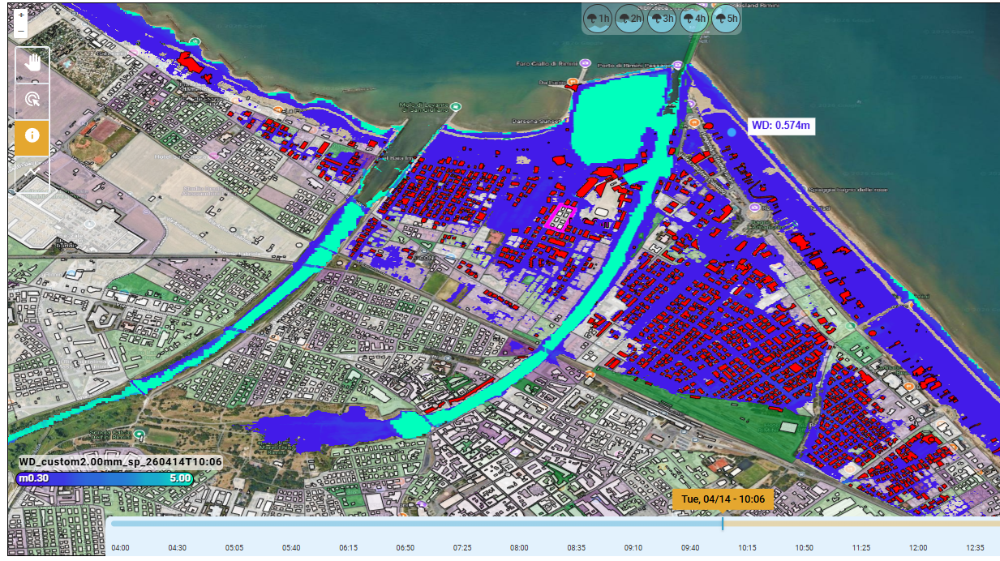<figcaption>
Interrogazione puntuale dei valori della Water Depth tramite tool "identify"
</figcaption></figure>

**Modalità di visualizzazione dei risultati:**

Dal [#layer-menu-coastal](../../interfaccia-gui-web/barra-laterale-destra.md#layer-menu-coastal "mention"),con la funzione "_**Buildings Layer**_**"** è possibile visualizzare direttamente sulla mappa gli edifici danneggiati dall'allagamento (è possibile accendere o spegnare il layer anche accedendo nella [#layers](../../interfaccia-gui-web/barra-laterale-destra.md#layers "mention")).

<figure>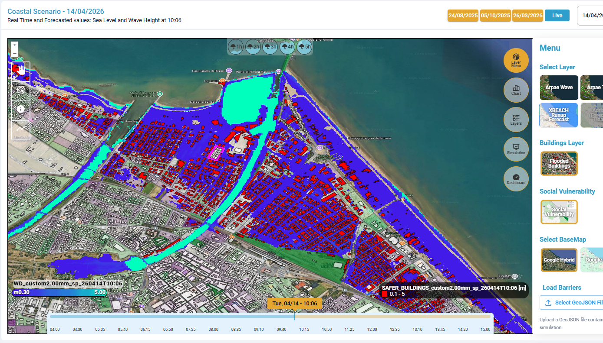<figcaption>
Layer Menù -  Building Layer
</figcaption></figure>

Dal [#layer-menu-coastal](../../interfaccia-gui-web/barra-laterale-destra.md#layer-menu-coastal "mention")la funzione "**Social Vulnerability**" permette di visualizzare direttamente una mappa che rappresenta la distribuzione spaziale dell’indice di vulnerabilità sociale (Social Vulnerability Index) per l’area di Rimini. Diventa quindi possibile confrontare il rischio di allagamento del territorio, identificando le aree più esposte e supportando le decisioni operative e la pianificazione dell’emergenza. (è possibile accendere o spegnare il layer anche accedendo nella [#layers](../../interfaccia-gui-web/barra-laterale-destra.md#layers "mention") ).

<figure>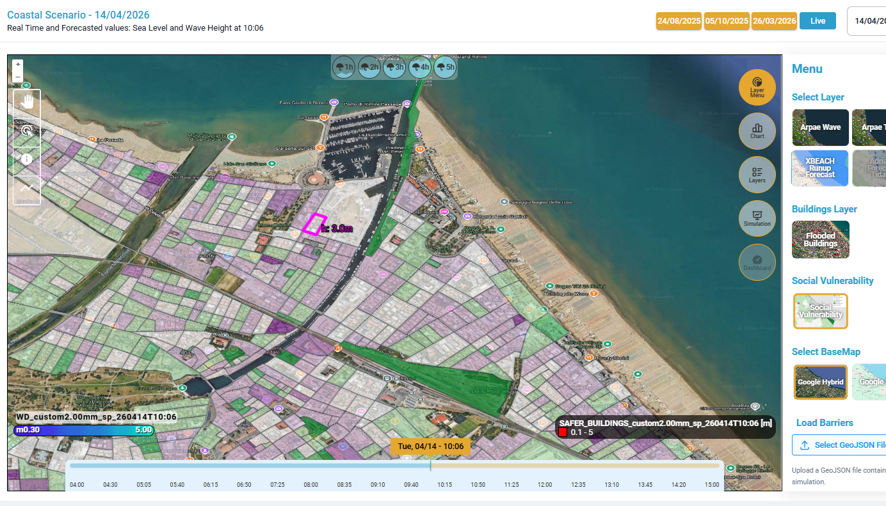<figcaption>
Layer Menù -  Social Vulnerability Index (anno 2021)
</figcaption></figure>

**Dashboard:**

Inoltre, l'ultimo Tool[#dashboard](../../interfaccia-gui-web/barra-laterale-destra.md#dashboard "mention") fornisce una vista sintetica e interattiva sugli **impatti previsti o rilevati** in seguito all'evento alluvionale simulato, evidenziando il numero e il tipo di **strutture/elementi sensibili allagati**.&#x20;

<figure><figcaption>
Funzione Dashboard
</figcaption></figure>


Modificando l'altezza di allagamento (_**WD thresh**_) nella [#dashboard](../../interfaccia-gui-web/barra-laterale-destra.md#dashboard "mention")automaticamente cambia la visualizzazione _Layer Safer\_Building_, ovvero numero e il tipo di edifici allagati.


<figure>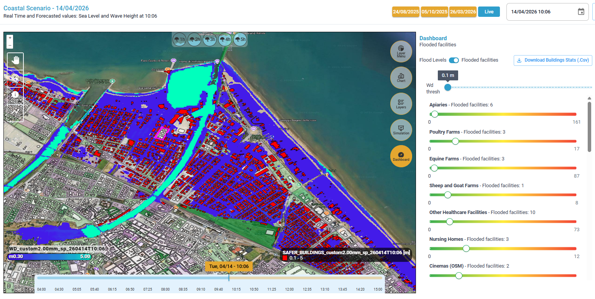<figcaption>
Visualizzazione edifici con WD superiore a 0.1 m (default)
</figcaption></figure> <figure>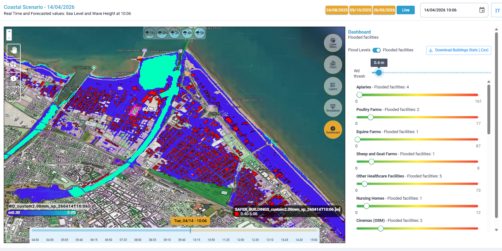<figcaption>
Visualizzazione edifici con WD superiore a 0.4 m (modificato da dashboard)
</figcaption></figure>

Inoltre, tramite il tasto "_Download building Stats_" (presente in alto a destra del Tool[#dashboard](../../interfaccia-gui-web/barra-laterale-destra.md#dashboard "mention")) è possibile effettuare il download (in formato .csv) di tutti gli edifici con le loro caratteristiche.&#x20;

<figure>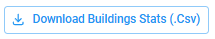<figcaption></figcaption></figure>

Per la descrizione di dettaglio di ciascun layer risultato dalla simulazione si veda il capitolo[RISULTATI](https://app.gitbook.com/s/a942UcvwUbWZZQpiVGr1/risultati "mention")


Un video di esempio sulla visualizzazione dei risultati è disponibile [qui](https://drive.google.com/open?id=1T28RwzwdbGOgXs-P1uNcskfLsXmxxJzR\&usp=drive_fs).




### VIDEO

#### Scenario Costiero - Video esempio di visualizzazione dei dati disponibili



#### Scenario Costiero - Video esempio di visualizzazione dati nel grafico _Chart_



#### Scenario Costiero - Video esempio di simulazione di Allagamento Costiero&#x20;



#### Scenario Costiero - Video esempio di visualizzazione dei risultati



