# 🔥 Scenario Fire

#### **Procedura per la Simulazione di propagazione di un incendio**&#x20;

Di seguito verranno descritti i passi per eseguire una simulazione di propagazione di un incendio, basato sul modello [safer\_fire.md](../modelli-alla-base-delle-simulazioni/safer_fire.md "mention").



### Selezionare Scenario _Fire_&#x20;

L'utente deve selezionare lo Scenario _Fire Simulation_ dal menù della [barra-laterale-sinistra.md](../../interfaccia-gui-web/barra-laterale-sinistra.md "mention")

<figure><figcaption>
Scenario incendio
</figcaption></figure>



### Definire Data e Istante Temporale di Riferimento

Il servizio dà la possibilità d'indagare sia eventi storici che eventi in tempo reale _(Live)_.

La data di interesse può essere selezionata dalla [barra-superiore.md](../../interfaccia-gui-web/barra-superiore.md "mention") con due modalità:&#x20;

1. Selezionando la data e l'ora di interesse dal **calendario** (dati del campo di vento a disposizione sono disponibili a partire dal 10 gennaio 2026)&#x20;
2. Selezionando uno dei **pulsanti rapidi** già presenti nella barra superiore, relativi a date significative (possibilità di customizzazione su richiesta dell'utente). Nel caso in cui si voglia procedere con una simulazione in tempo reale basta selezionare il **pulsante&#x20;**_**Live**_.

<figure><figcaption>
Calendario, pulsanti rapidi e pulsante <em>Live</em>
</figcaption></figure>

Una volta scelta la data e l'ora, si può procedere ad un'ulteriore definizione più esatta dell'orizzonte temporale che sarà poi oggetto della simulazione di incendio, utilizzando lo _slider_ della [barra-inferiore.md](../../interfaccia-gui-web/barra-inferiore.md "mention").

<figure><figcaption>
Slider temporale con cursore
</figcaption></figure>



### Selezione Sorgente Dati e BaseMap

Dal toolbar verticale della [barra-laterale-destra.md](../../interfaccia-gui-web/barra-laterale-destra.md "mention"), tramite [#layer-menu-fire](../../interfaccia-gui-web/barra-laterale-destra.md#layer-menu-fire "mention"), l'utente deve selezionare il provider di dati tra quelli disponibili. Il provider del dato può essere diverso a seconda dell'area oggetto dell'attivazione del servizio.&#x20;

Il vento è uno dei parametri meteorologici più critici per la propagazione degli incendi, spesso il fattore determinante per la loro velocità ed estensione. Al momento sono disponibili i dati del campo di vento (direzione e intensità) da **Arpae,** misurati in tempo reale, e i dati **icon2i\_wind** del modello previsionale tedesco ICON, entrambi mostrati sulla mappa tramite vettori a forma di frecce per la direzione e codifica a colori dal giallo al viola per l'intensità.

Oltre al vento, questa sezione consente di selezionare la fonte di altri dati determinanti per le analisi: la mappa della **classificazione dell’uso del suolo** e della **distribuzione spaziale dei combustibili** presenti sul territorio.

Infine, è possibile modificare il tipo di mappa di base per migliorare la leggibilità e l’analisi del dato (_BaseMap Google Hybrid, Road_ oppure Open Street Maps).

Le sezioni del **Layer Menu** sono cinque:

<figure>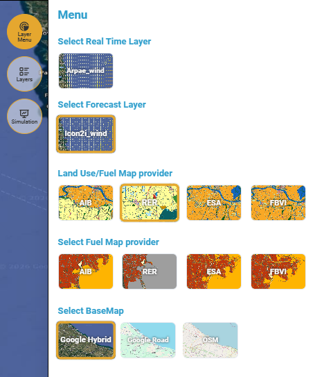<figcaption>
Layer Menu (Fire) per la selezione dei dati di input per le simulazioni
</figcaption></figure>

**1) Select Layer Real Time**

Al momento sono disponibili solo i dati puntuali misurati da ARPAE: corrisponde alla visualizzazione del campo di vento (direzione e intensità), mostrato sulla mappa tramite vettori (frecce) e codifica a colori.

**2) Select Forecast Layer**

Al momento è disponibile solo il layer previsionale **icon2i\_wind** del modello tedesco ICON: corrisponde alla visualizzazione del campo di vento (direzione e intensità), mostrato sulla mappa tramite vettori (frecce) e codifica a colori.

**3) Land Use/Fuel Map provider**

Consente di visualizzare la mappa della **classificazione dell’uso del suolo** nel territorio, che suddivide l’area in diverse categorie di copertura e utilizzo del suolo (agricolo, naturale, forestale, ecc.).scegliendo tra i vari fornitori di dati disponibili:

* Emilia Romagna Antincendio Boschivo (AIB)
* Emilia Romagna Region (RER)
* European Space Agency (ESA)
* Fuel Difference Built-up Vegetation Index (FBVI)

**4) Select Fuel Map provider**

Consente di visualizzare la mappa della **distribuzione spaziale dei combustibili** presenti sul territorio, ovvero i tipi di vegetazione e copertura del suolo che possono alimentare l’incendio, da aree non combustibili (es. acqua, aree urbanizzate) a vegetazione combustibile più densa e complessa, ed è direttamente correlata alla mappa dell'uso del suolo:

* Emilia Romagna Antincendio Boschivo (AIB)
* Emilia Romagna Region (RER)
* European Space Agency (ESA)
* Fuel Difference Built-up Vegetation Index (FBVI)

**5) Select BaseMap**

Consente di scegliere il layer di base tra:

* _Google Hybrid_: mappa satellitare
* _Google Road_: mappa stradale senza immagini satellitari
* _OSM_: mappa standard di OpenStreetMap



### Definizione dell'intervallo di tempo per la simulazione di propagazione del fuoco

L'utente ha la possibilità di indicare l'intervallo di tempo per il quale viene calcolata la durata della propagazione del fuoco, definendo sia la durata che l'intervallo di inizio e fine. 

La durata viene identificata selezionando le icone posizionate in alto al centro dell'ambente di mappatura. Se questa non viene specificata, di default la simulazione viene calcolata con una durata minima di 1 ora.

<figure><figcaption>
Selezione della durata di propagazione
</figcaption></figure>

L'orario di inizio e fine dell'intervallo può essere definito muovendosi con lo _slider_ della [barra-inferiore.md](../../interfaccia-gui-web/barra-inferiore.md "mention").

<figure><figcaption>
Selezione dell'inizio e fine dell'intervallo temporale di propagazione dell'incendio
</figcaption></figure>

Cambiando la durata della cumulata e/o l'intervallo di inizio e fine si visualizza sulla mappa la relativa distribuzione spaziale del campo di vento che verrà utilizzato per le simulazioni di propagazione del fuoco.



### Selezione del punto d'innesco

Il punto d'innesco (_**ignition point**_) è l’elemento chiave che ancora spazialmente la simulazione: rappresenta la posizione iniziale da cui ha origine l’incendio all’interno dello scenario e che verrà utilizzato dal modello per la simulazione di propagazione.

In alto a sinistra della mappa è presente un'etichetta: **“**_**Draw the Inigtion Point within the available rectangle (bbox) shown on the map"**_ che indica di disegnare **il punto d'innesco all'interno del rettangolo arancione mostrato sulla mappa**, ovvero l'area nella quale è possibile eseguire le simulazioni.

<figure>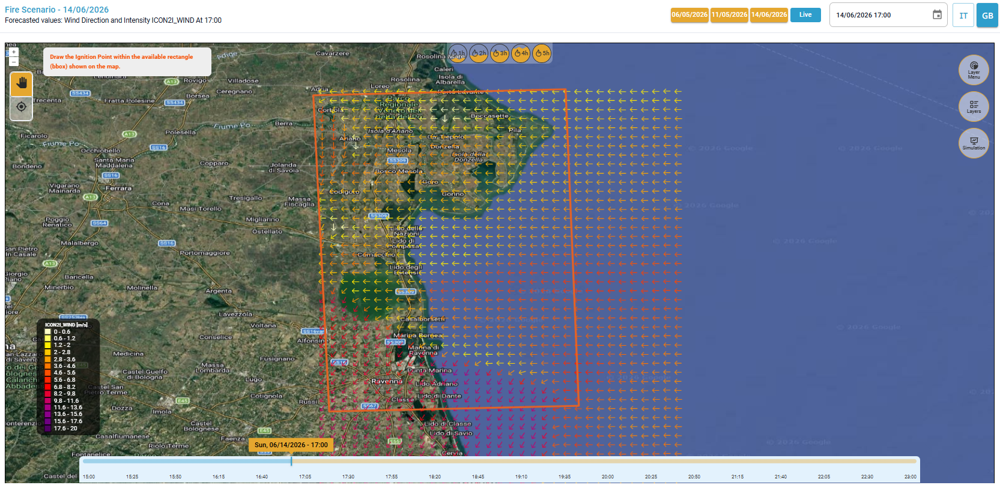<figcaption></figcaption></figure>

Tramite lo strumento "_**Fire Ignition**_" disponibile sul lato sinistro dell'area di mappatura, è possibile posizionare il punto d'innesco dell'incendio che si vuole simulare.

<figure><figcaption>
Strumento "<em>fire ignition</em>" per la selezione del punto d'innesco dell'incendio
</figcaption></figure>

Quando viene attivato lo strumento **“**_**Fire Ignition**_**”**, il comportamento del cursore sulla mappa cambia per consentire la definizione del punto di innesco:

* Il cursore viene sostituito da un **marcatore a croce di colore viola**, ben visibile sulla mappa per indicare con precisione il punto selezionato per l’innesco
* Accanto al cursore vengono mostrate le **coordinate geografiche** del punto, espresse in formato decimale (latitudine, longitudine).

<figure>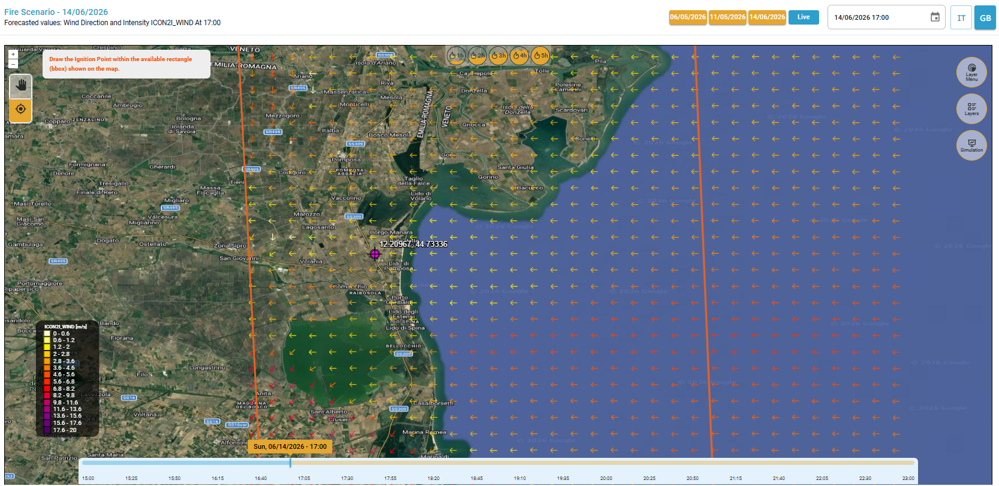<figcaption>
Selezione del punto d'innesco
</figcaption></figure>

Una volta selezionato il punto con un click:

* Il punto di innesco cambia colore, ed è ora rappresentato da un **marcatore a croce di colore arancione** che rimane fisso
* Il simbolo è posizionato esattamente nel punto cliccato sulla mappa e rimane visibile come riferimento fisso per tutta la simulazione
* Nell’etichetta in alto a sinistra si aggiungerà la scritta: **“Current Ignition Point: \[longitudine, latitudine]"** con coordinate espresse in formato decimale, per un' identificazione precisa e replicabile del punto selezionato.

La posizione del punto d'innesco può essere modificata selezionando un nuovo punto sulla mappa con lo strumento dedicato.

<figure>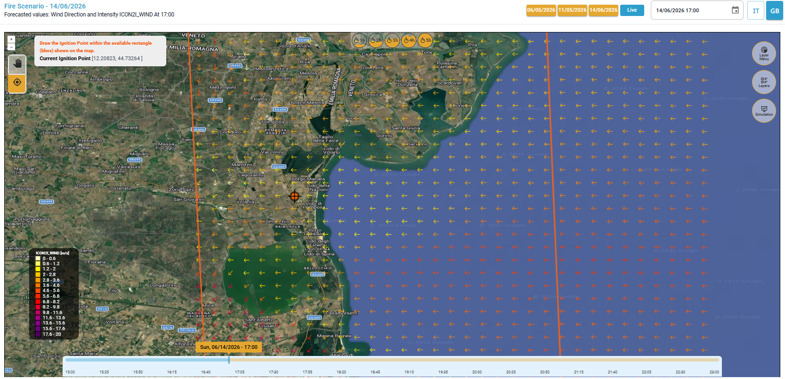<figcaption>
Punto d'innesco selezionato
</figcaption></figure>


Video di esempio sui dati disponibili e la selezione del punto d'innesco di un incendio è disponibile [qui](https://drive.google.com/file/d/1S67Bh2YR6-2jZf6hv5SGl_3G2mta3gaF/view)




### Esecuzione della Simulazione di incendio

Per eseguire una simulazione occorre ora selezionare lo strumento _**Simulation**_ della [barra-laterale-destra.md](../../interfaccia-gui-web/barra-laterale-destra.md "mention"), e seguire il seguente flusso di lavoro:

1. _**Select wind data source**_ – consente di selezionare i dati di input di vento tra:
   1. dati del provider (ICON2I data - _automatic_)
   2. dati personalizzati (_Custom parameters_) con la possibilità di inserire la velocità (_Wind speed_) e direzione del vento (_Wind direction_) manualmente.
2. _**Select LandUse Provider**_ – consente di selezionare il fornitore di dati sull'uso del suolo tra:
   * Forest firefighting (Civil Protection)
   * Emilia Romagna Region (RER)
   * European Space Agency (ESA)
   * Fuel Difference Built-up Vegetation Index (FBVI)
3. _**Confirm and start the simulation**_ – avvia il calcolo del modello di allagamento. Si aprirà anche un pannello che riassume tutte le ipotesi di input (data e ora della simulazione, coordinate del punto d'innesco e fornitore del dato di uso del suolo, direzione e velocità del vento).

<figure>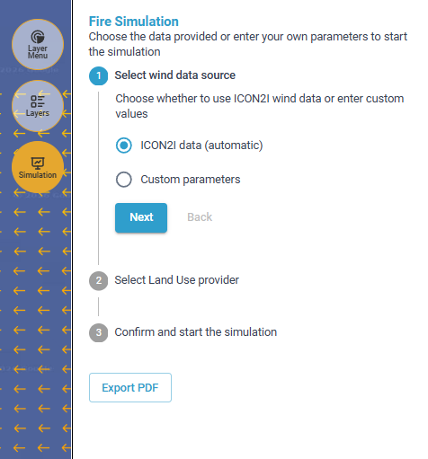<figcaption>
Simulazione con dati di input da ICON2I
</figcaption></figure> <figure>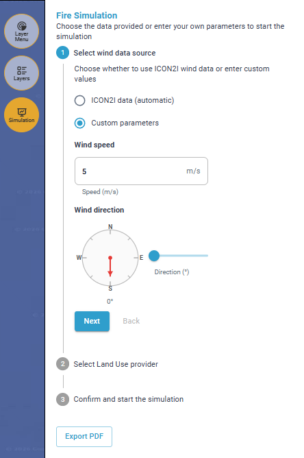<figcaption></figcaption></figure>

Una volta selezionato il dato di input per il vento, con il pulsante _**Next**_ si passa alla selezione dell'opzione desiderata tra diversi fornitori di dati di uso del suolo, e sempre tramite _**Next**_ si passa allo step finale di conferma e lancio della simulazione, possibile solo se il punto di innesco è stato inserito correttamente.

Con il pulsante _**Back**_ è possibile tornare indietro in ogni momento e modificare i dati di input per lanciare un'altra simulazione con parametri differenti. &#x20;

Con il pulsante _**Confirm**_ viene avviata la simulazione: una rotella appare al posto del pulsante e mostra che il calcolo è in corso, ma può essere interrotto in qualsiasi momento tramite il pulsante _**Cancel**._&#x20;

<figure>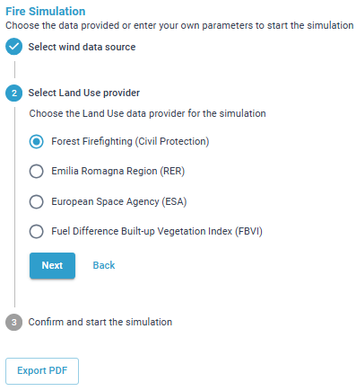<figcaption>
Selezione del fornitore di dati sull'uso del suolo
</figcaption></figure> <figure>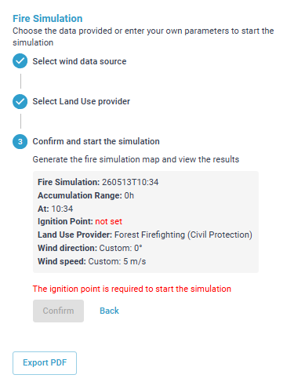<figcaption>
Avviso di mancato inserimento del punto di innesco
</figcaption></figure>

<figure>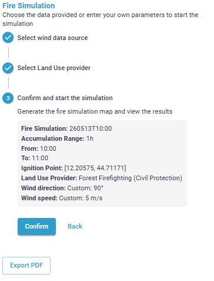<figcaption>
Riassunto dei dati input e avvio del calcolo (<em>Confirm</em>)
</figcaption></figure> <figure>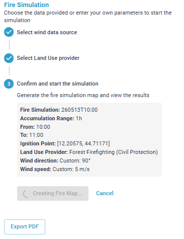<figcaption>
Calcolo del modello di propagazione del fuoco (pulsante <em>Cancel</em> per interrompere la simulazione)
</figcaption></figure>


**Pulsante Export PDF**: possibilità di esportare la mappa con il risultato delle simulazioni in formato PDF


<figure>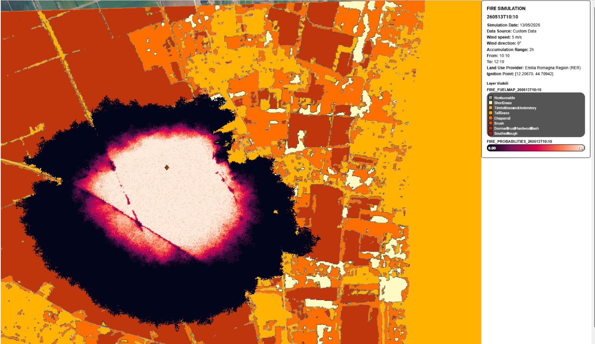<figcaption>
File PDF generato da "<em>Export PDF</em>"
</figcaption></figure>

A destra in alto è riportata una legenda che riassume i principali input della simulazione e i layer visualizzati

<figure>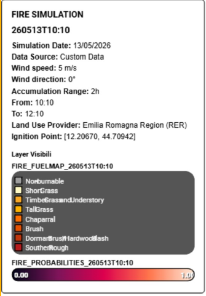<figcaption>
Esempio di legenda del file PDF (dati di vento custom)
</figcaption></figure> <figure>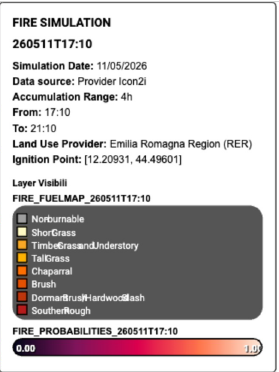<figcaption>
Esempio di legenda del file PDF (dati di vento ICON)
</figcaption></figure>


Un video dimostrativo di come eseguire una simulazione di propagazione di un incendio è disponibile [qui](https://drive.google.com/open?id=1b9T4MI_0mcf84cSi2puFXHZWCnp52xjC\&usp=drive_fs)




### Visualizzazione dei risultati

Dopo qualche minuto dal lancio della simulazione, l'utente vedrà comparire direttamente nell'ambiente centrale la mappa di propagazione del fuoco per lo scenario definito.

Nella sezione [#layers](../../interfaccia-gui-web/barra-laterale-destra.md#layers "mention") del toolbar verticale sono stati generati diversi layer come risultato dell'ultima simulazione effettuata, che vengono visualizzati con la relativa legenda:

* FIRE\_PROBABILITIES: rappresenta il **risultato della simulazione**, ovvero la probabilità che il fuoco interessi ciascuna area del territorio. I valori vanno da 0 - bassa probabilità (viola scuro) a 1 - alta probabilità (rosa chiaro).
* FIRE\_FUELMAP: rappresenta la **distribuzione spaziale dei combustibili** presenti sul territorio, ovvero i tipi di vegetazione e copertura del suolo che possono alimentare l’incendio. Da aree non combustibili (es. acqua, aree urbanizzate) a vegetazione combustibile più densa e complessa.

È inoltre presente il layer:

* FIRE\_LANDUSE: rappresenta la **classificazione dell’uso del suolo** nel territorio, basata sulla fonte di dati scelta, che suddivide l’area in diverse categorie di copertura e utilizzo del suolo (agricolo, naturale, forestale, ecc.).

<figure><figcaption>
Mappa Risultato della simulazione di propagazione del fuoco
</figcaption></figure>

<figure>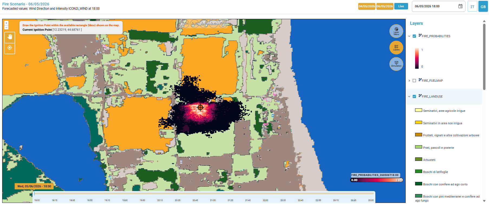<figcaption>
Confronto della probabilità di propagazione del fuoco con la mappa di uso del suolo 
</figcaption></figure>

Per la descrizione di dettaglio di ciascun layer risultato dalla simulazione si veda il capitolo[RISULTATI](https://app.gitbook.com/s/a942UcvwUbWZZQpiVGr1/risultati "mention")


Un video di esempio sulla visualizzazione dei risultati è disponibile [qui](https://drive.google.com/open?id=1iHqYO691d07MrplSxbgymE4Qxj_8W9ZF\&usp=drive_fs).




### VIDEO

#### Scenario di Incendio - Video esempio di visualizzazione dei dati disponibili e selezione del punto di innesco



#### Scenario di Incendio -  Video esempio di simulazione di propagazione del fuoco



#### Scenario di Incendio - Video esempio di visualizzazione dei risultati


