# 🌧️ Scenario Pluvial FORECAST

#### Procedura per la Simulazione di Allagamenti Pluviali nello scenario Forecast

Di seguito verranno descritti i passi per eseguire una simulazione di allagamento per eventi futuri o in modalità "Forecasting".



### Selezionare Scenario _Pluvial Forecast_

L'utente deve selezionare lo scenario _Pluvial Forecast_ dalla [barra-laterale-sinistra.md](../../interfaccia-gui-web/barra-laterale-sinistra.md "mention")

<figure><figcaption>
Scenario Pluviale previsionale
</figcaption></figure>



### Definire data e istante temporale di riferimento

Il servizio dà la possibilità d'indagare sia eventi storici che eventi in tempo reale _(Live)_.

La data di interesse puo essere selezionata dalla [barra-superiore.md](../../interfaccia-gui-web/barra-superiore.md "mention") con due modalità:&#x20;

1. Selezionando la data e l'ora di interesse dal **calendario** (dati meteo a disposizione con continuità a partire dal 17 luglio 2025)
2. Selezionando uno dei **pulsanti rapidi** già presenti nella barra superiore, relativi a date con eventi pluviali di riferimento (possibilità di personalizzazione su richiesta dell'utente). Nel caso invece si voglia procedere con una simulazione in tempo reale basta selezionare il **pulsante&#x20;**_**Live**_.

<figure>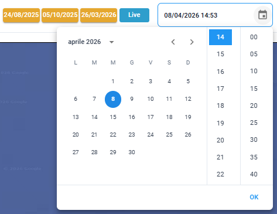<figcaption>
Calendario, pulsanti rapidi e pulsante <em>Live</em>
</figcaption></figure>

Una volta scelta la data e l'ora, si può procedere anche ad una definizione più esatta dell'orizzonte temporale che sarà poi oggetto della simulazione di allagamento, utilizzando lo _slider_ della [barra-inferiore.md](../../interfaccia-gui-web/barra-inferiore.md "mention").

<figure>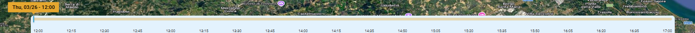<figcaption>
Slider temporale con cursore
</figcaption></figure>



### Selezione sorgente dei dati previsionali e mappa di base

Dal toolbar verticale della [barra-laterale-destra.md](../../interfaccia-gui-web/barra-laterale-destra.md "mention"), tramite [#source-provider](../../interfaccia-gui-web/barra-laterale-destra.md#source-provider "mention"), l'utente deve selezionare il provider di dati previsionali e può scegliere tra diverse fonti. Il provider del dato può essere diverso a seconda dell'area oggetto dell'attivazione del servizio SaferCast.&#x20;

Per Rimini, l'utente può scegliere tra diverse fonti di dati meteorologici:

* **ICON** **(5h successive all'ora selezionata)** – modello open-source con aggiornamenti regolari e copertura globale, con passo temporale di 1 ora.
* **MeteoBlue (5h successive all'ora selezionata)** – previsioni ad alta risoluzione fornite da partner commerciale con passo temporale 15 minuti, integrate con dati locali.

Muovendo lo _slider,_ che si trova in basso al centro dello schermo, la mappa mostra l'evolversi dei dati previsionali disponibili a partire dell'orario selezionato in futuro (dipendendo dall'intervallo temporale coperto da ciascun provider).

<figure>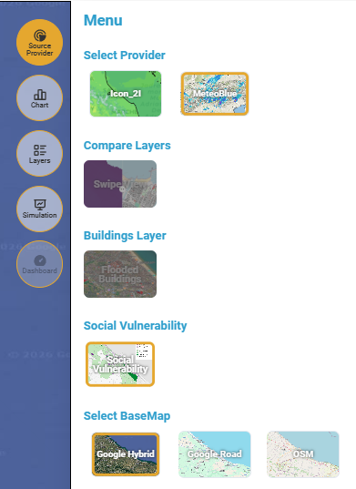<figcaption>
Source Provider per la selezione dei dati di input per le simulazioni
</figcaption></figure>

L'utente può nello stesso menù cambiare la mappa base di riferimento (_BaseMap Google Hybrid,_ _Google_ _Road_ oppure _Open Street Maps_).&#x20;

Inoltre, è disponibile una mappa di "_**Social Vulnerability**_" che rappresenta la distribuzione spaziale dell’indice di vulnerabilità sociale (_Social Vulnerability Index_) per l’area di Rimini. Il territorio è suddiviso in **poligoni (unità territoriali),** ciascuno colorato secondo una **scala qualitativa**, che indica il grado di vulnerabilità della popolazione residente.

Le funzioni _Compare Layers_ e _Buildings_ _Layers_ rimarranno disattivate fino a che non verrà effettuata la prima simulazione di allagamento.



### Definizione della cumulata di pioggia

L'utente ha inoltre la possibilità di indicare una cumulata di pioggia da simulare, definendo sia la durata che l'intervallo di inizio e fine.\
La durata viene identificata selezionando le icone posizionate in alto al centro:

<figure><figcaption></figcaption></figure>

L'orario di inizio e fine dell'intervallo di cumulata selezionata può essere definito muovendosi con lo _slider_ della [barra-inferiore.md](../../interfaccia-gui-web/barra-inferiore.md "mention").

<figure>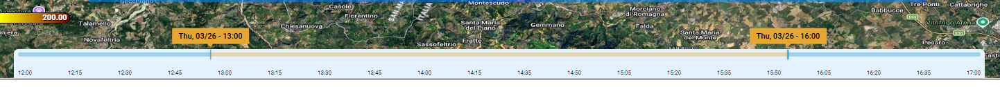<figcaption></figcaption></figure>

Cambiando la durata della cumulata e l'intervallo di inizio e fine viene visualizzata sulla mappa la relativa distribuzione spaziale dell'evento pluviale che sarà simulato.

<figure>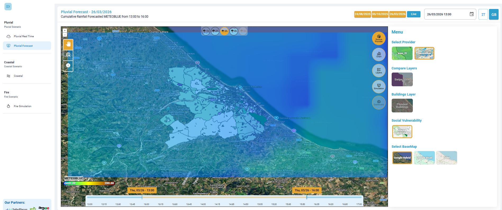<figcaption>
Visualizzazione pioggia cumulata sull'area
</figcaption></figure>


Video esempio sulla tipologia di dati disponibili è visibile [qui](https://drive.google.com/file/d/14yV9yPWxVlxih4FOxp0QZtExa3cmr3yK/view).




### Visualizzazione valori della cumulata di pioggia

L'utente ha la possibilità di visualizzare per un singolo punto i valori della cumulata di pioggia per lo scenario definito nello step precedente. L’asse verticale esprime la quantità di pioggia in mm e l’asse orizzontale l’intervallo temporale.

Cliccando sul punto di interesse col pulsante "_Identify_" e successivamente attivando il pulsante [#chart](../../interfaccia-gui-web/barra-laterale-destra.md#chart "mention") nella [barra-laterale-destra.md](../../interfaccia-gui-web/barra-laterale-destra.md "mention"), si ottiene un grafico che riporta i valori rilevati dal radar (istogrammi in celeste, con passo temporale in base al dato selezionato) e i valori di cumulata di pioggia, nel caso in cui sia stata selezionata (linea arancione).

<figure><figcaption>
Chart - Pioggia istantanea e cumulata del radar per un punto scelto sulla mappa tramite tool "<em>Identify</em>"
</figcaption></figure>

Inoltre, in alto a sinistra sono presenti degli strumenti di navigazione del grafico che consentono di fare zoom in, zoom out, zoom selettivo (_Selection zoom_), spostare la vista (_panning_), resettare lo zoom a quello iniziare (_reset zoom_) e un menù per scaricare il grafico in formato svg, png e csv.

<figure><figcaption>
Strumenti di navigazione del grafico
</figcaption></figure>


Un video di esempio sulla visualizzazione dei dati in chart è disponibile [qui](https://drive.google.com/file/d/1dUHCU5NIlTox7w2kJV2kiVXnZ0WShgmN/view?usp=sharing).




### Esecuzione della simulazione di allagamento

I passi precedenti consentono quindi all'utente di definire la sorgente di dati, una cumulata e l'intervallo temporale dell'evento pluviale che si vuole simulare.

Per eseguire una simulazione di allagamento occorre ora selezionare lo strumento _**Simulation**_ della [barra-laterale-destra.md](../../interfaccia-gui-web/barra-laterale-destra.md "mention"), e seguire il seguente flusso di lavoro:

1. _**Select data for the simulation**_ – consente di selezionare i dati per la simulazione, con due possibilità:
   * \[Provider selezionato] - \[ora o intervallo temporale]: utilizza il dato selezionato all'ora/intervallo orario selezionato. Questa opzione contiene tutte le impostazioni scelte finora ed è già preselezionata in automatico. Permette di simulare un valore non uniforme di pioggia su tutto il dominio di calcolo.
   * _Custom_ (_uniform rain_ - pioggia uniforme): permette di impostare manualmente un valore uniforme di pioggia cumulata totale su tutto il dominio di calcolo.
2. _**Flood models**_ – permette di scegliere il modello di allagamento per le simulazioni, tra i modelli sviluppati da SaferPlaces ([safer\_rain.md](../modelli-alla-base-delle-simulazioni/safer_rain.md "mention") di default e [untrim.md](../modelli-alla-base-delle-simulazioni/untrim.md "mention") se disponibile)
3. _**Confirm and start the simulation**_ – avvia il calcolo del modello di allagamento.

<figure>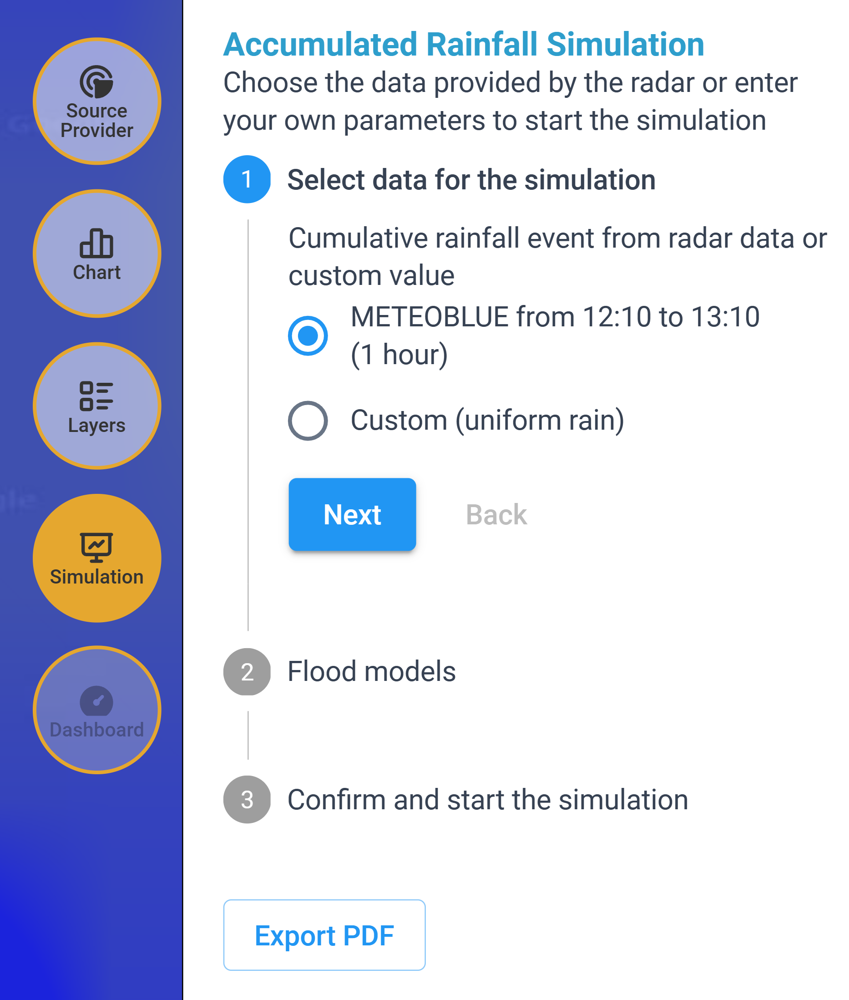<figcaption>
Selezione dati di input per la simulazione da Provider
</figcaption></figure> <figure><figcaption>
Selezione dati di input per la simulazione personalizzato (Custom)
</figcaption></figure>

Una volta selezionata l'opzione desiderata (dato da _provider_ o personalizzato &#x63;_&#x75;stom_) con il pulsante _Next_ si passa allo step successivo di scelta del modello di allagamento e al seguente step di conferma e lancio della simulazione.&#x20;

Con il pulsante _Back_ è possibile tornare indietro e modificare i dati di input o il modello alluvionale per lanciare un'altra simulazione con parametri differenti. &#x20;

Una volta lanciata la simulazione con il pulsante _Confirm,_ il calcolo è in corso, ma può essere interrotto in qualsiasi momento tramite il pulsante _Cancel._&#x20;

<figure><figcaption>
Scelta modello di simulazione: SaferPlaces
</figcaption></figure> <figure><figcaption>
Scelta modello di simulazione: UNTRIM (se disponibile)
</figcaption></figure>

<figure>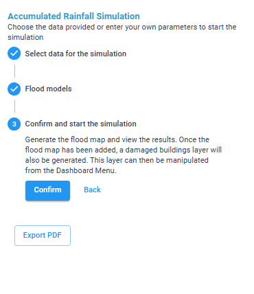<figcaption>
Lancio della simulazione con il pulsante <em>Confirm</em>
</figcaption></figure> <figure>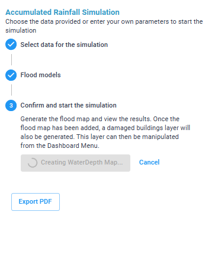<figcaption>
Simulazione in corso (possibilità d'interruzione della stessa con il pulsante <em>Cancel</em>)
</figcaption></figure>


**Pulsante Export PDF**: offre la possibilità di esportare la mappa con il risultato delle simulazioni in formato PDF


<figure>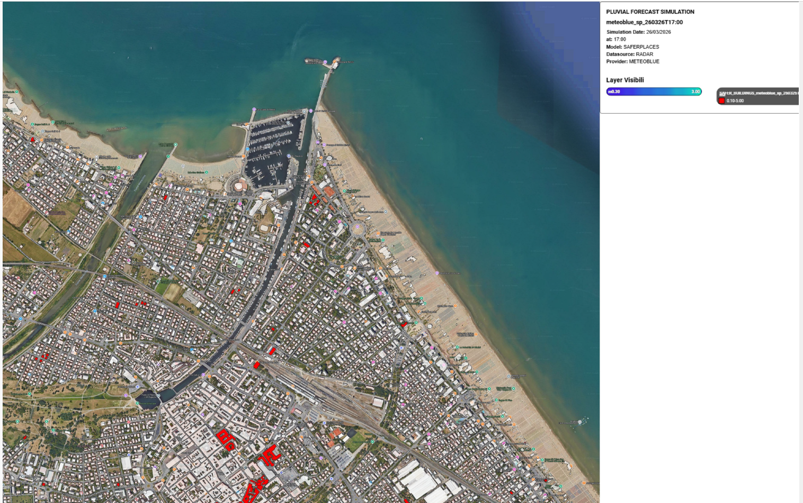<figcaption>
esempio di PDF generato
</figcaption></figure>

A destra in alto è riportata una legenda che riassume i principali input della simulazione e i layer visualizzati

<figure>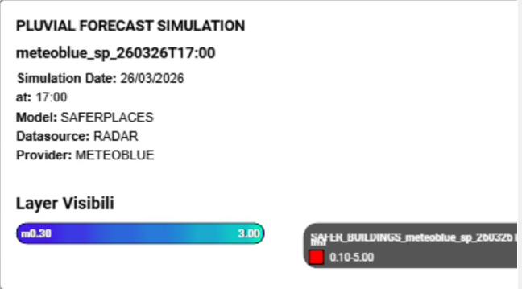<figcaption>
esempio: Legenda PDF
</figcaption></figure>


Un video dimostrativo di una simulazione di allagamento pluviale, nello scenario Forecast, è disponibile [qui](https://drive.google.com/file/d/1wsP15aiLIHjoc1NLjrNCbRQW_ZH7h5gU/view?usp=sharing)




### Visualizzazione dei risultati

Dopo qualche minuto dal lancio della simulazione, l'utente vedrà comparire direttamente nell'ambiente centrale la mappa di allagamento per lo scenario di pioggia definito.

Nella sezione[#layers](../../interfaccia-gui-web/barra-laterale-destra.md#layers "mention") del toolbar verticale è stato generato il layer _**WD (WATER DEPTH)**_ risultato dell'ultima simulazione di allagamento effettuata e il layer _**SAFER\_BUILDING**_, che permette di visualizzare in rosso, sulla mappa, gli edifici danneggiati dall'allagamento.


Di default si considerano allagati (e quindi rappresentati in rosso) gli edifici caratterizzati da un livello d’acqua superiore a 0.1 m; tale valore può essere modificato tramite la Dashboard.


<figure><figcaption>
Visualizzazione della <em>Water Depth</em> e degli edifici allagati sulla carta di vulnerabilità del territorio
</figcaption></figure>

**Strumenti:**

Selezionando il tool "_Feature Select_" e cliccando su un edificio si aprirà una finestra che descrive le caratteristiche dell'edificio stesso:

* indirizzo,
* tipologia,
* classe,
* altezza edificio,
* altezza dell'allagamento.

Alcune caratteristiche possono non essere presenti per tutti gli edifici.

<figure>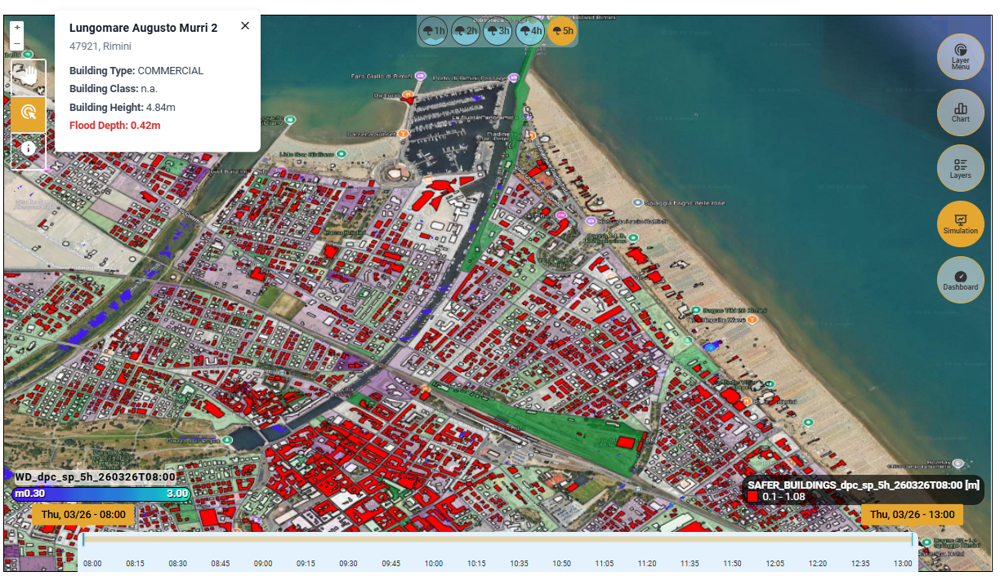<figcaption>
Caratteristiche dell'edificio selezionato
</figcaption></figure>

Cliccando sul tool "_Identify_" e successivamente cliccando su un punto di interesse sulla mappa, è possibile visualizzare il valore della Water depth in quel punto.

<figure>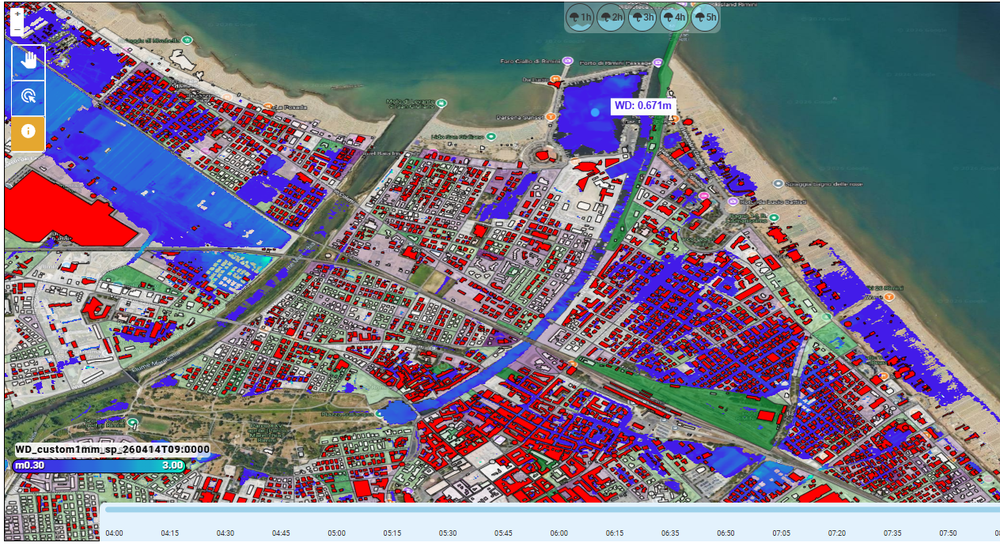<figcaption>
Interrogazione puntuale dei valori della Water Depth tramite tool "<em>Identify</em>"
</figcaption></figure>

**Modalità di visualizzazione dei risultati:**

Dal [#source-provider](../../interfaccia-gui-web/barra-laterale-destra.md#source-provider "mention"), tramite "_**Compare Layers**"_ è possibile confrontare il layer risultato delle simulazioni di allagamento con il layer dell'intensità di pioggia tramite la funzione _Swipe View_, muovendo il cursore orizzontalmente.&#x20;

<figure>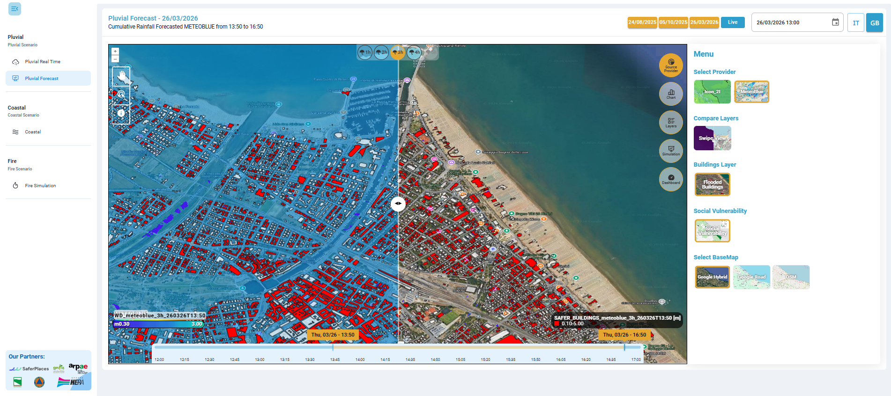<figcaption>
<em>Compare Layers</em>  - funzione <em>Swipe view</em>
</figcaption></figure>

Dal [#source-provider](../../interfaccia-gui-web/barra-laterale-destra.md#source-provider "mention"),con la funzione "_**Buildings Layer**_" è possibile visualizzare direttamente sulla mappa gli edifici danneggiati dall'allagamento (è possibile accendere o spegnare il layer anche accedendo nella sezione [#layers](../../interfaccia-gui-web/barra-laterale-destra.md#layers "mention") ).

<figure>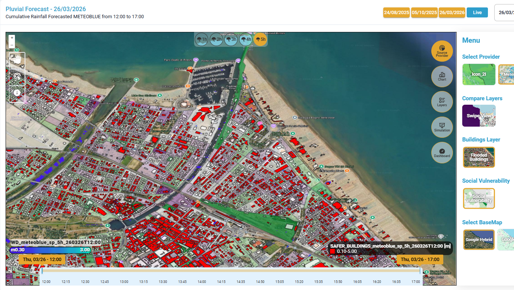<figcaption>
Source Provider -  Building Layer
</figcaption></figure>

Dal [#source-provider](../../interfaccia-gui-web/barra-laterale-destra.md#source-provider "mention"), la funzione "**Social Vulnerability**" permette di visualizzare una mappa che rappresenta la distribuzione spaziale dell’indice di vulnerabilità sociale (_Social Vulnerability Index,_ riferito all'anno 2021) per l’area di Rimini. Diventa quindi possibile confrontare il rischio di allagamento del territorio con le aree più vulnerabili, identificando le aree più esposte, supportando le decisioni operative e la pianificazione dell’emergenza. (Si può accendere o spegnare questo layer anche dalla sezione [#layers](../../interfaccia-gui-web/barra-laterale-destra.md#layers "mention")).

<figure>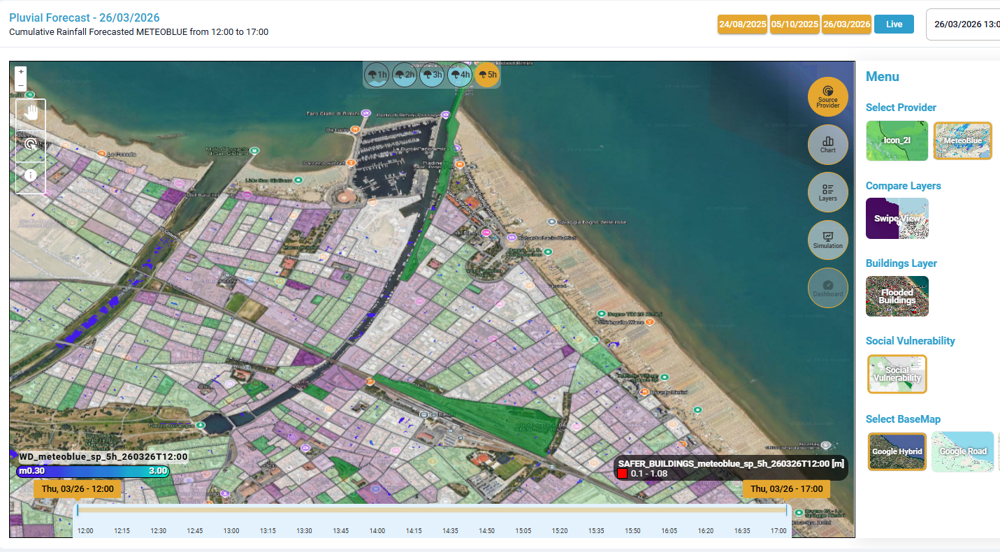<figcaption>
Source Provider -  Social Vulnerability Index (anno 2021)
</figcaption></figure>

**Dashboard:**

Infine, l'ultimo strumento della[#dashboard](../../interfaccia-gui-web/barra-laterale-destra.md#dashboard "mention") fornisce una vista sintetica e interattiva sugli **impatti previsti o rilevati** in seguito all'evento alluvionale simulato, evidenziando il numero e il tipo di **strutture/elementi sensibili allagati**.&#x20;

<figure>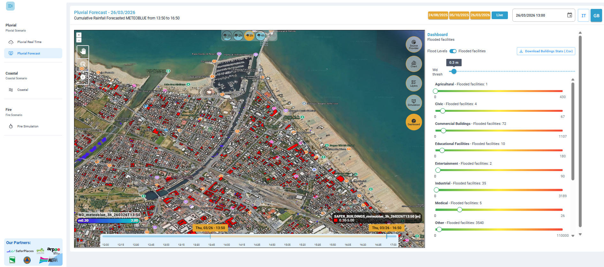<figcaption>
Funzione dashboard
</figcaption></figure>


Modificando l'altezza di allagamento nella [#dashboard](../../interfaccia-gui-web/barra-laterale-destra.md#dashboard "mention")automanticamente cambia la visualizzazione del _Layer Safer\_Building_


<figure>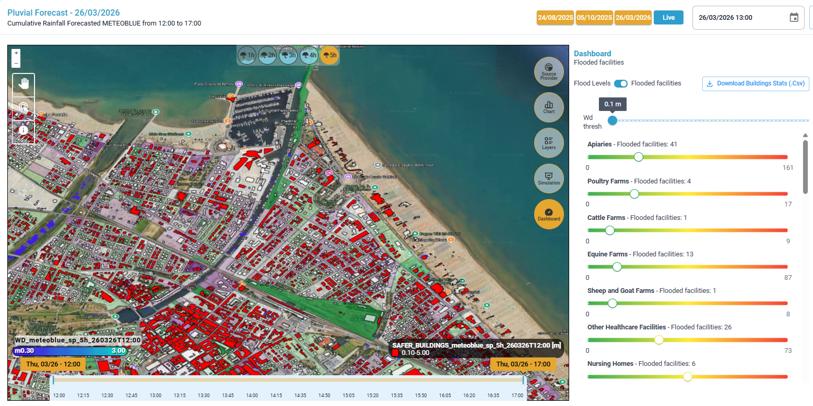<figcaption>
Visualizzazione building con WD superiore a 0.1 m (default)
</figcaption></figure> <figure>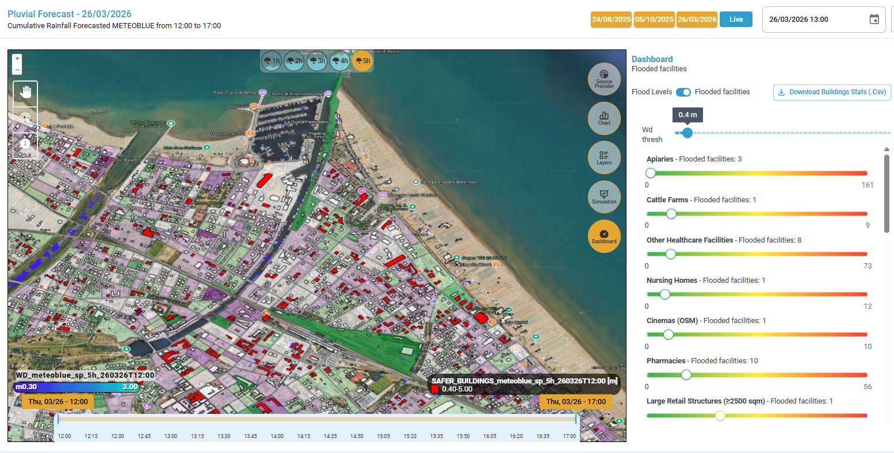<figcaption>
Visualizzazione building con WD superiore a 0.4 m (modificato da dashboard)
</figcaption></figure>

Inoltre, tramite il tasto "_**Download building Stats**_" (presente in alto a destra del Tool[#dashboard](../../interfaccia-gui-web/barra-laterale-destra.md#dashboard "mention")) è possibile effettuare il download (in formato .csv) di tutti gli edifici e le loro caratteristiche.&#x20;

<figure><figcaption></figcaption></figure>

Per la descrizione di dettaglio di ciascun layer risultato dalla simulazione si veda il capitolo[RISULTATI](https://app.gitbook.com/s/a942UcvwUbWZZQpiVGr1/risultati "mention")


Un video di esempio sulla visualizzazione dei risultati è disponibile [qui](https://drive.google.com/file/d/1hcPnG0gnV_91VMWqEQeUC5v2_STHqex_/view?usp=sharing).




### VIDEO

#### Scenario Forecast - Video esempio di visualizzazione dei dati disponibili



#### Scenario Forecast - Video esempio di visualizzazione dati nel grafico chart



#### Scenario Forecast - Video esempio di simulazione di Allagamento Pluviale



#### Scenario Forecast - Video esempio di visualizzazione dei risultati


