# 🌧️ Scenario Pluvial REAL TIME

#### Procedura per la Simulazione di Allagamenti Pluviali nello scenario Real Time

Di seguito verranno descritti i passi per eseguire una simulazione di allagamento per eventi in tempo reale o "Nowcasting".



### Selezionare Scenario _Pluvial Real Time_

L'utente deve selezionare lo Scenario _Pluvial Real Time_ dal menù della [barra-laterale-sinistra.md](../../interfaccia-gui-web/barra-laterale-sinistra.md "mention")

<figure><figcaption>
Scenario Pluviale in tempo reale
</figcaption></figure>



### Definire data e istante temporale di riferimento

Il servizio dà la possibilità d'indagare sia eventi storici che eventi in tempo reale _(Live)_.

La data di interesse può essere selezionata dalla [barra-superiore.md](../../interfaccia-gui-web/barra-superiore.md "mention") con due modalità:&#x20;

1. Selezionando la data e l'ora di interesse dal **calendario** (dati meteo a disposizione con continuità a partire dal 17 luglio 2025)
2. Selezionando uno dei **pulsanti rapidi** già presenti nella barra superiore, relativi a date con eventi pluviali di riferimento (possibilità di personalizzazione su richiesta dell'utente). Nel caso invece si voglia procedere con una simulazione in tempo reale basta selezionare il **pulsante&#x20;**_**Live**_.

<figure><figcaption>
Calendario, pulsanti rapidi e pulsante <em>Live</em>
</figcaption></figure>

Una volta scelta la data e l'ora, si può procedere ad una definizione più esatta dell'orizzonte temporale che sarà poi oggetto della simulazione di allagamento, utilizzando lo _slider_ della [barra-inferiore.md](../../interfaccia-gui-web/barra-inferiore.md "mention").

<figure><figcaption>
Slider temporale con cursore
</figcaption></figure>



### Selezione della sorgente dei dati Real time e mappa di base

Dal toolbar verticale della [barra-laterale-destra.md](../../interfaccia-gui-web/barra-laterale-destra.md "mention"), tramite [#layer-menu](../../interfaccia-gui-web/barra-laterale-destra.md#layer-menu "mention"), l'utente deve selezionare il provider di dati tra quelli disponibili. Il provider del dato Radar o Nowcasting può essere diverso a seconda dell'area oggetto dell'attivazione del servizio SaferCast.&#x20;

Per Rimini, l'utente può scegliere tra le seguenti fonti di dati meteorologici:

* **Hera**: radar meteorologico fornito da Hera, al momento disattivato e non ancora ripristinato.
* **DPC** **(5h precedenti all'ora selezionata)**: radar meteorologico del Dipartimento di Protezione Civile

E le seguenti fonti di dati pluviometrici:

* **ARPAE:** dati di precipitazione (espressi in mm di pioggia) acquisiti in telemisura dalla rete idrometeorologica regionale (in grado di rilevare diverse variabili come temperature, precipitazioni, livelli idrometrici, portate, umidità, pressione, vento, radiazione solare).
* **CAE:** dati di precipitazione (in mm di pioggia) della rete CAE.

Muovendo lo _slider,_ in basso al centro dello schermo, si può osservare l'evolversi dell'evento nel tempo, dipendendo dall'intervallo temporale coperto da ciascuna sorgente di dati radar.

<figure><figcaption>
Layer Menù per la selezione dei dati di input per le simulazioni
</figcaption></figure>

Nello stesso menù, l'utente può cambiare la mappa base di riferimento (_BaseMap Google Hybrid,_ _Google_ _Road_ oppure _Open Street Maps_) e visualizzare la mappa di vulnerabilità sociale (_Social Vulnerability_).&#x20;

Inoltre, è disponibile una mappa di "_**Social Vulnerability**_" che rappresenta la distribuzione spaziale dell’indice di vulnerabilità sociale (_Social Vulnerability Index_) per l’area di Rimini. Il territorio è suddiviso in **poligoni (unità territoriali),** ciascuno colorato secondo una **scala qualitativa**, che indica il grado di vulnerabilità della popolazione residente.

Le funzioni _Compare Layers_ e _Buildings_ _Layer_ rimarranno disattivate fino a quando non verrà effettuata la prima simulazione di allagamento.



### Definizione della cumulata di pioggia

L'utente ha inoltre la possibilità di indicare una cumulata di pioggia da simulare, definendo sia la durata che l'intervallo di inizio e fine.\
La durata viene identificata selezionando le icone posizionate in alto al centro:

<figure><figcaption></figcaption></figure>

L'orario di inizio e fine dell'intervallo di cumulata selezionato può essere definito muovendosi con lo _slider_ della [barra-inferiore.md](../../interfaccia-gui-web/barra-inferiore.md "mention").

<figure><figcaption></figcaption></figure>

Cambiando la durata della cumulata e l'intervallo di inizio e fine viene visualizzata sulla mappa la relativa distribuzione spaziale dell'evento pluviale che sarà simulato.

<figure>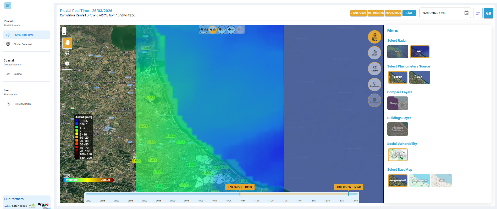<figcaption>
Esempio di cumulata di pioggia (durata di 2h e intervallo dalle 10:50 alle 12:50)
</figcaption></figure>


Un video di esempio che illustra la tipologia di dati disponibili è visibile [qui](https://drive.google.com/file/d/1sOHarpC57anyj2xarvMOadOwqicauId4/view?usp=sharing).




### Visualizzazione valori di pioggia

L'utente ha la possibilità di visualizzare per un singolo punto i valori di precipitazione per lo scenario definito nello step precedente. L’asse verticale esprime la quantità di pioggia in mm e l’asse orizzontale l’intervallo temporale.&#x20;

Cliccando sul punto di interesse col pulsante "_Identify_" e successivamente attivando il pulsante [#chart](../../interfaccia-gui-web/barra-laterale-destra.md#chart "mention") nella [barra-laterale-destra.md](../../interfaccia-gui-web/barra-laterale-destra.md "mention"), si ottiene un grafico che riporta sia i valori rilevati dal radar con passo temporale di 5 min che i valori di cumulata di pioggia (nel caso in cui sia stata selezionata).

<figure>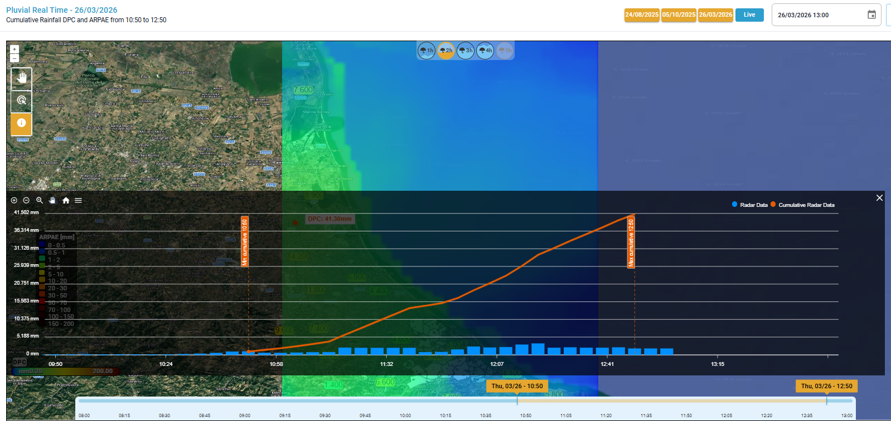<figcaption>
Chart - grafico che riporta sia la cumulata di pioggia che i valori rilevati dal radar con passo temporale di 5 min 
</figcaption></figure>

Analogamente, selezionando con il pulsante _"Single Feature Select"_ un pluviometro e attivando il pulsante [#chart](../../interfaccia-gui-web/barra-laterale-destra.md#chart "mention") nella [barra-laterale-destra.md](../../interfaccia-gui-web/barra-laterale-destra.md "mention"), si ottiene un grafico che riporta sia i valori rilevati dal pluviometro con passo temporale di 15 min che i valori di cumulata di pioggia (nel caso in cui sia stata selezionata).

<figure>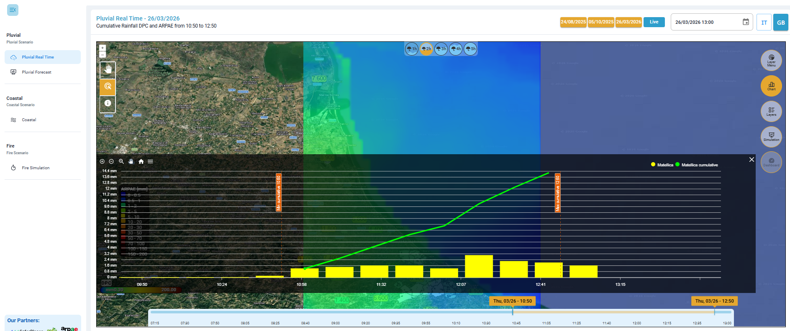<figcaption>
Chart - grafico che riporta sia la cumulata di pioggia che i valori rilevati dal pluviometro con passo temporale di 15 min 
</figcaption></figure>

Passando con il mouse sopra al grafico, appare un'etichetta che mostra i valori puntuali dei dati (punto radar e pluviometro selezionato) e i valori cumulati nel caso in cui sia stata selezionata una cumulata.

<figure>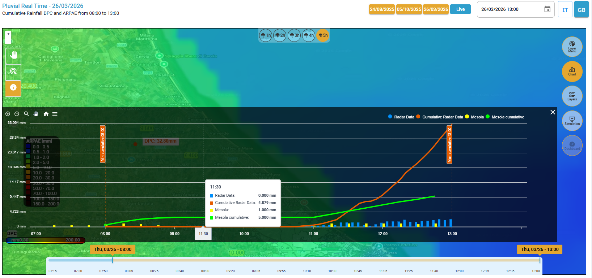<figcaption>
Tooltip di dettaglio che si ottiene passando con il mouse sul grafico
</figcaption></figure>

Inoltre, in alto a sinistra sono presenti degli strumenti di navigazione del grafico che consentono di fare zoom in, zoom out, zoom selettivo (_Selection zoom_), spostare la vista (_panning_), resettare lo zoom a quello iniziare (_reset zoom_) e un menù per scaricare il grafico in formato svg, png e csv.


Un video di esempio sulla visualizzazione dei dati nel grafico _Chart_ è disponibile [qui](https://drive.google.com/file/d/1Vyb_3btr8urEbEvBdhesQTJVjayUoPmx/view?usp=sharing)




### Esecuzione della simulazione di allagamento

I passi precedenti consentono quindi all'utente di definire la sorgente di dati, una cumulata e l'intervallo temporale dell'evento pluviale che si vuole simulare.

Per eseguire una simulazione di allagamento occorre ora selezionare lo strumento _**Simulation**_ della [barra-laterale-destra.md](../../interfaccia-gui-web/barra-laterale-destra.md "mention"), e seguire il seguente flusso di lavoro:

1. _**Select data for the simulation**_ – consente di selezionare i dati per la simulazione, con due possibilità:
   * \[Provider selezionato] - \[ora o intervallo temporale]: utilizza il dato selezionato all'ora/intervallo orario selezionato. Questa opzione contiene tutte le impostazioni scelte finora ed è già preselezionata in automatico. Permette di simulare un valore non uniforme di pioggia su tutto il dominio di calcolo.
   * _Custom_ (_uniform rain_ - pioggia uniforme): permette di impostare manualmente un valore uniforme di pioggia cumulata totale su tutto il dominio di calcolo.
2. _**Flood models**_ – permette di scegliere il modello di allagamento per le simulazioni, tra i modelli sviluppati da SaferPlaces ([safer\_rain.md](../modelli-alla-base-delle-simulazioni/safer_rain.md "mention")o [untrim.md](../modelli-alla-base-delle-simulazioni/untrim.md "mention"))
3. _**Confirm and start the simulation**_ – avvia il calcolo delle simulazioni con modello di allagamento scelto.

<figure><figcaption>
Selezione dati di input per la simulazione da Provider
</figcaption></figure> <figure><figcaption>
Selezione dati di input per la simulazione personalizzato (Custom)
</figcaption></figure>

Una volta selezionata l'opzione desiderata (dato da _provider_ o personalizzato &#x63;_&#x75;stom_) con il pulsante _Next_ si passa allo step successivo di scelta del modello di allagamento e al seguente step di conferma e lancio della simulazione.&#x20;

Con il pulsante _Back_ è possibile tornare indietro e modificare i dati di input o il modello alluvionale per lanciare un'altra simulazione con parametri differenti. &#x20;

Una volta avviata la simulazione con il pulsante _Confirm,_ il calcolo è in corso, ma può essere interrotto in qualsiasi momento tramite il pulsante _Cancel._&#x20;

<figure>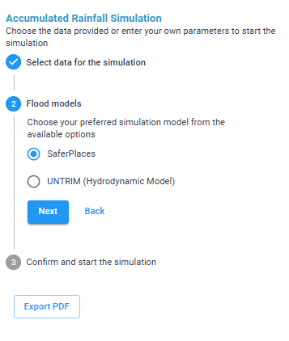<figcaption>
Scelta modello di simulazione: SaferPlaces
</figcaption></figure> <figure>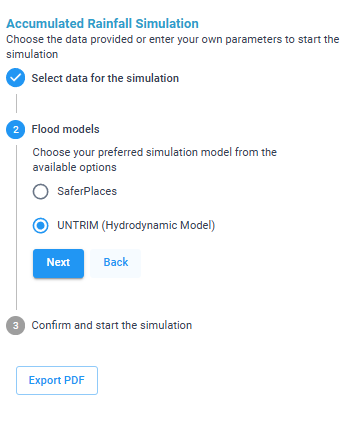<figcaption>
Scelta modello di simulazione: UNTRIM (se disponibile)
</figcaption></figure>

<figure><figcaption>
Lancio della simulazione con il pulsante <em>Confirm</em>
</figcaption></figure> <figure>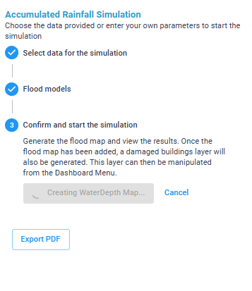<figcaption>
Simulazione in corso (possibilità d'interruzione della stessa con il pulsante <em>Cancel</em>)
</figcaption></figure>


**Pulsante Export PDF**: offre la possibilità di esportare la mappa con il risultato delle simulazioni, in formato PDF


<figure>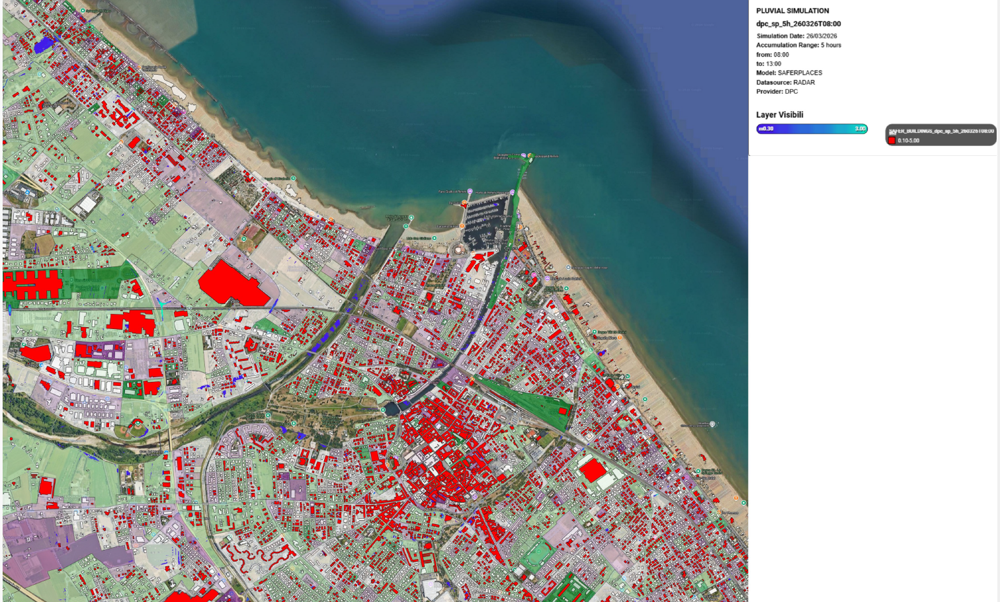<figcaption>
Esempio di pdf generato
</figcaption></figure>

A destra in alto è riportata una legenda che riassume i principali dati di input della simulazione e i layer risultato visualizzati.

<figure>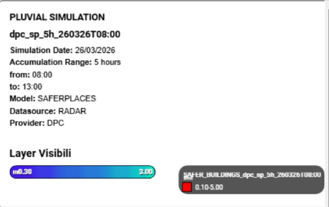<figcaption>
Esempio: Legenda PDF
</figcaption></figure>


Un video di esempio di una simulazione di allagamento pluviale, nello scenario Real Time è disponibile [qui](https://drive.google.com/file/d/19n43b_dM40ZL8n-7zE_oEJnIqrcPoJPM/view?usp=sharing)




### Visualizzazione dei risultati

Dopo qualche minuto dal lancio della simulazione, l'utente vedrà comparire direttamente nell'ambiente centrale la mappa di allagamento per lo scenario di pioggia definito, posizionata sopra la mappa della vulnerabilità.

Nella sezione[#layers](../../interfaccia-gui-web/barra-laterale-destra.md#layers "mention") del toolbar verticale è stato generato il layer _**WD (WATER DEPTH)**_ risultato dell'ultima simulazione di allagamento effettuata e il layer _**SAFER\_BUILDING**_, che permette di visualizzare in rosso, sulla mappa, gli edifici danneggiati dall'allagamento.


Di default si considerano allagati (e quindi rappresentati in rosso) gli edifici caratterizzati da un livello d’acqua superiore a 0.1 m; tale valore può essere modificato tramite la Dashboard.


<figure>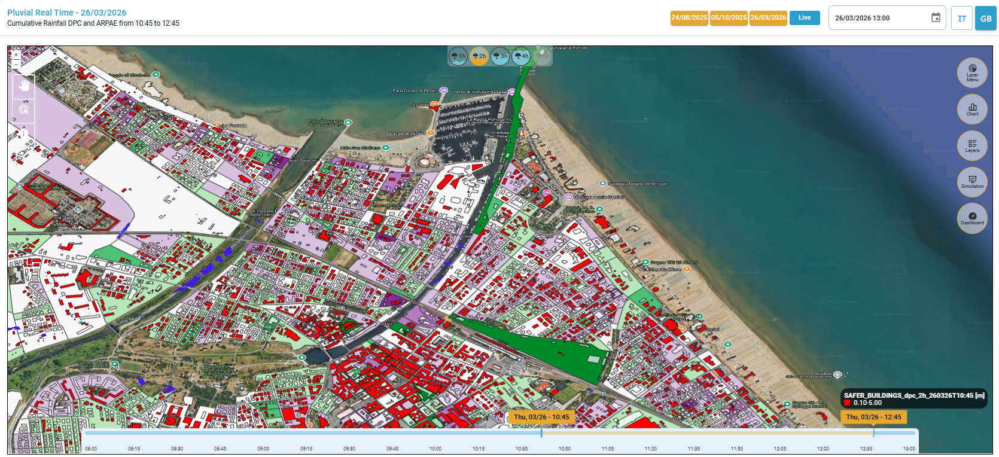<figcaption>
Visualizzazione della <em>Water Depth</em> e degli edifici allagati sulla carta di vulnerabilità del territorio
</figcaption></figure>

<figure>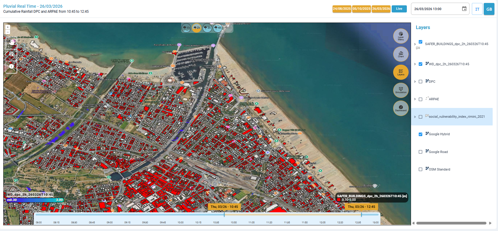<figcaption>
Visualizzazione della <em>Water Depth</em> e degli edifici allagati su mappa di base (Google Hybrid)
</figcaption></figure>

**Strumenti:**

Selezionando il tool "&#x46;_&#x65;ature Select_" e cliccando su un edificio si aprirà una finestra che descrive le caratteristiche dell'edificio stesso:

* indirizzo,
* tipologia,
* classe,
* altezza edificio,
* altezza dell'allagamento.

Alcune caratteristiche possono non essere presenti per tutti gli edifici.

<figure><figcaption>
Caratteristiche dell'edificio selezionato
</figcaption></figure>

Cliccando sul tool "_Identify_" e successivamente cliccando su un punto di interesse sulla mappa, è possibile visualizzare il valore della _Water Depth_ in quel punto.

<figure><figcaption>
Interrogazione puntuale dei valori della <em>Water Depth</em> tramite tool "I<em>dentify</em>"
</figcaption></figure>

**Modalità di visualizzazione dei risultati:**

Dal [#layer-menu](../../interfaccia-gui-web/barra-laterale-destra.md#layer-menu "mention"), tramite "_**Compare Layers**_" è possibile confrontare il layer risultato delle simulazioni di allagamento con il layer dell'intensità di pioggia tramite la funzione _Swipe View_, muovendo il cursore orizzontalmente.&#x20;

<figure><figcaption>
Layer Menù - Compare Layers - funzione Swipe View
</figcaption></figure>

Dal [#layer-menu](../../interfaccia-gui-web/barra-laterale-destra.md#layer-menu "mention"), con la funzione "_**Buildings Layer**_" è possibile visualizzare direttamente sulla mappa gli edifici danneggiati dall'allagamento (è possibile accendere o spegnare il layer anche accedendo nella sezione [#layers](../../interfaccia-gui-web/barra-laterale-destra.md#layers "mention") ).

Dal [#layer-menu](../../interfaccia-gui-web/barra-laterale-destra.md#layer-menu "mention"), la funzione "_**Social Vulnerability**_" permette di visualizzare una mappa che rappresenta la distribuzione spaziale dell’indice di vulnerabilità sociale (_Social Vulnerability Index,_ riferito all'anno 2021) per l’area di Rimini. Diventa quindi possibile confrontare il rischio di allagamento del territorio con le aree più vulnerabili, identificando le aree più esposte, supportando le decisioni operative e la pianificazione dell’emergenza. (Si può accendere o spegnare questo layer anche dalla sezione [#layers](../../interfaccia-gui-web/barra-laterale-destra.md#layers "mention")).

<figure>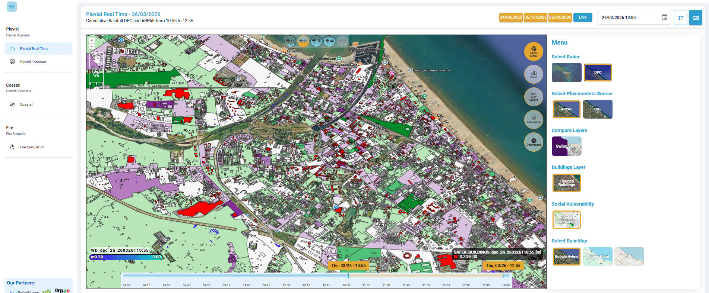<figcaption>
Layer Menù - Social Vulnerability Index (anno 2021)
</figcaption></figure>

**Dashboard:**

Infine, l'ultimo Tool della[#dashboard](../../interfaccia-gui-web/barra-laterale-destra.md#dashboard "mention") fornisce una vista sintetica e interattiva sugli **impatti previsti o rilevati** in seguito all'evento alluvionale simulato, evidenziando il numero e il tipo di **strutture/elementi sensibili allagati**.&#x20;

<figure>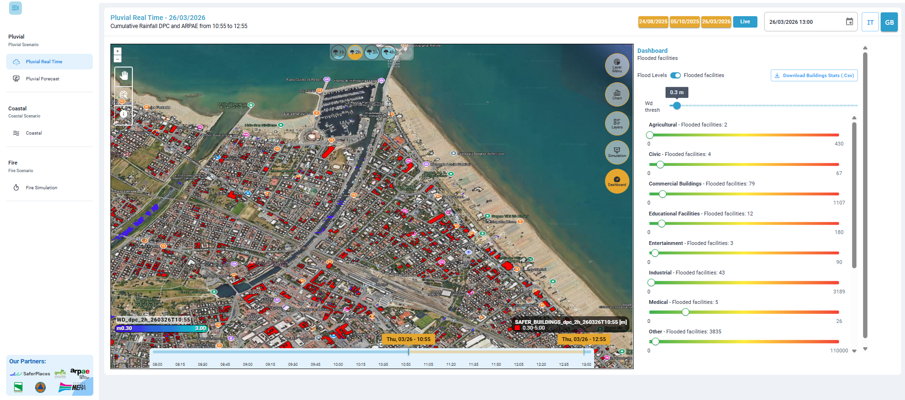<figcaption>
Funzione dashboard
</figcaption></figure>


Modificando l'altezza di allagamento (_Wd thresh_) nella [#dashboard](../../interfaccia-gui-web/barra-laterale-destra.md#dashboard "mention")automaticamente cambia la visualizzazione del Layer Safer\_Building


<figure>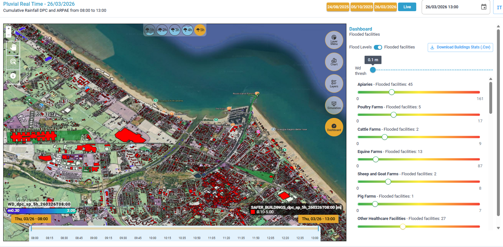<figcaption>
Visualizzazione edifici con WD superiore a 0.1 m (default)
</figcaption></figure> <figure>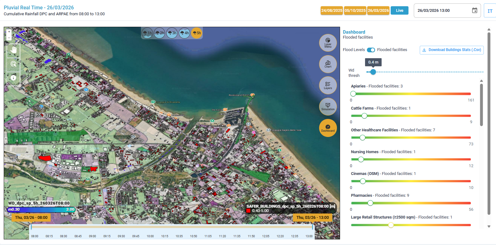<figcaption>
Visualizzazione edifici con WD superiore a 0.4 m (modificato da dashboard)
</figcaption></figure>

Inoltre, tramite il tasto "_**Download building Stats**_" (presente in alto a destra all'interno del Tool[#dashboard](../../interfaccia-gui-web/barra-laterale-destra.md#dashboard "mention")) è possibile effettuare il download (in formato .csv) di tutti gli edifici e le loro caratteristiche.&#x20;

<figure><figcaption></figcaption></figure>

Per la descrizione di dettaglio di ciascun layer risultato dalla simulazione si veda il capitolo[RISULTATI](https://app.gitbook.com/s/a942UcvwUbWZZQpiVGr1/risultati "mention")


Un video di esempio sulla visualizzazione dei risultati è disponibile [qui](https://drive.google.com/file/d/1GHIY6YvTBtu9anG3c_P8nw1m1jZhcVNl/view?usp=sharing)




### VIDEO&#x20;

#### Scenario Real Time - Video esempio di visualizzazione dei dati disponibili



#### Scenario Real Time - Video esempio di visualizzazione dati nel grafico _Chart_



#### Scenario Real Time - Video esempio di simulazione di Allagamento Pluviale



#### Scenario Real Time - Video esempio di visualizzazione dei risultati


