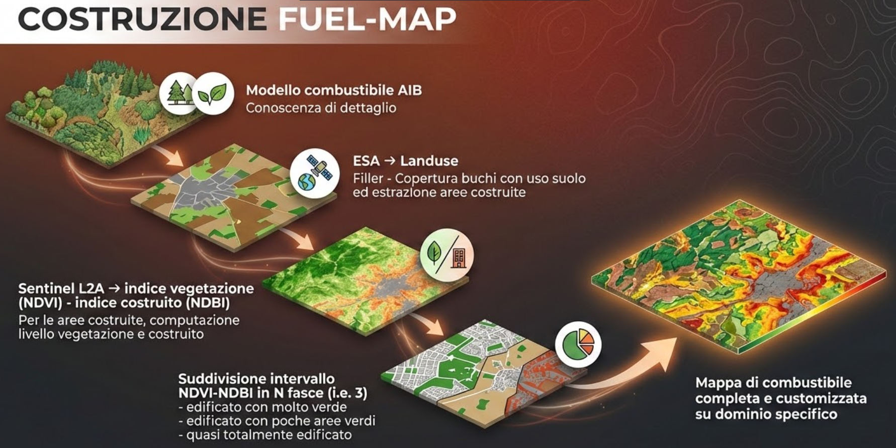

---
metaLinks:
  alternates:
    - >-
      https://app.gitbook.com/s/6a3QgDGzrxeFxNcSzPJg/simulazioni-allagamento-pericolo-e-danno/modelli-di-allagamento-hazard-saferplaces/safer_river
---

# 🔥 Safer\_FIRE


Il modello **Safer\_FIRE è un modello probabilistico per la simulazione della propagazione degli incendi**, basato sull’integrazione di differenti sorgenti informative territoriali e ambientali. Al fine di stimare l’evoluzione spaziale e temporale del fronte di fiamma, il sistema utilizza dati relativi a:

* morfologia del terreno (Digital Elevation Model);
* tipologia di vegetazione e combustibile presente;
* umidità del suolo e della vegetazione;
* vento (direzione e intensità);
* punti di innesco dell’incendio;
* dati satellitari e cartografici ad alta risoluzione.


**Safer\_FIRE** è il motore di simulazione sviluppato per questa applicazione e si basa sul modello **PROPAGATOR**, realizzato da **CIMA Research Foundation** per la previsione e l’analisi della dinamica degli incendi boschivi. Il sistema nasce con l’obiettivo di fornire uno strumento rapido e scientificamente affidabile per valutare come un incendio possa evolvere nel tempo e nello spazio, supportando attività di prevenzione, pianificazione e gestione dell’emergenza.

A differenza dei modelli puramente deterministici, SaferFIRE adotta un approccio **probabilistico**: invece di descrivere un’unica evoluzione possibile dell’incendio, il modello stima le aree con maggiore probabilità di propagazione in funzione delle condizioni ambientali e meteorologiche presenti. Questo approccio consente di rappresentare in modo più realistico la natura complessa e variabile degli incendi forestali.

Il funzionamento del sistema si basa sull’integrazione di differenti sorgenti informative territoriali e ambientali. Tra i principali dati utilizzati vi sono:

* morfologia del terreno (Digital Elevation Model);
* tipologia di vegetazione e combustibile presente;
* umidità del suolo e della vegetazione;
* vento (direzione e intensità);
* punti di innesco dell’incendio;
* dati satellitari e cartografici ad alta risoluzione.

Questi elementi vengono combinati all’interno di una griglia spaziale nella quale ogni cella possiede caratteristiche specifiche di combustibilità e propagazione.

**Mappa dei combustibili (**_**Fuel Map**_**)**

Uno degli aspetti centrali di SaferFIRE è la costruzione della _**fuel map**_, ovvero la mappa dei combustibili, che descrive il comportamento potenziale del territorio rispetto al fuoco. La _fuel map_ viene ottenuta integrando dati [ESA WorldCover](https://esa-worldcover.org/en), immagini Sentinel e modelli AIB (Antincendio Boschivo) specialistici, permettendo di distinguere aree forestali, vegetazione rada, zone agricole, superfici urbanizzate e altre categorie territoriali.

<figure><figcaption>
Procedimento per la costruzione della mappa dei combustibili (<em>fuel map</em>)
</figcaption></figure>

Durante la simulazione, l’algoritmo valuta continuamente la probabilità che il fuoco si propaghi verso le celle adiacenti, considerando fattori come:

* direzione e velocità del vento;
* pendenza del terreno;
* quantità e tipologia di combustibile;
* umidità della vegetazione;
* fenomeni di spotting (trasporto di braci).

Il risultato è una rappresentazione dinamica dell’evoluzione dell’incendio, aggiornata a intervalli temporali successivi, utile per identificare aree a rischio, tempi di propagazione e possibili impatti su infrastrutture o zone abitate.

Le simulazioni prodotte da Safer\_FIRE consentono quindi di:

* supportare decisioni operative in scenari emergenziali;
* analizzare scenari di rischio;
* valutare strategie di mitigazione;
* migliorare la pianificazione territoriale e di protezione civile.

**Fonti**

[PROPAGATOR, how to simulate fire dynamics](https://www.cimafoundation.org/en/news/propagator-how-to-simulate-fire-dynamics/)

[PROPAGATOR](https://cimafoundation.github.io/propagator_sim/0.0.2/): An operational cellular-automata wildfire simulator developed by [CIMA Research Foundation](https://www.cimafoundation.org/). PROPAGATOR couples a Numba-powered propagation core with reusable I/O pipelines and a configurable CLI for fire forecasting.

Article: [PROPAGATOR: An Operational Cellular-Automata Based Wildfire Simulator](https://www.mdpi.com/2571-6255/3/3/26)
